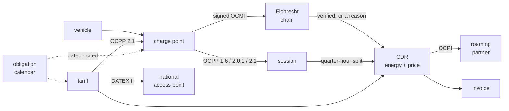

# emob

**The open-source e-mobility operating stack** — the CPO and EMP halves of a
charging business in one Rust workspace: the CSMS a station connects to, the
roaming node a partner peers with, the Eichrecht evidence chain a signed meter
value survives in, and the driver contract all of it turns into an invoice.

[](#license)

📖 **[Documentation](https://hupe1980.github.io/emob/docs/)** ·
[Getting started](https://hupe1980.github.io/emob/docs/getting-started/) ·
[The Eichrecht chain](https://hupe1980.github.io/emob/docs/eichrecht/) ·
[Architecture](https://hupe1980.github.io/emob/docs/architecture/)

> 🚧 **Status: early.** Twelve domain crates and seven daemons are built, tested
> and green. Everything else is designed and marked 📐 rather than blurred into
> it.

**913 tests.** The ones that are hard to fake:

- **A real message, end to end.** The Open Charge Alliance's own published OCPP
  example goes in at the wire and comes out as a taxable amount — and again as a
  file the driver's own verifier reads.
- **Meters this workspace did not write.** Records from five real devices in the
  S.A.F.E. reference data set, including an eBZ LD3 on secp192r1 with the
  non-canonical DER a real meter emits.
- **One session, three roaming paths, one amount.** Self-roaming, OCPI 2.3.0 and
  OICP 2.3 through a broker that refuses what the live one refuses.
- **One price, three audiences.** The driver at the point, the roaming partner
  and the national access point read the same decimal.
- **A month, and a year.** A month closes into a validated EN 16931 invoice, a
  SEPA collection and balanced postings; a year files its THG-Quote notification
  with every ineligible point refused by name.
- **A hundred stations that reconcile exactly.** `billed + refused == metered`,
  with the residual zero rather than small.
- **Properties over generated input**, not examples — because an example is a
  shape somebody already thought of: one price however finely a session is
  sliced, every quantity priced or named, no VAT category owed a negative amount,
  a record its own validator accepts, a month that adds up under the standard's
  own 317 rules, and one price on all three wires.

## Why

Open source stops at the charging station. [CitrineOS] is a CSMS, [SteVe] is a
1.6 CSMS, [EVerest] is the station firmware. Nobody open ships the other half —
the e-mobility provider, the roaming node, the calibration-law evidence chain,
the billing — as one system that agrees with itself about what a kilowatt-hour
was worth.

That other half is what this workspace is, and it is built on protocol stacks
that already exist as siblings rather than re-implemented: [`ocpp-kit`],
[`ocpi-kit`], [`oicp-kit`], [`iso15118`], [`eebus`].



Every arrow is a place a kilowatt-hour can quietly become the wrong number.

[CitrineOS]: https://lfenergy.org/projects/citrineos/
[SteVe]: https://github.com/steve-community/steve
[EVerest]: https://everest.github.io
[`ocpp-kit`]: https://github.com/hupe1980/ocpp-kit
[`ocpi-kit`]: https://github.com/hupe1980/ocpi-kit
[`oicp-kit`]: https://github.com/hupe1980/oicp-kit
[`iso15118`]: https://github.com/hupe1980/iso15118
[`eebus`]: https://github.com/hupe1980/eebus

## Quick start

```console
cargo add emob-eichrecht emob-session emob-cdr emob-tariff
```

A signed meter value becomes a billable quantity through exactly one door, and
that door answers `None` when anything at all is wrong — a bad signature, an
unregistered key, a substitute reading, a record deleted from the middle of the
session:

```rust
use emob_eichrecht::{Evidence, KeyRegistry};

let evidence = Evidence::assemble(&records, &registry, session_start);

match evidence.billable_energy() {
    Some(energy) => println!("bill {energy}"),   // 29.500 kWh
    None => for reason in evidence.reasons() {
        eprintln!("blocked: {reason}");          // → an operator, not an invoice
    },
}
```

There is no second route. A caller who wants to bill anyway has to write code
that visibly ignores the answer — which is the point, because German calibration
law lets you invoice a measured value only if the customer can check it, long
after the session `[MessEG §33]`.

**[Getting started](https://hupe1980.github.io/emob/docs/getting-started/)** takes
that session the rest of the way: across the quarter hours the market settles on,
into a record another company pays against, priced by a tariff that shows the
same number before the session starts, out to a roaming partner and the national
access point, and into an e-invoice with a SEPA collection behind it.

## The twenty-seven properties that decide quality

Not features — properties, each one either true of every run or false. They are
what the tests are for, and each links to the page that explains why it is hard.

| # | Property | Where |
|---|---|---|
| 1 | A value that does not verify does not bill | [Eichrecht](https://hupe1980.github.io/emob/docs/eichrecht/) |
| 2 | A chain proves four things, and OCMF says which | [Eichrecht](https://hupe1980.github.io/emob/docs/eichrecht/) |
| 3 | The signed record also says when the car stopped charging | [Eichrecht](https://hupe1980.github.io/emob/docs/eichrecht/) |
| 4 | Import and export never net, and the register says so | [Eichrecht](https://hupe1980.github.io/emob/docs/eichrecht/) |
| 5 | The customer can repeat the check, in software neither party wrote | [Eichrecht](https://hupe1980.github.io/emob/docs/eichrecht/) |
| 6 | The quarter-hour split conserves energy exactly | [Settlement](https://hupe1980.github.io/emob/docs/settlement/) |
| 7 | …and the grid that settles the energy does not price the minutes | [Settlement](https://hupe1980.github.io/emob/docs/settlement/) |
| 8 | The identification is read off the signed record, not asked for | [Settlement](https://hupe1980.github.io/emob/docs/settlement/) |
| 9 | A record says what it is, and nothing is inferred back out of it | [Settlement](https://hupe1980.github.io/emob/docs/settlement/) |
| 10 | The rounding happens once, and the document says what it cost | [Settlement](https://hupe1980.github.io/emob/docs/settlement/) |
| 11 | A roaming settlement is not taxed where the charge point stands | [Settlement](https://hupe1980.github.io/emob/docs/settlement/) |
| 12 | The price shown is the price charged, and it rides on the record | [Tariffs](https://hupe1980.github.io/emob/docs/pricing/) |
| 13 | One price, three audiences, and the screen the article regulates | [Tariffs](https://hupe1980.github.io/emob/docs/pricing/) |
| 14 | A reservation is priced, and it is not a period of the session | [Tariffs](https://hupe1980.github.io/emob/docs/pricing/) |
| 15 | A price bound is two ceilings, not one | [Tariffs](https://hupe1980.github.io/emob/docs/pricing/) |
| 16 | A price per hour of the day needs a zone, and an offset is not one | [Tariffs](https://hupe1980.github.io/emob/docs/pricing/) |
| 17 | What cannot be evaluated is not assumed open | [Tariffs](https://hupe1980.github.io/emob/docs/pricing/) |
| 18 | The wire's numbers are telemetry, and the seam says so in the types | [OCPP](https://hupe1980.github.io/emob/docs/ocpp/) |
| 19 | A record two companies hold is one they can both read | [Roaming](https://hupe1980.github.io/emob/docs/roaming/) |
| 20 | A crossing has a cost, and the record says what it was | [Roaming](https://hupe1980.github.io/emob/docs/roaming/) |
| 21 | A record that has been settled cannot be sent again | [Roaming](https://hupe1980.github.io/emob/docs/roaming/) |
| 22 | The identifier that routes the money checks itself | [Roaming](https://hupe1980.github.io/emob/docs/roaming/) |
| 23 | The price on the map is the price on the invoice | [Locations](https://hupe1980.github.io/emob/docs/locations/) |
| 24 | Compliance is a query, not a consulting engagement | [Compliance](https://hupe1980.github.io/emob/docs/compliance/) |
| 25 | Notified is not published, and the quota turns on the difference | [Compliance](https://hupe1980.github.io/emob/docs/compliance/) |
| 26 | Money is never a float, and scale is information | [Architecture](https://hupe1980.github.io/emob/docs/architecture/) |
| 27 | An agent proposes; it cannot move money, and that is a property | [Architecture](https://hupe1980.github.io/emob/docs/architecture/) |

Three of them are worth the summary here, because they are what a reviewer
should disbelieve first.

**The Eichrecht chain is proven against hardware nobody here wrote.** A verifier
tested only against its own fixtures proves the code agrees with itself, which is
not the question. The suite runs records from five real meters out of the
S.A.F.E. reference data set — including an eBZ LD3 on secp192r1 with the
non-canonical DER a real device emits — and the format underneath is the
[`ocmf`](https://crates.io/crates/ocmf) crate's, written against all 256 records
of that corpus with OpenSSL as an independent oracle.

**One tariff object reaches all three audiences that are owed a price.** The
driver at the point over OCPP 2.1, the roaming partner over OCPI 2.3.0, and the
national access point over DATEX II — from one decimal, with a test asserting the
three read the same number. The display-versus-bill drift that
`[AFIR Art. 5(4)]` exists to prevent is unrepresentable rather than tested for.

**The regulation is read from the Official Journal, not from a summary.** A
surprising number of these rules turn on a reading the secondary sources get
wrong: a renovation that is not a deployment, an exemption that is a date rather
than a technology, a paragraph that limits its first two subparagraphs and not
its third, an SME threshold whose financial half is an `and` where every
restatement writes `or`, and a German price-indication duty that is two years
older and considerably wider than the European one everybody models.

## Layout

| Crate | What it holds | State |
|---|---|---|
| [`emob-core`](crates/emob-core) | Identifiers in both grammars, text-preserving; exact energy and money; the settlement grid; the charge-point, provider **and undertaking** profiles; the obligation calendar over all three; and `Crossing`, the account a value owes when it is carried onto somebody else's wire | ✅ |
| [`emob-eichrecht`](crates/emob-eichrecht) | **The law, not the format** (that is [`ocmf`](https://crates.io/crates/ocmf)): which quantity each failure takes away, the station key registry, the evidence record, and the transparency file filtered to what verified | ✅ |
| [`emob-session`](crates/emob-session) | Authorisation paths, cumulative meter series, the timestamped state machine, and the quarter-hour split | ✅ |
| [`emob-cdr`](crates/emob-cdr) | The record, its price, idempotent acceptance, pre-flight validation | ✅ |
| [`emob-tariff`](crates/emob-tariff) | Period-based rating with tiers and VAT, the display derived from it, the AFIR shape check, validity windows and a content fingerprint — one object, read by the invoice, the driver's screen, the roaming partner and the national access point | ✅ |
| [`emob-ocpp`](crates/emob-ocpp) | The OCPP seam, both ways: signed meter values lifted out of transaction events with no field a float could arrive in, and the tariff carried onto OCPP 2.1's *Tariff and Cost* block so the price on the station's screen is the object that rates the CDR | ✅ |
| [`emob-poi`](crates/emob-poi) | The register and the national access point feed: DATEX II AFIR Recharging, with the published price carried from the tariff that rates the session | ✅ |
| [`emob-roam`](crates/emob-roam) | The roaming edge, on both wires: the canonical record onto OCPI 2.3.0 and 2.2.1 in both directions, and onto **OICP 2.3** through Hubject — where the record carries no money at all, so the price crosses separately as a pricing product and the account says the amount did not. Routing read out of the contract identifier itself. eMIP is still 📐 | ✅ |
| [`emob-sim`](crates/emob-sim) | A deterministic fleet: virtual stations that sign genuine OCMF, eight seeded faults, and a day that reconciles exactly — assembled from OCPP events | ✅ |
| `emob-pnc` | Plug & Charge contracts, OPCP pools, multi-PKI | 📐 |
| `emob-smart` | Load management, OCPP charging profiles, DER control, § 14a guard, V2G | 📐 |
| [`emob-thg`](crates/emob-thg) | The greenhouse-gas quota: `[38k §6(3)]`'s four conditions per point, and a notification built only from energy a meter signed. Notified is not published, and no factor is a constant | ✅ |
| [`emob-billing`](crates/emob-billing) | Rated CDRs → an EN 16931 e-invoice and the verdict on it, a SEPA collection, and postings addressed by role. The rounding happens once, at the line, and the residual is reported | ✅ |
| [`emob-service`](crates/emob-service) | The daemon shell, and the three parts of it that are about charging: an OCPI-party authority model, the CloudEvents catalogue, one webhook signature | ✅ |

| Service | What it does | State |
|---|---|---|
| [`csmsd`](services/csmsd) | The CSMS a station connects to: OCPP 1.6J/2.0.1/2.1 on `ocpp-kit` transport, the two ledgers side by side, the chain from a signed value to a settled record | ✅ |
| [`agentd`](services/agentd) | The advisory plane on `agentplane` — specialists that correlate across many exact answers, and cannot move money by construction. Evidence triage, the tariff sweep, and a compliance sweep that answers **which duties this estate will fail on the day they start** | ✅ |
| [`poid`](services/poid) | The national access point feed `[AFIR Art. 20(2)]`: the DATEX II snapshot, the updates that reference it, and a feed nobody refreshed named rather than read as current | ✅ |
| [`tarifd`](services/tarifd) | Publishing a tariff version to the three audiences owed it, from one decimal, **before** it takes effect — and to none of them if the stations cannot be given it | ✅ |
| [`roamd`](services/roamd) | The roaming node: **who** a record goes to, routed out of the contract's own issuer; **when** it is late, against the window that partner agreed to; and **what to do** with one that arrives — accept, dispute, or refuse, with a retry told apart from a restatement. A record the partner has taken is sealed `[OCPI 2.3.0 §mod_cdrs]`, and a correction may not overtake its own reversal | ✅ |
| [`billd`](services/billd) | The service that closes a month: what number the invoice carries, that the period closes **once** and a re-closing is a correction rather than a second demand, which document supersedes which — the reversal first — and which account each role-addressed posting lands in. The only manifest that may declare `doubleentry`, with the place of supply in the account path because a VAT liability has a creditor. Posting is a separate act from issuing: a platform that books on issue holds a trial balance the recipient's own records disagree with | ✅ |
| [`empd`](services/empd) | The provider side: the keyed token store `emob-roam` asks for by name, because OCPI wants an RFID uid on every outgoing CDR and a session refuses to hold one; `[OCPI 2.3.0 §mod_tokens]`'s five answers and the whitelist read as the two-sided rule it is; `[AFIR Art. 5(5)]`'s quote with the operator's price passed through **unchanged**, over a price list with no country in it; and the C-60/23 fee owed by a contract that charged nothing all month | ✅ |
| `pncd`, `opsd`, `sited` | | 📐 |

`emob-roam` is the one crate whose MSRV is not the workspace's. Everything that
decides money promises **1.94**, which is the floor the sibling workspaces
(`mako`, `hems`) carry and consume; `ocpi-kit` asks for 1.96, and raising the
shared floor to take one wire would make every downstream pay for a protocol it
does not use. `just msrv` checks the promise where it is made rather than
asserting one number for everything.

`csmsd` is deliberately the thinnest thing in the repository. Everything about
the OCPP seam that could be *wrong* lives in `emob-ocpp` and is tested there
against the Open Charge Alliance's own example messages; what is left is
sockets, routing and bookkeeping. A daemon is the worst place to keep a rule,
because CI does not run it.

## Development

```console
just            # list every recipe
just ci         # fmt, clippy, purity, tests, guards, deny, docs
just test       # cargo test --workspace --all-features
just guards     # no-floats, check-citations, check-manifests, check-wire,
                # check-prose, check-concepts, check-reach,
                # check-constructors, check-graph
just purity     # no clock, no I/O, no unsafe in the domain crates
just msrv       # the crates that promise 1.94 still build on 1.94
```

The domain crates take time and keys as arguments and never read a clock, so a
dispute about a two-year-old session is replayed exactly as it happened — and
`just purity` fails the build if that stops being true.

### Releasing

`just release-check` packages every publishable crate in dependency order and
builds each from its own tarball. Pushing a `vX.Y.Z` tag runs
[`release.yml`](.github/workflows/release.yml), which re-runs the whole gate
against the tagged revision, refuses a tag whose version the manifests do not
carry, and then publishes the twelve crates one step at a time in dependency
order.

A publish is twelve uploads and can stop in the middle, leaving the version spent
for some crates and free for the rest — so each step treats *already uploaded* as
the upload having already happened, and a re-run finishes the release instead of
needing a version bump. Every other failure still stops the run.

It needs a `CARGO_REGISTRY_TOKEN` secret on a `crates-io` environment, which is
also where a required reviewer goes: a version number is spent the moment
crates.io accepts it.

## Sources

Every regulatory claim in the code cites a document, section and page from
`specs/`, which is gitignored (the documents are third-party and copyrighted)
and indexed with retrieval URLs in `specs/README.md`, so the corpus can be
rebuilt from a fresh clone.

The rules are read from the primary text, and a surprising number of them turn
on a reading the summaries get wrong: a renovation that is not a deployment, an
exemption that is a date rather than a technology, a paragraph that limits its
first two subparagraphs and not its third, an SME threshold whose financial half
is an `and` where every restatement writes `or`.

## License

MIT OR Apache-2.0, at your option.
