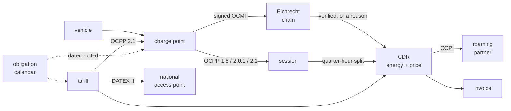

# emob

**The open-source e-mobility operating stack** — the CPO and EMP halves of a
charging business in one Rust workspace: the CSMS a station connects to, the
roaming node a partner peers with, the Eichrecht evidence chain a signed meter
value survives in, and the driver contract all of it turns into an invoice.

[](#license)

📖 **[Documentation](https://hupe1980.github.io/emob/docs/)** ·
[Getting started](https://hupe1980.github.io/emob/docs/getting-started/) ·
[The Eichrecht chain](https://hupe1980.github.io/emob/docs/eichrecht/) ·
[Architecture](https://hupe1980.github.io/emob/docs/architecture/)

> 🚧 **Status: early.** Twelve domain crates are real, tested and green —
> [`emob-core`](crates/emob-core), [`emob-eichrecht`](crates/emob-eichrecht),
> [`emob-session`](crates/emob-session), [`emob-cdr`](crates/emob-cdr),
> [`emob-tariff`](crates/emob-tariff), [`emob-ocpp`](crates/emob-ocpp),
> [`emob-poi`](crates/emob-poi), [`emob-roam`](crates/emob-roam),
> [`emob-billing`](crates/emob-billing), [`emob-thg`](crates/emob-thg),
> [`emob-service`](crates/emob-service)
> and [`emob-sim`](crates/emob-sim) — with two daemons on top of them and
> **782 tests**, an end-to-end test that drives the Open Charge Alliance's own
> OCPP example message from the wire to a taxable amount and back out again as a
> file the driver's verifier reads, records from **five** real meters this
> workspace did not write, one session that settles at the same money over three
> roaming paths, one price that reads the same to the driver at the point, the
> roaming partner and the national access point, a month that closes from the
> meter to a validated e-invoice, a SEPA collection and a balanced set of
> postings, a year that files its THG-Quote notification with every ineligible
> point refused by name, and a **hundred-station fleet run** that reconciles
> exactly.
> Everything else is designed and not yet built, and this README marks which is
> which rather than blurring the two.

## Why

Open source stops at the charging station. [CitrineOS] is a CSMS, [SteVe] is a
1.6 CSMS, [EVerest] is the station firmware. Nobody open ships the other half —
the e-mobility provider, the roaming node, the calibration-law evidence chain,
the billing — as one system that agrees with itself about what a kilowatt-hour
was worth.

That other half is what this workspace is, and it is built on protocol stacks
that already exist as siblings rather than re-implemented: [`ocpp-kit`],
[`ocpi-kit`], [`oicp-kit`], [`iso15118`], [`eebus`].



Every arrow is a place a kilowatt-hour can quietly become the wrong number.

[CitrineOS]: https://lfenergy.org/projects/citrineos/
[SteVe]: https://github.com/steve-community/steve
[EVerest]: https://everest.github.io
[`ocpp-kit`]: https://github.com/hupe1980/ocpp-kit
[`ocpi-kit`]: https://github.com/hupe1980/ocpi-kit
[`oicp-kit`]: https://github.com/hupe1980/oicp-kit
[`iso15118`]: https://github.com/hupe1980/iso15118
[`eebus`]: https://github.com/hupe1980/eebus

## The twenty-seven properties that decide quality

### A value that does not verify does not bill

German calibration law lets you bill a measured value only if the customer can
check it, long after the session — `[MessEG §33]`, `[PTB-A 50.7]`. Every closed
platform asserts this; no open one implements it. Here it is an invariant of the
type system: the only way to obtain a billable quantity is
`Evidence::billable_energy()`, and it returns `None` whenever anything is wrong.

```rust
let evidence = Evidence::assemble(&records, &registry, session_start);

match evidence.billable_energy() {
    Some(energy) => println!("bill {energy}"),        // 29.500 kWh
    None => for reason in evidence.reasons() {
        eprintln!("blocked: {reason}");                // → an operator, not an invoice
    },
}
```

Getting there means parsing OCMF **without destroying it**. The signature covers
the payload bytes as written, so a parser that deserialises and re-serialises to
verify has already lost — key order, whitespace and number formatting each
change the hash. And signatures alone cannot see a *deletion*: drop the middle
records of a session and every remaining signature still verifies, which is why
pagination and the transaction-marker chain are checked as their own question.

### …against a meter that exists

A verifier tested only against its own fixtures proves that the code agrees with
itself, which is not the question anybody is asking. So the suite also runs a
record this workspace did not write — an **eBZ LD3**, ordinary German charging
hardware, from the reference data set the S.A.F.E. Transparenzsoftware ships —
against the key it is published with:

```rust
let evidence = Evidence::assemble(&[record], &registry, session_start);

assert_eq!(evidence.billable_energy().unwrap().to_string(), "0.268 kWh");
assert!(!evidence.is_billable_for_time());   // its clock is only informative
```

It broke three things on the way in, and none of them was reachable from a
fixture this codebase produced:

- it is signed on **secp192r1**, which the build recognised and refused — so
  every session from an eBZ fleet would have been unbillable;
- its DER signature pads both integers to a fixed 24 bytes, so `r` begins `e1`
  with no sign octet and any strict parser must read it as a **negative
  number**. The signature is good; the wrapper is not, and rejecting it rejects
  a meter the reference verifier accepts;
- its register is in `Wh` and its clock status is `I`, so the energy bills to
  one watt-hour of resolution and the duration does not bill at all.

`[OCMF Tab. 22]` names seven algorithms. Four verify here, and the three that do
not each say **why** — the brainpool pair because no pure-Rust implementation
publishes usable arithmetic, secp192k1 because none is published at all. A wrong
answer is worse than no answer, so none of them is approximated.

Three more vendors' records followed, and each broke something else. A **DZG
DVH4013** signs with `s` in the high half of the curve order — which plain ECDSA
allows, `openssl` accepts and the reference verifier accepts, and `k256` refuses
because Bitcoin's malleability rule lives inside it:

```rust
verify(&dzg_record, &dzg_key)?;   // was: Err(SignatureMismatch)
```

`SignatureMismatch` is the diagnostic for *tampering*, so every session from
that meter was unbillable and the reason on the operator's queue pointed at
fraud. A self-signed fixture uses a signer that naturally produces low `s`, so a
self-signed corpus cannot contain the case, however large it is.

The same records also write `RV` as a **quoted string** padded with spaces, and
a **TwinCharger Pro** unquotes `FV` and `CT`, which the tables type as strings.
All four records were refused at the parser and all four verify in the reference
implementation. The signature covers the bytes as written, so the quoting cannot
have been altered without breaking it, and `"       9.038"` keeps its three
decimals exactly as a bare token would — so they are read, and an object where a
number belongs is still refused.

### …and the customer can repeat the check

`[MessEG §33]` does not require a measured value to be *correct*. It requires
the affected party to be able to **check** it — so a platform that verifies
internally and reports "verified" has satisfied nobody.

```rust
let xml = transparency::to_xml(&evidence);   // hand this to the driver
```

That is the container the S.A.F.E. Transparenzsoftware reads: each record
verbatim beside the public key it was checked against — the key the registry
supplied out of band, never one chosen to make the file verify. A session that
does **not** bill still gets a file, because a dispute is exactly when it
matters.

And every record of one session carries **one** `transactionId`, because that
attribute is what the verifier *groups* by rather than what it numbers records
with: its `MainView` collects `getValues(currentTransactionId)` and hands the
whole list to `verifyTransaction`, which is where the begin/end pairing and the
energy difference happen. Numbering the records instead — with the pagination
counter, the obvious choice — is schema-valid, passes every test a writer can
run against itself, and silently degrades one session into N single-record
transactions the driver's verifier cannot pair. The reference data set carries
one id across both halves, and so does this.

The same reading fixed the `context` label: a record that carries `TX=B` **and**
`TX=E` is a whole transaction rather than either half of one — which is the
shape of the eBZ reference record — so it is labelled neither, exactly as the
reference sample files leave it.

And the file reads back, because the export is only half of the duty. The other
half arrives when a driver disputes a bill and sends the file back:

```rust
for value in transparency::from_xml(&their_file)? {
    // Checked against *our* registry — never against the key the file carries,
    // which is the artefact under examination.
    let evidence = Evidence::assemble(&[value.record], &registry, session_start);
    let same_key = value.claimed_key.as_ref() == registry_key;
}
```

A reader that verified against the file's own key would prove only that whoever
wrote the file owned a private key. What the key in the file *is* good for is
the comparison: one that differs from the registered key is a dispute with an
answer, and one that matches narrows the argument to the numbers. The reader
refuses what it does not understand rather than guessing — no comments, no
CDATA, no unknown entity — because a verifier that half-understands a container
is the failure the container exists to prevent, pointed inward.

### A chain proves four things, and OCMF says which

Energy, duration, identity and **direction** are separate claims with separate
fields — `EF` marks energy and time unusable independently, `TM` states how far
the clock can be trusted, `IL` states how the user was identified, and the OBIS
code states which way the energy went. Collapsing them into one boolean throws
away the distinctions the format exists to carry.

```rust
assert_eq!(evidence.billable_energy().unwrap().to_string(), "18.000 kWh");
assert!(!evidence.is_billable_for_time());   // the clock was never synchronised
```

So a session on an unsynchronised clock has a register an invoice may use and a
duration it may not — and building a CDR for it against a per-minute occupancy
fee is refused **by name**, with the fix in the message: price it per kWh. A
signed record reporting `INVALID` — the certificate did not check out — blocks
both, because the energy was measured and there is nobody provably behind it.

An omitted field is **unchanged**, not absent — "fields that have an identical
value to the previous reading are omitted" `[OCMF Tab. 7 preamble]` is a rule
over fields, and `RI`/`TX` are its examples rather than its list. A reading that
omits `EF` after a flagged one is still flagged; reading the omission as "no
fault" would clear something the station signed.

A register from the range `[OCMF Tab. 25]` **reserves and does not define** —
`B4`–`BF`, `C4`–`C7` — blocks the energy. An unrecognised manufacturer code is
still evidence and still bills; a reserved one is a billing-relevant quantity the
specification has claimed and not published.

### The signed record also says when the car stopped charging

`[OCMF Tab. 7, TX]` defines `S` — "Suspended = Transaction active, but currently
not charging" — which is the interval `[AFIR Art. 5(4)]` prices per minute.
`evidence.suspended_intervals()` reads it, and the OCPP seam compares it against
`chargingState`, the protocol's account of the same minutes.

A **note, never a refusal**: `S` is optional, so its absence says nothing and
most of the fleet never emits one. Its presence against a contrary protocol claim
is two stories about one event, and only one of them is signed.

### Import and export never net, and now the register says so

`[OCMF Tab. 25]` reserves the OBIS range `B0`–`B3` for import and `C0`–`C3` for
export, so the signed register itself states the direction. Taking it from the
session model instead would leave the invariant asserted and never compared:

```rust
assert_eq!(evidence.direction(), Some(Direction::Export));

CdrBuilder::from_session(&session, Direction::Import)?  // …the session says draw
    .evidence(evidence_ref)
    .build()
// Err: the record claims import but the signed register measured export
//      [OCMF Tab. 25]: import and export never net, and one of the two is a
//      V2G discharge
```

A code this crate cannot classify states *no* direction rather than defaulting
to import — and the CDR is then free to claim one.

### The identifier that routes the money checks itself

A contract id ends in a digit whose only job is to catch a transcription error —
a card read wrong, a character lost in a support form, a column shifted in a
partner's export. An identifier that has lost one still parses, still routes,
and bills the session to somebody else's contract. So it is computed, not
carried:

```rust
let iso: Emaid = "NL-TNM-000122045-U".parse()?;
let packed: Emaid = "NLTNM000122045".parse()?;   // written without the digit

assert_eq!(iso, packed);                          // one contract
assert_eq!(packed.check_digit(), 'U');            // …derived, not invented
assert!("NL-TNM-000122045-X".parse::<Emaid>().is_err());
```

There are **three** grammars, not two — ISO 15118-1, EMI3, and DIN SPEC 91286,
whose instance section is six characters rather than nine — miss it and every
German RFID card carrying an EVCOID fails to parse. They are told apart by shape,
and **their check-digit algorithms are different algorithms**: a 2×2 matrix
product that catches transpositions for ISO and EMI3, a base-11 weighted sum for
DIN. Both are pinned by the vectors the reference implementations publish.

A DIN card also has an EMI3 spelling — `NL-TNM-012204-5` and
`NL-TNM-C00122045-K` are one contract written for two worlds — and the
conversion is explicit rather than implicit, because an ISO instance that merely
happens to begin `C0` would otherwise collide with a DIN contract nobody issued.

### Compliance is a query, not a consulting engagement

```rust
let report = assess(&point, date!(2027-01-01));

for finding in report.failing() {
    println!("{}  {}", finding.obligation.citation, finding.obligation.remedy);
    // [AFIR Art. 5(7)]  connect the point to a CSMS: without it neither the
    //                   data nor the smart-charging duties can be met
    // [LSV26 §4]        file the electronic Inbetriebnahme notice within two
    //                   weeks; a late filing can close the point
}
```

Forty duties from AFIR, Delegated Regulation (EU) 2025/656, LSV 2026,
MessEG/PTB-A, the THG-Quote's four preconditions and the NIS2/CRA cybersecurity
regime, each dated, cited and executable.
Two of them are paragraphs of Article 5 that compliance models simply do not
carry: **5(3)**, which the Regulation names *by number* as one of the two
paragraphs authorities must monitor `[AFIR Art. 5(6)]`, and **5(11)**, which
puts a duty on the **owner** of a point the operator does not own — the hotel,
the supermarket, the municipality whose hardware a CPO runs and cannot change.
Every duty carries its citation — `cargo xtask check-citations` fails the build
if one names a document the source index does not list — and its validity
window, so a duty cannot be applied a year before it exists.

Three of them come from `[REA 6-A]`, the Regelermittlungsausschuss's e-mobility
rulebook, and all three bind a DC station that meters on the **AC side, before
the rectifier** — a legacy arrangement in which the rectification losses sit
inside the number the customer pays for. It is permitted only below 2018 and at
most 50 kW (the same threshold as AFIR's, pointing the other way), only where
the rectification belongs to one session — which a **shared rectifier in a
multi-outlet cabinet does not** — and only if the customer is **told**. A
platform whose claim is that the customer can check the value owes them the fact
that part of it is loss.


Applicability and satisfaction stay separate questions: a private depot is not
*failing* the ad-hoc payment duty, the duty does not bind it. And **the calendar
knows who each duty binds**. `[AFIR Art. 5(5)]` binds the mobility service
provider, not the point, so it is judged against a `ProviderProfile`:

```rust
provider.surcharges_cross_border_roaming = true;
assert_eq!(assess_provider(&provider, today).verdict(), Verdict::Failing);
```

An operator whose every charge point is faultless can still be in breach as a
provider — and in Germany, where one company usually wears both hats, that is
the half nobody checks.

### …and the law binds a third subject nobody models

`[NIS2 Anh. I]` names this industry in the Energy sector by its role, in as many
words: *operators of a recharging point responsible for the management and
operation of a recharging point which provides a recharging service to end
users, including in the name and on behalf of a mobility service provider*.
Precisely the operator whose points the profile above describes — and **none of
what it asks is a fact about a point**. Size, governance, whether an early
warning can leave the building inside a day: those are facts about the
undertaking.

```rust
let report = assess_undertaking(&operator, date!(2026-09-01));
// [NIS2 Art. 21(2)]  close the measures RiskManagement::missing() names
// [NIS2 Art. 20(2)]  train the management body, and offer the same regularly
//                    to all employees
```

Seven duties: five from NIS2 — registration, the ten risk-management measures,
the 24 h early warning, the management body's approval and its training — and
two from the Cyber Resilience Act, which bind only an undertaking that places a
product with digital elements on the market. The ten measures are a
**conjunction**, because the article says the measures "shall include at least
the following": nine of ten is not ninety per cent of a duty, and
`RiskManagement::missing()` names the gaps rather than scoring them.

Two things in that regime are easy to get wrong and both are tested:

**The financial half of the size test is an `and`.** `[NIS2 Art. 2(1)]` reaches
an entity that qualifies as medium-sized under Recommendation 2003/361/EC or
exceeds those ceilings, and the Recommendation defines an SME as *fewer than 250
staff **and** (turnover ≤ €50 M **and/or** balance sheet ≤ €43 M)*. Negated, the
financial half becomes a conjunction — so an asset-light operator turning over
€60 M on a €20 M balance sheet does **not** exceed the ceilings. Every secondary
source checked writes "250 employees or €50 million turnover" and drops the
balance-sheet conjunct, which puts that operator in a class it is not in.

**A directive binds from the day the Member State transposed it.** `[NIS2 Art.
41]` told Member States to apply the rules from 18.10.2024; a directive binds
nobody directly, and Germany's NIS2UmsuCG came into force on 06.12.2025. The
calendar dates the NIS2 duties from the German day, because reporting a breach
in between would name fourteen months in which no German authority could act.
The Cyber Resilience Act beside it is a Regulation, so `[CRA Art. 71]`'s own
dates are the dates — 11.09.2026 for the reporting duty, 11.12.2027 for the
rest — in every Member State, with no transposition in between. Treating "the EU
date" as one thing is how a compliance model gets both wrong.

### The quarter-hour split conserves energy exactly

Germany's pass-through model settles a session against the quarter hours it
touched `[A6 §IV.1]`. A session running 10:01 to 10:22 crosses a boundary two
thirds of the way through, and seven kilowatt-hours times two thirds does not
terminate.

Computing each slot independently leaves a sum that misses the total, and the
usual fix shoves the remainder into the last slot — misattributing energy to
whoever held 10:15. Instead, the cumulative value at each boundary is computed
once and differences are taken, so the sum **telescopes**: every interior
boundary cancels exactly, whatever it was rounded to.

```rust
let split = split::into_quarter_hours(&series)?;
assert!(split.conserves());        // exactly, for every session
assert!(!split.fully_measured());  // …and it says when it had to interpolate
```

A test runs 144 generated sessions chosen for awkward ratios and asserts it on
every one. Interpolation assumes constant power across a gap, which a tapering
charge curve does not deliver — so the assumption travels with the number, all
the way to the partner's copy of the record.

Conservation is not the whole of it, and its strength is also its hiding place:
the sum telescopes whatever each boundary was rounded to, so an imprecise
boundary is invisible in the total and lands entirely on the supplier who held
that quarter hour. Each boundary therefore multiplies before it divides —
`delta × offset / gap`, never `delta × (offset / gap)` — which is the same rule
the rating engine follows for the same reason.

### …and the grid that settles the energy does not price the minutes

The quarter hour is where the energy settles `[A6 §IV.1]`. It is **not** where
the price changes: `[AFIR Art. 5(4)]` prices the time a vehicle is connected and
not charging *per minute*, and a vehicle stops charging when it stops charging
rather than at `:15:00`. One `charging` flag per quarter hour cannot describe the
one a charge finishes in.

```rust
let split = session.split(Direction::Import)?;   // cut at the grid and at
                                                 // the session's state changes
```

Since the sum telescopes whatever the boundaries are, an extra boundary costs
nothing. A quarter hour may then hold two slots, and `market_series()` sums them
back — the market settles a whole Messperiode against one balance group.

### The identification is read, not asked for

The signed record states how strongly the driver was identified; the session
states how it was authorised. When they disagree the one with a signature behind
it wins, and the CDR is refused rather than billed at the stronger claim's
tariff. That check is only worth anything if nobody can hand it the answer:

```rust
let evidence_ref = EvidenceRef::from_evidence(&evidence, "OCMF");
```

The strength comes off the records — the **weakest** level any of them
asserted — because a chain is only as strong as its weakest claim, and a
hand-filled field can be filled with whatever value makes the record build.

### The price shown is the price charged, and it rides on the record

A tariff has to rate a finished session *and* be displayed before one starts
`[AFIR Art. 5(4)]`. When those come from two places they drift — the screen
reads a CMS field, the invoice reads the tariff engine, one of them was
updated — and a driver is billed something other than the quote. Here
`describe()` is derived from the tariff that `rate()` reads, and the rated
result lives **on the CDR**, computed from the record's own charging periods:

```rust
let cdr = CdrBuilder::from_session(&session, Direction::Import)?
    .key(party, "cdr-1".parse()?)
    .evidence(evidence_ref)
    .rated_with(&tariff)          // priced from its own quarter hours
    .build()?;

assert_eq!(describe(&tariff, cdr.started_at).per_kwh(), Some(dec("0.49")));
assert_eq!(cdr.total_cost().unwrap().to_string(), "8.82 EUR");
assert_eq!(cdr.cost.unwrap().rated.tax().to_string(), "1.41 EUR");
```

Because the rating walks the record's periods rather than one lump total, a
tiered tariff actually tiers: "the first 10 kWh at 0.39, the rest at 0.59"
charges ten at 0.39 and the rest at 0.59, instead of retroactively repricing the
whole session the moment it crosses the threshold. **The split that conserves
energy is the input that prices it.**

Walking the periods is not enough on its own, though, because the tier boundary
then lands wherever the caller's periods happened to land. So `rate` **cuts each
period at every threshold that falls inside it** — the energy exactly at the
threshold, the time in proportion — and one session priced at seven different
granularities comes to one total:

```rust
// One period of 30 kWh, or three of ten, or ninety-six quarter hours:
assert_eq!(rate(&tiered, &session).exact_total().amount(), dec("15.70"));
```

A price that depends on how finely the session was sliced is not a price.

And which price applies is asked **per dimension**, not per period. `[OCPI 2.3.0
§Tariff]` says so in one sentence — "the first Tariff Element with a Price
Component *for that dimension* … with matching Tariff Restrictions will be
used" — and the shape that shows why is the one the specification itself
recommends, one unrestricted default element per dimension:

```rust
let tariff = Tariff { elements: vec![
    TariffElement::unrestricted(vec![PriceComponent::new(Dimension::Flat,   dec("0.50"))]),
    TariffElement::unrestricted(vec![PriceComponent::new(Dimension::Energy, dec("0.49"))]),
], ..t };

// Both are in force. Stopping at the first bills the fee and drops the energy.
assert_eq!(rate(&tariff, &session).exact_total().amount(), dec("5.40"));
```

A dimension nothing priced is not an error — the specification answers it with
"there will be no costs for that Tariff Dimension" — but it is a *quantity*, so
`RatingNote::Unpriced` carries how much of the session went unpriced rather than
only that something did.

And a tariff id is a name, so the record names the tariff by **content** too —
the same answer the evidence chain gives one layer down. A CPO that edits a
tariff in place keeps the id; a partner re-rating six weeks later gets a
different total and cannot tell an honest price change from a restated one:

```rust
assert!(cdr.was_priced_with(&tariff));   // not "does the id match"
```

`[AFIR Art. 5(4)]` also settles which *version* governs a session — the price
must be known "before they initiate a recharging session", so a CPO that raises
its price at 10:15 has not raised it for the driver who plugged in at 10:00.
`TariffHistory` is that rule, refusing overlapping versions at construction
because an instant with two prices has no rule for choosing between them.

The component order is the regulation's too: AFIR prescribes kWh, then minute,
then session, then the rest, so `Dimension` is declared in that order and
**sorting the components is complying with the article**.

And a tariff can be unlawful on its own. At 50 kW and above the ad-hoc price
"shall be based on the price per kWh", with an occupancy fee per minute allowed
only *in addition* — so the same per-minute tariff is fine on a 22 kW post and
refused on the 150 kW charger beside it.

A tariff can also be unlawful in a way that has nothing to do with its shape.
The article asks for a **price per minute**; OCPI carries time prices per hour;
and sixty has a factor of three, so an ordinary occupancy fee of €2.50 an hour
is €0.0416… a minute and has no exact decimal spelling at all:

```rust
assert!(!check_afir(&two_fifty_an_hour, dec("150")).is_lawful());
// [AFIR Art. 5(4)] asks for a price per minute, and a rounded one is not the
// price charged. Quote an hourly rate divisible by three.
```

Rounding it shows a price the tariff does not charge, which is exactly the
display-versus-bill drift this crate exists to make unrepresentable; not
rounding it shows a driver twenty-eight digits. Neither is a price "known to end
users before they initiate a recharging session", so the tariff is refused and
the remedy is in the message. €6.00 an hour is €0.10 a minute and passes.

### One price, three audiences, and the screen the article regulates

A CPO states its ad-hoc price to three parties, and each is a duty:

| Audience | Wire | Duty |
|---|---|---|
| the driver, at the point, **before** starting | OCPP 2.1 `SetDefaultTariff` | `[AFIR Art. 5(4)]` |
| the roaming partner who settles against it | OCPI 2.3.0 `Tariff` | the number two companies reconcile |
| the national access point | DATEX II `EnergyRate` | `[AFIR Art. 20(2)(c)]` |

Almost every stack computes that number three times, in three systems, and
reconciles none of them against the invoice. The failure is asymmetric: the
screen is read by the driver who pays, the feed by route planners, and the
invoice by nobody until it is disputed.

Here the three crossings read one `Tariff` — the value `rate()` charges with:

```rust
let ocpp = emob_ocpp::to_ocpp(&tariff, at)?;           // the charge point's screen
let ocpi = emob_roam::ocpi::tariff::to_ocpi(&tariff, &party, at)?;   // the partner
let (nap, _) = emob_poi::rate::publish(&tariff, "rate-1");           // the feed

assert_eq!(ocpp.value.energy.unwrap().prices[0].price_kwh.to_string(), "0.59");
assert_eq!(ocpi.value.elements[0].price_components[0].price.get(), dec("0.59"));
assert_eq!(nap.prices[0].value, dec("0.59"));
```

**The station selects the tier the invoice is built from, by construction.**
OCPI orders *elements* and picks, per dimension, the first whose restrictions
match; OCPP 2.1 orders *prices* inside each dimension and picks the first whose
conditions match. Projecting the element list per dimension, in order, is the
projection `matching_component` already performs at rating time — so the
crossing is a re-shaping and not a second implementation of "which price
applies". Had the two rules differed, the honest answer would have been to
refuse the crossing: a charge point showing a different tier from the CDR is
worse than a charge point showing nothing.

And OCPP 2.1 requires the station to **display** the tariff's own `description`,
which is `describe().full_disclosure()` — every tier with its conditions, in the
order the article prescribes. The disclosure duty and the rating travel in one
object.

The unit turns the €2.50-an-hour objection above into something sharper. OCPI's
field is per hour, so there the tariff is well-formed and merely unlawful.
**OCPP 2.1's field is `priceMinute`** — the article's own unit — so the same
tariff has no representation at all, and the crossing refuses rather than
writing a rounded figure the station would charge:

```rust
assert!(to_ocpi(&two_fifty_an_hour, &party, at).is_ok());     // OCPI has no objection
assert!(emob_ocpp::to_ocpp(&two_fifty_an_hour, at).is_err()); // the station cannot state it
```

Three more losses are refusals for the same reason — **in the driver's disfavour
and invisible in the document**: a dimension charged at two VAT rates (OCPP
carries one `taxRates` list per dimension, so the second tier would be taxed at
the first's), a session fee conditioned on a quantity (`TariffConditionsFixed`
carries the wall clock and nothing else, so publishing it stripped makes the
station charge it on *every* session), and an unevaluable restriction. What is
merely visible — a `step_size` OCPP has no field for, a `valid_until` it has no
field for, the residual a gross price leaves when the wire quotes net, the tiers
past the tenth that OCPP's ten-line `description` cannot hold — is carried with
an account. The finished document then goes through `ocpp-kit`'s own validator,
because the bounds are a list somebody maintains and the schema is the kit's to
own.

### Money is never a float, and scale is information

Every quantity here either is money or becomes money.
`cargo xtask no-floats` fails the build on an `f32` or `f64` anywhere in the
workspace — including `Decimal::from_f64`, because a float converted late is
still a float that was wrong early.

```rust
let start = Energy::from_kwh(Decimal::from_str("2935.600")?)?;
let end   = Energy::from_kwh(Decimal::from_str("2965.100")?)?;
assert_eq!((end - start)?.to_string(), "29.500 kWh");
```

Note the trailing zeros. A register reporting `2935.600 kWh` is stating three
decimals of resolution, and OCMF forbids transforming that representation "since
this would change … the number of valid digits". So scale survives every
operation — `Energy::from_wh` even converts by moving the decimal point rather
than dividing, so `29500 Wh` becomes `29.500 kWh` and not `29.5`.

The same care applies to division, and it is a rule with a **single** exception:
there isn't one. 35 minutes at €6.00 an hour is `6.00 × 2100 / 3600 = 3.50`
exactly, and `6.00 × (2100 / 3600)` is `3.4999999999999999999999999998`. Time
accumulates in whole seconds and converts once, after the multiplication — and
so does the quarter-hour split's interpolation, where a conservation proof would
otherwise make the loss invisible.

Rounding follows the currency's own minor unit rather than a hard-coded two:
ISO 4217 gives the yen none and the dinar three, and a total rounded to two
decimals in yen invents a hundredth of a unit that does not exist.

**Money is the one place scale belongs to the unit rather than the instrument**,
and it is the exception that makes the rule above coherent. `round_dp` narrows a
value that is too precise and leaves one that is not alone, so `11.90 / 1.19`
comes back as `10` and an invoice prints `10 EUR` beside `8.44 EUR` — the same
money, and a document that looks broken. A euro has two decimal places whatever
arithmetic produced the figure; a kilowatt-hour's scale is a claim the meter
made. `Money` and `Energy` are separate types for exactly that reason.

### What cannot be evaluated is not assumed open

A tariff element carrying a restriction this build does not understand — an OCPI
`reservation` condition, a partner extension — **never matches**, and the rating
says so in a note that travels with the record:

```rust
assert!(rated.reasons().any(|r| r.contains("cannot evaluate")));
```

Silently treating an unknown condition as absent applies a price under
conditions nobody checked. It is the same mistake as billing on an unverified
signature, one layer up.

### A record says what it is, and nothing is inferred back out of it

A period that moved no energy is not therefore occupancy. A car at 100 % state
of charge can leave a quarter hour at exactly `0.000 kWh` while the session's own
state machine says it was charging — and pricing that quarter hour at the
occupancy fee `[AFIR Art. 5(4)]` permits charges a driver for parking they were
told was charging. So the CDR **states** it, from the session history:

```rust
assert!(cdr.periods[1].energy.is_zero());
assert!(cdr.periods[1].charging);        // a taper, not an occupancy
```

…and the inbound pre-flight refuses a partner's record whose two halves
contradict each other. The same reasoning fixed the window: a period's start
comes from the slot's own readings, not from the quarter hour clamped to the
session, so a station that authorises at 10:00 and sends its first meter value
at 10:20 does not produce a record claiming twenty minutes of measurement that
never happened.

### The wire's numbers are telemetry, and the seam says so in the type system

OCPP carries two kinds of meter value and only one of them is money. The
numeric ones — `meterStart`, `meterStop`, `SampledValue.value` — answer whether
every event arrived and how the site is behaving. The signed one is a
`SignedMeterValueType` carrying an OCMF data set, and it is the only thing that
becomes a billed kilowatt-hour.

Being exact is not the same as being billable, and conflating the two is the
mistake this seam exists to prevent. `ocpp-kit` 0.2 made every OCPP number an
exact decimal — its ledger's `meter_wh` is an `Option<Decimal>`, so nothing on
the wire loses a digit to a binary float any more. That closes one failure and
leaves the other exactly where it was: an exact `108814` is still the meter's
*lifetime* register, and billing it is still wrong by a factor of a hundred and
seventy.

[`emob-ocpp`](crates/emob-ocpp) makes that structural rather than remembered:
**its input vocabulary has no numeric meter value in it at all.** There is no
field a float could arrive in, so there is no path from one to a `Cdr`.

The Open Charge Alliance's own example message is the argument. Its `meterStop`
is `108814` — the meter's *lifetime* register in watt-hours — while the
transaction's signed difference is `0.636 kWh`:

```rust
let assembled = transaction.assemble(Direction::Import)?;
let evidence  = Evidence::assemble(&assembled.records, &registry, started);

assert_eq!(evidence.billable_energy().unwrap().to_string(), "0.636 kWh");
```

A CSMS billing the protocol's number would bill a figure nothing signed, from a
register that is not the session's, and be out by a factor of a hundred and
seventy `[OCA SMV §5.2]`.

And that is not a claim about a fixture. [`csmsd`](services/csmsd) runs a real
`ocpp-kit` station against a real `ocpp-kit` CSMS over a real TCP WebSocket, the
station sends that exact message, and the record that comes out the other end
bills the signed difference:

```rust
// meterStop on the wire: 108814 Wh of lifetime register.
assert_eq!(outcome, Outcome::Settled { energy: "0.636 kWh".into(), .. });
```

Getting there means unwrapping three envelopes, each a place implementations go
wrong. OCPP 2.x has a field for a `SignedMeterValueType`; **1.6 serialises the
whole object into the `value` string** of a `SampledValue` whose `format` is
`SignedData` — a string holding JSON holding base64 holding the record. And the
`publicKey` beside it is not key bytes: `[OCA SMV §3.2.2]` specifies base64 over
`oca:base16:asn1:<hex>`, whose last component is the key *as printed on the
cabinet* so a customer can compare the two, with non-hex characters to be
ignored. The same document's example message then sends base64 over plain hex
with no envelope, so both are read — a reader that implemented only the
specification would reject the specification's own example.

It is a claim either way. A key arriving on the same socket as the record it
signs proves only that whoever holds that socket owns a private key, so the key
that decides anything still comes from the registry, out of band.

None of that unwrapping lives in this workspace any more. It is spec knowledge
every OCPP CSMS doing Eichrecht has to reimplement, which is the definition of
something belonging in the protocol kit — so it was filed upstream, and
[`ocpp-kit`](https://github.com/hupe1980/ocpp-kit) absorbed it. `emob-ocpp` lost
sixty per cent of its lines and kept the part that is actually Eichrecht. It is
still a crate rather than a module for a reason the shrinking made clearer:
folding it into `emob-cdr` would put `ocpp-kit` in the dependency graph of every
crate that decides money, and today the five that do build with no protocol
implementation anywhere in their tree.

And a **retry is not a reading**. OCPP transports retry; the same signed record
arrives twice carrying the same pagination counter, because the meter produced
one. A CSMS that appends both hands the chain a `PaginationBreak` — a transport
retry reported as a missing record, on a session that is intact. Records are
de-duplicated by the digest of the bytes their signature covers, and
`duplicates_dropped` says how often the link retried.

### A record two companies hold is one they can both read

A CDR is a claim sent to somebody who was not there and who will pay against it,
so what leaves this process has to be legible to them:

```json
{
  "started_at": "2026-01-02T10:00:00+01:00",
  "periods": [
    { "quarter_hour": "2026-01-02T10:00:00+01:00", "energy": "9.000" }
  ],
  "total_energy": "18.000",
  "cost": { "rated": { "currency": "EUR" } }
}
```

None of that is what the types produced by default. `time`'s own `Serialize`
writes an instant as `[2026, 2, 10, 0, 0, 0, 1, 0, 0]` — a nine-element array of
its internal fields, with a *date* as `[year, ordinal]` — and a three-byte
currency newtype writes `[69, 85, 82]`. Both round-trip through this codebase
perfectly, which is exactly why a test that serialises and deserialises passes
without noticing: the wire format was never the thing being checked.

Two things are wrong with it. Every wire this stack meets — OCPI, OCPP, OICP,
EN 16931 — writes an instant as RFC 3339 and a currency as its ISO 4217 code, so
a partner could not read the record at all. And the shape is a dependency's
private business: nothing promises it survives a `time` release, so a settlement
archive written by one version and read by another is a dispute with no answer.
The tariff fingerprint refuses to let `time` format anything it hashes, for that
reason; the wire carries the same exposure and needs the same defence.

So every date, instant and duration goes out through one module that pins the
spelling, and the test asserts the **shape** rather than the round trip:

```rust
assert!(!json.contains("[2026,"));   // nothing in a form only we can read
```

### The price on the map is the price on the invoice

`[AFIR Art. 5(2)]` makes the price a driver is shown before a session the price
they may be charged for it. `[AFIR Art. 20(2)(c)]` makes that same ad-hoc price
data the operator must publish, free of charge, through the national access
point — the Mobilithek in Germany, in the DATEX II Recharging profile, from
**14 April 2026** `[DATEX-II-Profil]`.

Two duties about one number. Almost every stack in this market computes it
twice: once in the billing system that rates the CDR, and once in the export job
that fills the feed. Two computations is two chances to be wrong, and the
failure is asymmetric — a feed is read by route planners and comparison sites,
and nobody ever reconciles it against an invoice.

So [`emob-poi`](crates/emob-poi) has no price model. It publishes the
`emob-tariff` value that rates the session, exact decimal from the tariff to the
JSON number:

```rust
let (rate, notes) = emob_poi::rate::publish(&tariff, "rate-1");
// "value": 0.49, "taxRate": 19 — the same numbers the CDR is priced with.
```

**Two things AFIR requires and the profile it requires cannot say.** The whole
price vocabulary of `[DATEX-II-Profil Tab. A.116]` is `basePrice`, `flatRate`,
`free`, `other`, `pricePerKWh` and `pricePerMinute`. There is no per-hour type,
so an hourly tariff divides by sixty — publishing the hourly figure under
`pricePerMinute` overstates it sixtyfold, and `0.25` an hour does not divide
exactly. And there is no occupancy type at all, though `[AFIR Art. 5(4)]`
permits that fee by name above 50 kW; the profile's only hook is a **boolean**
saying whether charging and parking are one fee. Both go out as the nearest true
statement the vocabulary allows, with the exact figure beside them, and both
raise a note rather than being rounded away in silence.

**And one thing the profile *can* say, which is easy to leave unsaid.** A tiered
tariff publishes two prices per kWh, and a price published without the band it
applies in reads as unconditional — a route planner shows the first tier as *the*
price. `EnergyPrice` carries `energyBasedApplicability` and
`timeBasedApplicability`, so the band goes out with the price; the only catch is
that their bounds are whole integers and a tariff's thresholds are not. A lower
bound rounds **up** and an upper bound rounds **down**, so the published band is
a subset of the real one and no statement in the document is false:

```rust
// A tier from 10.5 kWh. `fromKWh: 10` would claim it applies over [10, 10.5).
assert_eq!(published.prices[1].energy_applicability.unwrap().from_kwh, Some(11));
// …and the figure that had to move travels in a note.
```

**The register decides what the feed may say.** `[LSV26 §4(1)]` makes
commissioning, decommissioning and an operator change notifiable, so an operator
meeting its duty knows which state every point is in. A point the register knows
is decommissioned cannot be published as `available`, because the type that
carries a status has no constructor for that pair. It is the commonest defect in
European charging data and a schema validator cannot see it.

**A dangling reference is worse than an invalid document.** The dynamic
publication carries no infrastructure: every object in it is a `versionG`
reference into the static one, sent separately, usually by a different job. A
reference that does not resolve is *dropped* by the consumer, not rejected — so
bumping a version in one job and not the other takes a charger off every map
with no error anywhere. Both publications are built from one inventory.

There is no XSD in the profile release, so the test is the profile's **own
published example**: every JSON path the crate emits is one the Mobilithek's
reference instance contains, with array indices collapsed so a path names a
shape. A misspelled key, a level of nesting too few, an attribute hung on the
wrong class — all of them fail there.

### A hundred stations, and nothing unaccounted for

A verifier tested against its own fixtures proves the code agrees with itself.
A *fleet* tested the same way proves nothing at all — so
[`emob-sim`](crates/emob-sim) runs a reference day and asserts the one thing a
silent failure cannot satisfy:

```rust
let outcome = ReferenceDay::builder()
    .stations(100)
    .sessions_per_station(4)
    .faults(FaultPlan::everything(Rate::one_in(9)))
    .build()
    .run();

// 400 sessions: 197 settled (8969.120 kWh), 203 refused (9555.738 kWh),
//               metered 18524.858 kWh
assert!(outcome.reconciles());              // billed + refused == metered, exactly
assert!(outcome.every_refusal_has_a_reason());
```

The assertion is **not** "everything billed". It is that every kilowatt-hour a
meter moved either reached a settled record or was refused with a reason —
`Σ allocated + residual = total` over a day rather than a session. A run
asserting "no errors" would pass by throwing sessions away.

The stations are imaginary; their **signatures are not**. Every session is
signed with a real ECDSA key over the real payload bytes, verified through the
real verifier, split on the real settlement grid, priced by the real rating
engine and accepted by the real ledger. Eight faults are seeded — a substitute
reading, a dropped record, a tampered byte, an unsynchronised clock, an export
register billed as a draw, a `TX=X` exception, an unregistered station, and a
**tariff the post may not offer** — and the run asserts that **each one is
actually exercised**, because a fleet that exercises only the rules somebody
remembered to list is a fleet that drifts.

The eighth is the one that is nothing to do with the meter, and it is why the
fleet now carries a rated power: half the posts are 22 kW and half are 150 kW,
and a per-minute-only tariff is an ordinary product on the first and unlawful on
the second `[AFIR Art. 5(4)]`. Seven metering faults never once ran the shape
gate — the energy was measured perfectly, every signature held, and the session
was priced with a tariff the operator may not offer.

One seed is one day, with no clock and no entropy source, so a failing run is
reproduced from its seed alone.

### A crossing has a cost, and the record says what it was

A CDR sent to a partner has to survive a translation, and a `From` impl makes
every one of those decisions once, silently, at the moment nobody is looking.
The consequence surfaces six weeks later as two companies holding two different
numbers for one session, with nothing in either document explaining the gap. So
[`emob-roam`](crates/emob-roam) returns the value **and the account**, by JSON
Pointer into the document the partner will be reading:

```rust
let crossing = emob_roam::ocpi::cdr::to_ocpi(&cdr, partner, &context)?;
```

The first entry is arithmetic this workspace has met before. OCPI carries
`total_time` and every period's `TIME` in **hours**, and `3600 = 2⁴ · 3² · 5²` —
only the twos and fives divide out, so a duration has an exact decimal spelling
exactly when nine divides its seconds. Twenty-one minutes does: `0.35`. Twenty
does not. It is the same factor of three that makes an occupancy fee of €2.50 an
hour unlawful `[AFIR Art. 5(4)]`, one layer out — and it bites here because the
money on the record was computed from whole seconds, so a partner re-deriving it
from the rounded figure gets a different number and no document says why.

The quarter-hour grid this workspace settles on is always exact, which is
precisely why the failure is invisible until a session starts or stops between
two boundaries. Which is every session.

**Some crossings are not a cost but a falsehood, and those are refused.** OCPI's
`ENERGY_EXPORT` is marked *Session Only* and a CDR's `total_energy` carries no
sign, so a V2G discharge arrives at the provider as an ordinary draw and the
settlement runs backwards — the provider paying for energy the driver supplied:

```rust
to_ocpi(&discharge, partner, &context)
// Err: ENERGY_EXPORT is Session-only and `total_energy` has no sign, so the
//      partner would read 3.400 kWh as a draw and pay the wrong way round
```

Import and export never net, enforced one layer down against the OBIS code the
meter signed; a translation that quietly re-signed one as the other would be
that invariant broken at the last possible moment, by us. An **unrated** record
is refused for the same reason — `total_cost` is required and the specification
gives the placeholder its own meaning, *"0.00 means free of charge"*, so sending
zero answers the question permanently in the partner's favour. And so is a
tariff element carrying a restriction this build cannot evaluate: dropping it
does not narrow the element, it **widens** it, and the partner then prices the
session under conditions nobody checked.

The same shape catches a **price bound**. OCPI's `min_price`/`max_price` bound
the session's cost *before taxes*, and the field is mandatory — so writing a
gross tariff's own figure into it publishes a minimum the partner enforces a VAT
rate too high, against the driver, out of a document this operator signed off.
The bound is converted at the rate the tariff's components carry. Where they
state **none** there is no tax to strip and the two figures are one number —
which is what the rating engine has always done with an absent rate. Only where
they state *different* rates is the bound refused: there is no single pre-tax
figure, and inventing one is the failure.

**And the record comes back.** A crossing that only goes one way makes this
workspace the billing side of a roaming relationship and never the paying one.
`from_ocpi` reads a partner's CDR into the canonical model, and the property is
the round trip — the document this crate writes is one it can read, with the
same key, window, periods and energy at the far end:

```rust
// The receiver verifies the payloads against **its own** registry, never the
// key inside the document, and only then reads the record in.
let theirs = Evidence::assemble(&records, &my_registry, started_at);
let back = from_ocpi(&wire, Some(EvidenceRef::from_evidence(&theirs, "OCMF")))?;

assert_eq!(back.value.cdr.total_energy, original.total_energy);
assert!(validate(&back.value.cdr).is_settleable());
```

What OCPI cannot carry is named rather than restored: a period's end comes from
the next period's start, every period comes back **interpolated** because
nothing states a provenance, and `charging` is read off the `TIME` and
`PARKING_TIME` dimensions — with a period that states neither *reported*, since
the only fallback left is the inference the canonical model refuses.

The cost does not come back at all. A canonical price carries one line per
distinct price, each reproducing its own amount; OCPI carries totals. Rebuilding
one means inventing the numbers that make it add up, and the pre-flight would
then be checking a document *this* crate wrote. So the record arrives unpriced
with the partner's figure beside it, and an eMSP re-rates and compares — which
is what an eMSP does anyway.

**Routing is a question the identifier already answers.** `DE-ABC-C00122045-6`
names its issuer in its first five characters — the party that holds the driver
and will pay. Most platforms route settlement off a hand-maintained map from
something else, and that map is where money goes to the wrong company:

```rust
registry.route(&"NL-TNM-C00122045-K".parse()?);   // Reach::Direct(NL*TNM)
registry.route(&"FR-XYZ-C00000001-4".parse()?);   // Reach::Hub { issuer: FR*XYZ }
```

A direct peer beats a hub, because a hub decides the recipient and the CPO gives
up knowing who settled. And the prefix is the default rather than the rule —
OCPI says outright that a party id has no direct link with the contract's
issuer — so an acquired partner declares its namespaces and the declaration
wins.

The check digit is verified **here**, because here is the last place anybody
looks: once the record is at the eMSP an id that lost a character still parses,
still routes, and bills somebody else's contract, and the CPO has already been
paid. `ocpi-kit` parses the digit without checking it, which is right for a wire
library — a peer's malformed id must still decode, or one bad record poisons a
page — and `emob-core` knows all three grammars and both algorithms.

The token carrying that id is an **argument** rather than a field on the CDR,
and that is a design rather than an omission. `emob-session` refuses to store a
raw token UID — it keeps a keyed hash — because a UID is a lifelong identifier
of a physical object a person carries. OCPI requires the real thing. So the
party holding the mapping presents it at the edge that has to send it, and the
CDR cannot leak what it never had.

One genuinely signed session goes out over three paths — self-roaming, OCPI
2.3.0, OCPI 2.2.1 — and settles at the same money on each; the signed records
arrive verbatim and re-verify at the far end against the *receiver's* registry,
never against the key the document carries.

**And the account is one vocabulary, not three.** `Crossing<T>` and its
pointer-addressed `Note` live in `emob-core`, beside the settlement grid, for
the same reason that type is there: three seams now owe one. OCPI, the DATEX II
national access point feed and OCPP 2.1's tariff answer the same question, and a
partner reading what a version downgrade cost and an operator reading what a
charge point's screen cannot show should be reading the same kind of sentence.

### The rounding happens once, and the document says what it cost

An invoice amount is a figure in a currency's minor unit; a rated line is exact
and unrounded. Somewhere between the meter and the document a number gets
rounded, and where it happens is not a style question.

EN 16931 states its totals as sums of the **line** amounts — `BT-106 = Σ BT-131`,
and per VAT category `BT-116 = Σ BT-131`. Both are sums of already-rounded
figures, so the rounding has to happen at the line or the document cannot satisfy
both at once. Rounding per category and apportioning back to lines produces an
invoice whose own lines do not add up to its own subtotals, which is the first
thing every validator in this space checks.

That means the document's taxable amount need not equal what the records came to
exactly — at most a minor unit per line, and real money. So it gets the treatment
the rest of this workspace gives an inexact crossing:

```rust
let crossing = InvoiceBuilder::new("R-2026-0001", issued, period, cpo, driver)
    .supplied_from("DE", dec("19"))
    .ledger(&ledger)          // `live`, never `iter` — a correction is a new record
    .due_on(due)
    .build()?;

assert!(crossing.value.reconciles());          // its subtotals reproduce its lines
crossing.value.rounding_residual();            // …and what that cost, exactly
for reason in crossing.reasons() { … }         // named per record, by JSON Pointer
```

The tax follows from the *rounded* taxable amount, by the standard's own rule, so
that residual is the whole of what the document approximates. A tiered session
keeps its tiers, because a tiered invoice has to show them.

And the verdict is the deliverable, not the XML. `to_en16931` returns the
semantic document **and** its report; `xrechnung` will not hand back a document
its profile rejects, because `Validated<XRechnung>` cannot be constructed from an
invalid invoice — the same discipline `Evidence::billable_energy` applies to a
kilowatt-hour one layer down. `BR-CO-25` — something is owed, so say when — is
asked at construction instead, because the answer is a commercial term the caller
holds and this crate reads no clock to invent one.

Nothing here reads a clock at all, which matters more than usual: `sepa` defaults
a collection date and a message timestamp off the system clock, and a collection
file that differs between two runs of one billing job is a file no bank
reconciles. Every one of those fields is an argument, and a test asserts the same
inputs produce the same bytes.

### A roaming settlement is not taxed where the charge point stands

Recharging an EV is a single composite supply of **goods** — the electricity —
which the Court of Justice settled in C-282/22. `[UStG §3g]` then says a supply
of electricity **to a reseller** is made where that reseller is established, and
an e-mobility provider buying sessions through roaming is exactly a reseller: it
does not consume the electricity, it resells it.

So a German CPO settling with a French eMSP is not making a German supply. The
place of supply is France, German VAT does not arise, and the invoice states the
reverse charge with the partner's own identifier on it `[UStG §13b]`:

```rust
let treatment = TaxTreatment::decide(&cpo.tax, &emsp.tax, "DE", dec("19"))?;
assert_eq!(treatment.category, VatCategory::ReverseCharge);
assert_eq!(treatment.place_of_supply, "FR");
```

Putting 19 % on that invoice charges tax that may not be charged and that the
partner cannot reclaim. The ad-hoc leg does not share the rule — a driver paying
at the point is not a reseller — so **two sessions at one post a minute apart can
carry different VAT**, which is why the treatment is decided per invoice from the
parties and not per station from a configuration field.

A cross-border reverse charge with a VAT identifier missing on either side is
refused, naming the party that has none. EN 16931's `BR-AE-2` and `BR-AE-3`
refuse that document anyway; refusing it where the rule lives means the message
names the missing identifier instead of a rule id.

And the books agree with the document. Under a reverse charge there is **no VAT
posting**, because the liability is the recipient's — a platform that posts 19 %
and omits it from the invoice has a VAT return that reconciles against nothing it
sent. The postings are addressed by *role* rather than by account number, because
SKR03 and SKR04 disagree about the numbers and a chart of accounts is not a
domain crate's business.

### A valid token is not permission to read somebody else's session

A roaming node holds several companies' sessions in one process, and its worst
failure is not losing one. It is serving party A's CDRs to party B — a
competitor's charging volumes, its tariffs and its drivers' movements — out of an
endpoint that answered a perfectly good credential.

A reverse proxy cannot catch that, because the proxy does not know which party
owns a record. Ownership is a field on the record, so the check lives where that
field is in scope:

```rust
let peer = Principal::peer(theirs, Role::Emsp, Capabilities::of([caps::CDR_READ]));

peer.may_act_for(caps::CDR_READ, &theirs);   // true
peer.may_act_for(caps::CDR_READ, &ours);     // false — valid token, somebody else's record
peer.may_act_for(caps::CDR_WRITE, &theirs);  // false — reaching it is not writing it
```

Three questions kept apart — **who** (a constant-time token comparison), **what**
(a capability set) and **whose records** (a party scope) — because collapsing any
two is how every roaming leak has happened.

Capabilities rather than roles, because an agent has to be able to hold *less*
than the operator it acts for: `Role::Cpo` delegated to an agent is still
`Role::Cpo`, while a capability set delegated is a subset, and `attenuate`
returns `None` rather than clamping when a request would widen either axis. Two
pattern forms and no more — `emob.cdr.read` or `emob.cdr.*` — because attenuation
has to be decidable by containment, and the wildcard widens at a **segment**
boundary, so `emob.cdr.*` does not admit `emob.cdrs.read`.

An empty grant permits nothing. An empty readiness set is not ready. A webhook
verifier with no secret rejects. The state a misconfiguration falls into is the
safe one, because the deployment where somebody forgot is exactly the one nobody
would notice.

### An agent proposes; it cannot move money, and that is a property

`agentd` answers the question no single domain call can: not *is this chain
sound* but *of four hundred refusals overnight, is that four hundred support
tickets or one meter*.

```text
[evidence-triage] BQ27400330016: the meter was in state Substitute at record 2,
                  which may not be billed
                  (3800.000 kWh at risk across 380) — a device fault rather than
                  a dispute: raise it with the station vendor…
```

The same shape for tariffs: `check_afir` decides whether one tariff is lawful at
one power, and what it cannot say is that the **same** tariff is an ordinary
product on the 22 kW posts and a breach on the two 150 kW cabinets beside them —
because `[AFIR Art. 5(4)]` binds a tariff at the power the point offers it at,
and no tariff document says which points those are.

"Advisory only" used to be a sentence in a design note. Two things make it
structural: the output type is a **leaf** — nothing in the workspace consumes an
`Advice`, so there is no path from an agent's answer into a document — and a
specialist's principal comes from `attenuate`, so no agent principal can hold a
capability that writes, and a test asserts every write case.

The specialists are deterministic functions; none calls a model. What the runtime
provides for one is not inference but the **journal**: the run, its input, its
answer and every effect in an append-only hash-chained log, with a replay that
re-executes the logic and reads each effect back rather than performing it again.
"Why did the queue say that in March" becomes a replay instead of an argument.

### Notified is not published, and the quota turns on the difference

A public kilowatt-hour is worth money twice — once from the driver, once from a
fuel supplier that has to reduce the emissions of what it sells. `[38k §6(3)]`
states **four cumulative conditions** between the two, and failing any of them
is invisible: the point charges, the session bills, the money arrives, and the
quota does not. The operator finds out a year later, about energy nobody can go
back and measure differently.

The condition most implementations get wrong is the first. It asks whether the
regulator has **published** the notified point, or the third party has
**consented** to publication — not whether the Anzeige was made. Those are
different facts from different regulations: `[LSV26 §4(1)]` requires the notice
and says nothing about publication, so reading eligibility off the notice date
passes every point in a compliant estate.

```rust
point.registration = Registration::notified_on(date!(2025 - 03 - 10));
point.quota.publication = RegisterPublication::Withheld;      // not eligible
point.quota.publication = RegisterPublication::ConsentGiven;  // eligible
```

So a point that fails one is a refusal that names the remedy, rather than a line
quietly missing from a file:

```text
DEABCE00042 is not eligible: publish the register entry or consent to its
publication, sign the conformity declaration the authority provides, and obtain
an operator identification code — or forgo the quota
```

Only energy a meter signed reaches the notification, because Nr. 2 asks for
exactly what `emob-eichrecht` already decided. And none of `[38k §5(3)]`'s three
factors is a constant: the counting factor steps down in 2035 and 2036, Anlage 3
is a three-row table, and the average emissions value is **announced in the
Bundesanzeiger by 31 October for the following obligation year** — so it is an
argument, carried with the notice it came from.

## Layout

| Crate | What it holds | State |
|---|---|---|
| [`emob-core`](crates/emob-core) | Identifiers in both grammars, text-preserving; exact energy and money; the settlement grid; the charge-point, provider **and undertaking** profiles; the obligation calendar over all three; and `Crossing`, the account a value owes when it is carried onto somebody else's wire | ✅ |
| [`emob-eichrecht`](crates/emob-eichrecht) | OCMF parse/verify on four curves, the key registry, the four-quantity session chain, the evidence record, the transparency file | ✅ |
| [`emob-session`](crates/emob-session) | Authorisation paths, cumulative meter series, the timestamped state machine, and the quarter-hour split | ✅ |
| [`emob-cdr`](crates/emob-cdr) | The record, its price, idempotent acceptance, pre-flight validation | ✅ |
| [`emob-tariff`](crates/emob-tariff) | Period-based rating with tiers and VAT, the display derived from it, the AFIR shape check, validity windows and a content fingerprint — one object, read by the invoice, the driver's screen, the roaming partner and the national access point | ✅ |
| [`emob-ocpp`](crates/emob-ocpp) | The OCPP seam, both ways: signed meter values lifted out of transaction events with no field a float could arrive in, and the tariff carried onto OCPP 2.1's *Tariff and Cost* block so the price on the station's screen is the object that rates the CDR | ✅ |
| [`emob-poi`](crates/emob-poi) | The register and the national access point feed: DATEX II AFIR Recharging, with the published price carried from the tariff that rates the session | ✅ |
| [`emob-roam`](crates/emob-roam) | The roaming edge: the canonical record onto OCPI 2.3.0 and 2.2.1 with the crossing's cost by JSON Pointer, and routing read out of the contract identifier itself. OICP and eMIP are still 📐 | ✅ |
| [`emob-sim`](crates/emob-sim) | A deterministic fleet: virtual stations that sign genuine OCMF, eight seeded faults, and a day that reconciles exactly — assembled from OCPP events | ✅ |
| `emob-pnc` | Plug & Charge contracts, OPCP pools, multi-PKI | 📐 |
| `emob-smart` | Load management, OCPP charging profiles, DER control, § 14a guard, V2G | 📐 |
| [`emob-thg`](crates/emob-thg) | The greenhouse-gas quota: `[38k §6(3)]`'s four conditions per point, and a notification built only from energy a meter signed. Notified is not published, and no factor is a constant | ✅ |
| [`emob-billing`](crates/emob-billing) | Rated CDRs → an EN 16931 e-invoice and the verdict on it, a SEPA collection, and postings addressed by role. The rounding happens once, at the line, and the residual is reported | ✅ |
| [`emob-service`](crates/emob-service) | The daemon shell, and the three parts of it that are about charging: an OCPI-party authority model, the CloudEvents catalogue, one webhook signature | ✅ |

| Service | What it does | State |
|---|---|---|
| [`csmsd`](services/csmsd) | The CSMS a station connects to: OCPP 1.6J/2.0.1/2.1 on `ocpp-kit` transport, the two ledgers side by side, the chain from a signed value to a settled record | ✅ |
| [`agentd`](services/agentd) | The advisory plane on `agentplane` — specialists that correlate across many exact answers, and cannot move money by construction | ✅ |
| `roamd`, `empd`, `pncd`, `poid`, `tarifd`, `billd`, `opsd`, `sited` | | 📐 |

`emob-roam` is the one crate whose MSRV is not the workspace's. Everything that
decides money promises **1.94**, which is the floor the sibling workspaces
(`mako`, `hems`) carry and consume; `ocpi-kit` asks for 1.96, and raising the
shared floor to take one wire would make every downstream pay for a protocol it
does not use. `just msrv` checks the promise where it is made rather than
asserting one number for everything.

`csmsd` is deliberately the thinnest thing in the repository. Everything about
the OCPP seam that could be *wrong* lives in `emob-ocpp` and is tested there
against the Open Charge Alliance's own example messages; what is left is
sockets, routing and bookkeeping. A daemon is the worst place to keep a rule,
because CI does not run it.

## Development

```console
just            # list every recipe
just ci         # fmt, clippy, purity, tests, guards, deny, docs
just test       # cargo test --workspace --all-features
just guards     # no-floats, check-citations, check-manifests
just purity     # no clock, no I/O, no unsafe in the domain crates
just msrv       # the crates that promise 1.94 still build on 1.94
```

The domain crates take time and keys as arguments and never read a clock, so a
dispute about a two-year-old session is replayed exactly as it happened — and
`just purity` fails the build if that stops being true.

### Releasing

`just release-check` packages every publishable crate in dependency order and
builds each from its own tarball. Pushing a `vX.Y.Z` tag runs
[`release.yml`](.github/workflows/release.yml), which re-runs the whole gate
against the tagged revision, refuses a tag whose version the manifests do not
carry, and then publishes the nine crates one step at a time in dependency
order.

A publish is nine uploads and can stop in the middle, leaving the version spent
for some crates and free for the rest — so each step treats *already uploaded* as
the upload having already happened, and a re-run finishes the release instead of
needing a version bump. Every other failure still stops the run.

It needs a `CARGO_REGISTRY_TOKEN` secret on a `crates-io` environment, which is
also where a required reviewer goes: a version number is spent the moment
crates.io accepts it.

## Sources

Every regulatory claim in the code cites a document, section and page from
`specs/`, which is gitignored (the documents are third-party and copyrighted)
and indexed with retrieval URLs in `specs/README.md`, so the corpus can be
rebuilt from a fresh clone.

The rules are read from the primary text, and a surprising number of them turn
on a reading the summaries get wrong: a renovation that is not a deployment, an
exemption that is a date rather than a technology, a paragraph that limits its
first two subparagraphs and not its third, an SME threshold whose financial half
is an `and` where every restatement writes `or`.

## License

MIT OR Apache-2.0, at your option.
