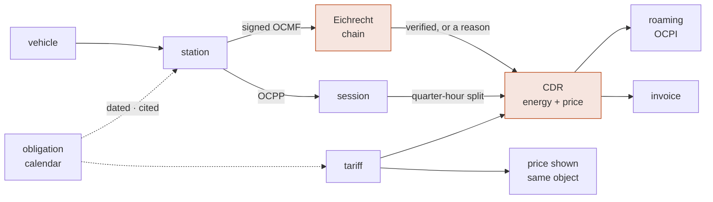

+++
title = "emob"
template = "index.html"
description = "The open-source e-mobility operating stack: CPO and EMP in one Rust workspace. OCMF signed meter values verified end to end, a quarter-hour split that conserves energy exactly, AFIR and Eichrecht as executable cited rules, and no binary float anywhere near the money."
+++

Someone plugs in a car. Four minutes later a number exists that two companies
will settle against, a tax authority may examine, and a driver may dispute two
years from now. Between the plug and that number sit a meter under calibration
law, a station protocol, a roaming hub, a tariff, and a dozen European duties
with dates attached.

Most charging platforms treat that chain as plumbing. emob treats it as the
product.



Every arrow is a place a kilowatt-hour can quietly become the wrong number. The
pages below are mostly about the arrows.

## Evidence you can defend two years later

<div class="cards">
<div class="card"><h3>A value that does not verify does not bill</h3><p>German law lets you invoice a measured value only if the customer can check it, long after the session. Here that is a property of the type system: the only route to a billable quantity returns nothing at all when anything is wrong — a bad signature, an unregistered key, a substitute reading, a deleted record.</p></div>
<div class="card"><h3>Parsed without being destroyed</h3><p>An OCMF signature covers the payload bytes <em>as written</em>. A parser that deserialises and re-serialises to verify has already lost: key order, whitespace and number formatting each change the hash. This one keeps the raw span, so “the signature holds” means what it says.</p></div>
<div class="card"><h3>Signatures cannot see a deletion</h3><p>Drop the middle records of a charging session and every remaining signature still verifies. The specification assigns that check to a separate component — contiguous pagination, a begin marker, an end marker — and so does this workspace, as its own question with its own answer.</p></div>
<div class="card"><h3>A chain proves four things</h3><p>Energy, duration, identity and direction are separate claims with separate fields. A session on an unsynchronised clock has a register an invoice may use and a duration it may not — so a per-kWh tariff bills it and a per-minute occupancy fee is refused by name. A record reporting that the certificate did not check out blocks both: the energy was measured, and there is nobody provably behind it.</p></div>
<div class="card"><h3>Import and export never net, and the register says so</h3><p>OCMF reserves an OBIS range that states which way a register measured — <code>B*</code> drawn, <code>C*</code> fed back. Carrying that as an opaque string and taking the direction from somewhere else is how a V2G discharge gets billed as consumption with nothing downstream noticing. Here the code is read, and a record that claims the other direction is refused.</p></div>
<div class="card"><h3>The customer can repeat the check</h3><p>German law does not require a measured value to be <em>correct</em>. It requires the affected party to be able to <strong>check</strong> it — so a platform that verifies internally and reports “verified” has satisfied nobody. The deliverable is a file the independent S.A.F.E. verifier reads: each record verbatim beside the key it was checked against, and emitted whether or not the session bills, because a dispute is exactly when it matters.</p></div>
</div>

## Arithmetic that adds up

<div class="cards">
<div class="card"><h3>Money is never a float</h3><p>Every quantity here either is money or becomes money. A build guard fails on an <code>f32</code> or <code>f64</code> anywhere — including a late <code>from_f64</code>, because a float converted at the boundary is still a float that was wrong at the source.</p></div>
<div class="card"><h3>Scale is a claim about accuracy</h3><p>A register reporting <code>2935.600 kWh</code> is stating three decimals of resolution. Rewriting it as <code>2935.6</code> discards something the meter said about itself — which OCMF forbids in as many words. Nothing here strips a trailing zero, and even <code>Wh → kWh</code> moves the point rather than dividing.</p></div>
<div class="card"><h3>The quarter-hour split conserves exactly</h3><p>A session from 10:01 to 10:22 must be settled against two quarter hours, and the boundary falls two thirds of the way through. Computing each slot independently leaves a sum that misses the total, and the usual fix shoves the remainder into the last slot — misattributing energy to whoever held it. Taking differences of cumulative boundaries makes the sum telescope instead: exact, always, whatever the ratio.</p></div>
<div class="card"><h3>The split that conserves is the input that prices</h3><p>“The first 10 kWh at 0.39, the rest at 0.59” is a condition on how much has been delivered <em>so far</em>. Rated against the session total instead, a 30 kWh session reprices all thirty at 0.59 — including the ten the driver was quoted at 0.39. Rating walks the record’s own quarter hours, so the arithmetic that settles the energy is the arithmetic that prices it — and it cuts a period wherever a threshold falls inside it, the wall clock included, so a night rate that begins at 22:00 begins at 22:00 however the session was sliced.</p></div>
<div class="card"><h3>The price shown is the price charged</h3><p>A tariff has to rate a session and be displayed before it starts. When those come from two places they drift, and a driver is billed something other than what they were quoted. Here the description is <em>derived from</em> the tariff that rates — one set of numbers, and the same predicate picks the element, so there is nothing to drift from. And a per-minute-only tariff, lawful on a 22 kW post, is refused on the 150 kW charger beside it.</p></div>
</div>

## A rulebook the code actually consults

<div class="cards">
<div class="card"><h3>Compliance is a query</h3><p>“Are we AFIR-ready for 2027?” is normally a consulting engagement. Here it is a function call against a calendar of dated, cited duties — and a build guard fails if a rule cites a document the source index cannot produce.</p></div>
<div class="card"><h3>Applicability is not failure</h3><p>A private depot is not <em>failing</em> the ad-hoc payment duty; the duty does not bind it. A free charger owes no payment instrument and no dynamic data — the same words appear in two articles. A 2019 point is outside the 2027 ISO 15118-20 duty because the Annex binds points <em>installed or renovated from</em> that date. Merging exemptions with real breaches is how compliance dashboards come to be ignored.</p></div>
<div class="card"><h3>A duty knows who it binds</h3><p>Article 5(5) binds the mobility service provider, not the charge point, so it is judged against a provider profile rather than stubbed out to report “different scope” for ever. An operator whose every point is faultless can still be in breach as a provider — and in Germany one company usually wears both hats.</p></div>
</div>

## Built to be replayed

<div class="cards">
<div class="card"><h3>Replayable, because nothing reads a clock</h3><p>The domain crates take time and keys as arguments. A dispute about a session from two years ago is answered by replaying the check exactly as it ran — and a build guard fails if a domain crate ever reaches for the ambient world.</p></div>
</div>

## One session, end to end

A charging session leaves behind a handful of OCMF records. Turning them into a
number worth invoicing means answering four questions that are usually
conflated, and answering them in order:

```rust
let records = raw.iter().map(|r| ocmf::parse(r)).collect::<Result<Vec<_>, _>>()?;
let evidence = Evidence::assemble(&records, &registry, session_start);

match evidence.billable_energy() {
    Some(energy) => println!("bill {energy}"),   // 29.500 kWh
    None => for reason in evidence.reasons() {
        eprintln!("blocked: {reason}");
        // record 2: the signature does not match the payload
        // pagination jumped from 1 to 3: a record is missing or duplicated
        // the meter was in state Substitute at record 2, which may not be billed
    },
}
```

| Question | Answered by |
|---|---|
| Did *this key* produce *these bytes*? | the ECDSA verification |
| Is this key *this charge point's* key? | the out-of-band key registry |
| Are any records missing from the session? | the chain validator |
| May these readings be billed at all? | the meter state and error flags |

The registry is the one most often skipped. A verifier that takes the public key
from the record it is checking has verified nothing at all — so keys arrive from
type approval documents or provisioning, never from a record, and they carry
validity windows so that a meter exchanged in June does not make January's
sessions unverifiable.

## Where it stands

Nine domain crates are real, tested and green — `emob-core`, `emob-eichrecht`,
`emob-session`, `emob-cdr`, `emob-tariff`, `emob-ocpp`, `emob-poi`, `emob-roam`
and `emob-sim` — with **621 tests**, no I/O, no clock, no floats, and an
end-to-end test that drives a genuinely signed session from the meter to a
taxable amount, and back out again as a file the driver's own verifier reads —
including one record `emob` did not write, from a real German meter, against the
key it is published with. That session also leaves the building and comes back:
it settles at the same money over self-roaming, OCPI 2.3.0 and OCPI 2.2.1, each
crossing reports what it cost, and the record a partner receives is one this
stack reads back into its own model. The rest of the platform — Hubject roaming,
Plug & Charge, invoicing — is designed and not yet built, and the
[documentation](@/docs/_index.md) marks which is which on every page rather than
blurring the two.

<div class="cta">

[Get started](@/docs/getting-started.md)
[Read the docs](@/docs/_index.md)
[GitHub](https://github.com/hupe1980/emob)

</div>
