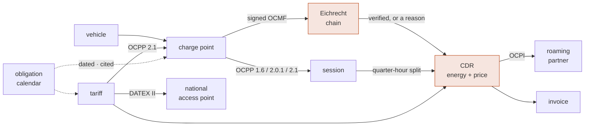
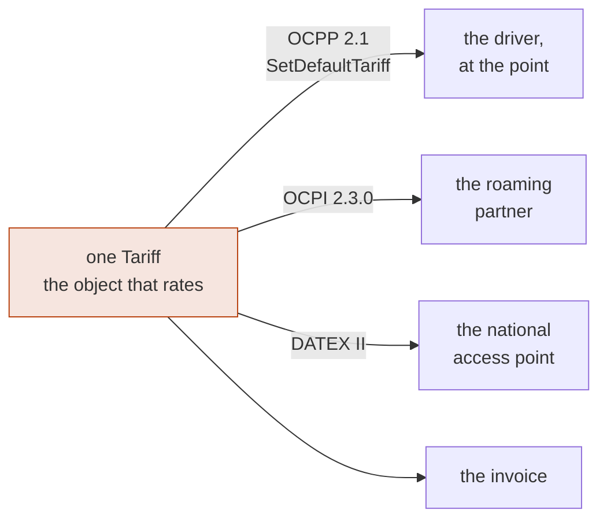

+++
title = "emob"
template = "index.html"
description = "The open-source e-mobility operating stack: CPO and EMP in one Rust workspace. OCMF signed meter values verified end to end, a quarter-hour split that conserves energy exactly, one tariff that reaches the driver, the roaming partner and the national access point as one number, AFIR and Eichrecht as executable cited rules, and no binary float anywhere near the money."
+++

Someone plugs in a car. Four minutes later a number exists that two companies
will settle against, a tax authority may examine, and a driver may dispute two
years from now. Between the plug and that number sit a meter under calibration
law, a station protocol, a roaming hub, a tariff, and a dozen European duties
with dates attached.

Most charging platforms treat that chain as plumbing. emob treats it as the
product.



Every arrow is a place a kilowatt-hour can quietly become the wrong number. The
pages below are mostly about the arrows.

## Evidence you can defend two years later

<div class="cards">
<div class="card"><h3>A value that does not verify does not bill</h3><p>German law lets you invoice a measured value only if the customer can check it, long after the session. Here that is a property of the type system: the only route to a billable quantity returns nothing at all when anything is wrong — a bad signature, an unregistered key, a substitute reading, a deleted record.</p></div>
<div class="card"><h3>Parsed without being destroyed</h3><p>An OCMF signature covers the payload bytes <em>as written</em>. A parser that deserialises and re-serialises to verify has already lost: key order, whitespace and number formatting each change the hash. The format is the <a href="https://crates.io/crates/ocmf"><code>ocmf</code></a> crate’s, written against all 256 records of the S.A.F.E. reference corpus with OpenSSL as an independent oracle — so “the signature holds” means what it says.</p></div>
<div class="card"><h3>Signatures cannot see a deletion</h3><p>Drop the middle records of a charging session and every remaining signature still verifies. The specification assigns that check to a separate component — contiguous pagination, a begin marker, an end marker — and it is asked as its own question with its own answer, apart from “did this key sign these bytes”.</p></div>
<div class="card"><h3>A chain proves four things</h3><p>Energy, duration, identity and direction are separate claims with separate fields. A session on an unsynchronised clock has a register an invoice may use and a duration it may not — so a per-kWh tariff bills it and a per-minute occupancy fee is refused by name. A record reporting that the certificate did not check out blocks both: the energy was measured, and there is nobody provably behind it.</p></div>
<div class="card"><h3>Import and export never net, and the register says so</h3><p>OCMF reserves an OBIS range that states which way a register measured — <code>B*</code> drawn, <code>C*</code> fed back. Carrying that as an opaque string and taking the direction from somewhere else is how a V2G discharge gets billed as consumption with nothing downstream noticing. Here the code is read, and a record that claims the other direction is refused.</p></div>
<div class="card"><h3>The customer can repeat the check</h3><p>German law does not require a measured value to be <em>correct</em>. It requires the affected party to be able to <strong>check</strong> it — so a platform that verifies internally and reports “verified” has satisfied nobody. The deliverable is a file the independent S.A.F.E. verifier reads: each record verbatim beside the key it was checked against, and emitted whether or not the session bills, because a dispute is exactly when it matters.</p></div>
</div>

## Arithmetic that adds up

<div class="cards">
<div class="card"><h3>Money is never a float</h3><p>Every quantity here either is money or becomes money. A build guard fails on an <code>f32</code> or <code>f64</code> anywhere — including a late <code>from_f64</code>, because a float converted at the boundary is still a float that was wrong at the source.</p></div>
<div class="card"><h3>Scale is a claim about accuracy</h3><p>A register reporting <code>2935.600 kWh</code> is stating three decimals of resolution. Rewriting it as <code>2935.6</code> discards something the meter said about itself — which OCMF forbids in as many words. Nothing here strips a trailing zero, and even <code>Wh → kWh</code> moves the point rather than dividing.</p></div>
<div class="card"><h3>The quarter-hour split conserves exactly</h3><p>A session from 10:01 to 10:22 must be settled against two quarter hours, and the boundary falls two thirds of the way through. Computing each slot independently leaves a sum that misses the total, and the usual fix shoves the remainder into the last slot — misattributing energy to whoever held it. Taking differences of cumulative boundaries makes the sum telescope instead: exact, always, whatever the ratio.</p></div>
<div class="card"><h3>The split that conserves is the input that prices</h3><p>“The first 10 kWh at 0.39, the rest at 0.59” is a condition on how much has been delivered <em>so far</em>. Rated against the session total instead, a 30 kWh session reprices all thirty at 0.59 — including the ten the driver was quoted at 0.39. Rating walks the record’s own quarter hours, and cuts a period wherever a threshold falls inside it — the wall clock and the local midnight a weekday rate turns on included — so the answer never depends on how the session was sliced.</p></div>
<div class="card"><h3>Every line explains its own amount</h3><p>One line per distinct price that applied, each reproducing its total from its own quantity and unit price, plus at most one visible adjustment for a minimum or a maximum. There is no term in a total that is not one of those two things, so “why is this €14.46” is answered by reading the record rather than by re-deriving it.</p></div>
<div class="card"><h3>Tax is a breakdown, not a number</h3><p>Electricity and a service fee can sit in different VAT categories, and a European e-invoice wants the taxable amount per rate. One dimension charged at two prices can span two categories, so the breakdown is per rate and per dimension — reading one rate off the first line taxes the second tier at the first tier’s rate.</p></div>
</div>

## One price, three audiences

A CPO states its ad-hoc price to three parties, and each is a duty with its own
citation: the **driver at the point**, before they start; the **roaming partner**
who will settle against it; and the **national access point**, free of charge.
Almost every stack computes that number three times, in three systems, and
reconciles none of them against the invoice.



Here the three crossings read one object — the same one that rates the CDR — so
there is nothing to drift from, and a test asserts the three read one decimal.
Where a wire cannot state the price exactly the crossing **refuses** rather than
rounding: OCPP 2.1 quotes time by the minute, and an ordinary €2.50-an-hour
occupancy fee has no exact per-minute decimal, so it has no honest representation
on the screen the regulation actually names.

## A rulebook the code actually consults

<div class="cards">
<div class="card"><h3>Compliance is a query</h3><p>“Are we AFIR-ready for 2027?” is normally a consulting engagement. Here it is a function call against a calendar of dated, cited duties — and a build guard fails if a rule cites a document the source index cannot produce.</p></div>
<div class="card"><h3>Applicability is not failure</h3><p>A private depot is not <em>failing</em> the ad-hoc payment duty; the duty does not bind it. A free charger owes no payment instrument and no dynamic data — the same words appear in two articles. A 2019 point is outside the 2027 ISO 15118-20 duty because the Annex binds points <em>installed or renovated from</em> that date. Merging exemptions with real breaches is how compliance dashboards come to be ignored.</p></div>
<div class="card"><h3>A duty knows which of three subjects it binds</h3><p>Article 5(5) binds the mobility service provider, not the point. The NIS2 energy annex names charge point operators by role and asks nothing about a point at all — size, governance, whether an early warning can leave the building inside a day. An operator whose every point is faultless can be in breach as a provider, and in breach again as a company.</p></div>
<div class="card"><h3>A directive is not a regulation</h3><p>NIS2 told Member States to apply its rules from October 2024; a directive binds nobody directly, and the German transposition came into force in December 2025. The Cyber Resilience Act beside it applies on its own dates in every Member State. Treating “the EU date” as one thing reports a breach in months when no authority could act.</p></div>
</div>

## Built to be replayed

<div class="cards">
<div class="card"><h3>Nothing reads a clock</h3><p>The domain crates take time and keys as arguments. A dispute about a session from two years ago is answered by replaying the check exactly as it ran — and a build guard fails if a domain crate ever reaches for the ambient world.</p></div>
<div class="card"><h3>A hundred stations, and nothing unaccounted for</h3><p>A deterministic fleet runs four hundred sessions from one seed, with virtual stations that sign genuine OCMF and a catalogue of seeded faults. Every kilowatt-hour is either settled or refused with a reason, and the two columns add up to the metered total exactly — because the arithmetic is exact decimal all the way down.</p></div>
<div class="card"><h3>A crossing has a cost, and it is written down</h3><p>Carrying a record onto somebody else’s model is not a re-encoding: something is rounded, collapsed, or has no field to live in. Every translation returns the value <em>and</em> the account of what it cost, by JSON pointer into the document the recipient will be reading. Disputes are settled with that account.</p></div>
</div>

## One session, end to end

A charging session leaves behind a handful of OCMF records. Turning them into a
number worth invoicing means answering four questions that are usually
conflated, and answering them in order:

```rust
let records = raw.iter().map(|r| ocmf::Record::parse(r)).collect::<Result<Vec<_>, _>>()?;
let evidence = Evidence::assemble(&records, &registry, session_start);

match evidence.billable_energy() {
    Some(energy) => println!("bill {energy}"),   // 29.500 kWh
    None => for reason in evidence.reasons() {
        eprintln!("blocked: {reason}");
        // record 2: the signature does not match the payload
        // pagination went 1 → 3 at record 1: a record was removed or reordered
        // record 2 reports meter state S (SUBSTITUTE)
    },
}
```

| Question | Answered by |
|---|---|
| Did *this key* produce *these bytes*? | the ECDSA verification |
| Is this key *this charge point's* key? | the out-of-band key registry |
| Are any records missing from the session? | the chain validator |
| May these readings be billed at all? | the meter state and error flags |

The registry is the one most often skipped. A verifier that takes the public key
from the record it is checking has verified nothing at all — so keys arrive from
type approval documents or provisioning, never from a record, and they carry
validity windows so that a meter exchanged in June does not make January's
sessions unverifiable.

## Where it stands

Twelve domain crates are real, tested and green — `emob-core`, `emob-eichrecht`,
`emob-session`, `emob-cdr`, `emob-tariff`, `emob-ocpp`, `emob-poi`, `emob-roam`,
`emob-billing`, `emob-thg`, `emob-service` and `emob-sim` — with two daemons on
top of them and **697 tests**. The domain crates do no I/O, read no clock and
hold no binary floats.

What that buys, concretely:

- a genuinely signed session runs from the meter to a taxable amount and back
  out as a file the driver's own verifier reads — including a record this
  workspace did not write, from a real German meter, checked against the key it
  is published with;
- the same session settles at the **same money** over self-roaming, OCPI 2.3.0
  and OCPI 2.2.1, each crossing reporting what it cost, and the record a partner
  receives is one this stack reads back into its own model;
- the tariff that priced it reaches the charge point's own screen over OCPP 2.1,
  a partner over OCPI and the national access point over DATEX II, and a test
  asserts the three read one decimal;
- a month closes: the same records become an EN 16931 invoice whose subtotals
  reproduce its own lines, a SEPA collection that draws the total to the cent
  and postings that balance — with the rounding stated rather than absorbed, and
  a cross-border settlement taxed where the reseller is established rather than
  where the charge point stands;
- the year's greenhouse-gas quota is filed from the same records, and a point
  that fails one of the four conditions between a kilowatt-hour and the quota is
  refused by name rather than missing from the file;
- a hundred-station fleet run reconciles exactly;
- a roaming peer's credential reaches its own party's records and no others, and
  the advisory plane beside the daemons **cannot move money** — its output type
  is a leaf nothing consumes, and its principal cannot hold a capability that
  writes.

Plug & Charge contracts, Hubject roaming, smart charging and the services that
publish and invoice are designed and not yet built. Every page here marks
✅ built and 📐 designed, and the gap between the two is never blurred.

<div class="cta">

[Get started](@/docs/getting-started.md)
[Read the docs](@/docs/_index.md)
[GitHub](https://github.com/hupe1980/emob)

</div>
