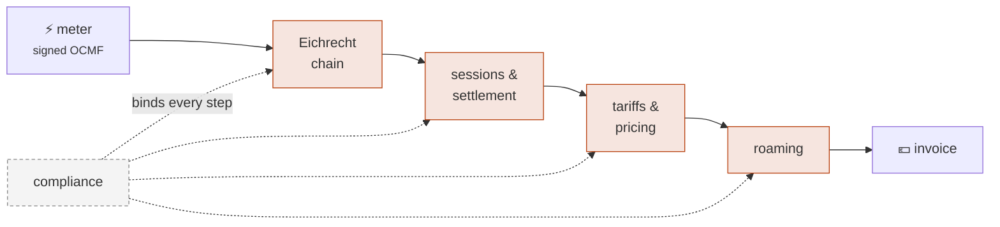

+++
title = "Documentation"
description = "How emob is put together: the Eichrecht evidence chain, the quarter-hour split, tariffs that rate what they display, the roaming edge, and the obligation calendar."
sort_by = "weight"
template = "section.html"
+++

# Documentation

Seven pages, in the order they build on each other — the chain a kilowatt-hour
travels, from the meter to the money and out to another company.

Every page marks ✅ built and 📐 designed. The gap between the two is the most
useful thing this documentation can tell you, so it is never blurred.

## Conventions

**Regulatory claims cite their source.** `[AFIR Art. 5(4)]` is Regulation (EU)
2023/1804 Article 5(4); `[DA-656 Anh. 2.1.1]` is Delegated Regulation (EU)
2025/656; `[LSV26 §4]` the Ladesäulenverordnung; `[MessEG §33]`, `[PTB-A 50.7]`
and `[REA 6-A]` the German metrology instruments; `[OCMF Tab. 7]` the Open Charge
Metering Format's own tables. A build guard fails if the source tree cites a
document the index cannot produce, so every claim on these pages can be followed
to a paragraph.

**German terms stay German where the regulation uses them** — Ladepunkt,
Eichrecht, Bilanzkreis, Durchleitung — because translating a legal term of art is
how its meaning drifts.

**The code samples are drawn from the crates' own tests**, abridged for reading
rather than invented for the page. The compiled versions are the doc-tests in the
[API documentation](https://docs.rs/emob-core), which CI builds with warnings
denied; a snippet here is an excerpt, so reach for `docs.rs` when you want the
signature rather than the shape.
