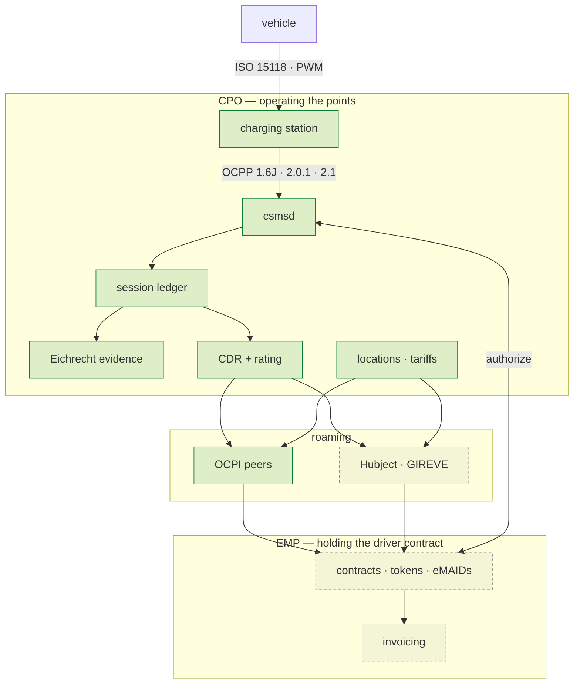

+++
title = "Architecture"
weight = 7
description = "What is built, what is designed, how emob sits beside the protocol kits it consumes, and the roaming stance that decides how the rest gets written."
+++

# Architecture

## Two roles, one platform

A German charging business usually wears both hats at once: it **operates**
charge points, and it **sells** charging to drivers as a provider. Those are
different regulatory subjects with different duties, and a stack that models only
the first can be faultless at every point it owns and still in breach as a
provider.



Solid is built; dashed is designed and not yet written.

A session between an operator's own EMP and its own CPO is **self-roaming
through the same canonical model** — same validation, same pricing, same
evidence — so going multi-party changes the transport and never the arithmetic.

## What exists today ✅

| Crate | Holds |
|---|---|
| `emob-core` | Identifiers in both grammars, text-preserving; exact energy and money; the charge-point **and provider** profiles; the obligation calendar |
| `emob-eichrecht` | OCMF parse and verify, the key registry, a chain that answers energy/duration/identity/direction separately, the evidence record, and the transparency file the driver checks the bill with |
| `emob-session` | Authorisation paths, cumulative meter series, a timestamped state machine, and the quarter-hour split that conserves exactly |
| `emob-cdr` | The record, **its price**, idempotent acceptance, and pre-flight validation |
| `emob-tariff` | Period-based rating with tiers and a VAT breakdown, the display derived from the rating tariff, the AFIR shape check, validity windows and a content fingerprint |
| `emob-ocpp` | The OCPP seam: signed meter values lifted out of transaction events, and no field a float could arrive in |
| `emob-poi` | The register and the national access point feed: DATEX II AFIR Recharging, publishing the tariff that rates the session rather than a copy of it |
| `emob-roam` | The roaming edge: a canonical CDR, tariff and location onto OCPI 2.3.0 and down to 2.2.1, each crossing returning the value **and** the account of what it cost; routing read out of the contract identifier's own issuer |
| `csmsd` | The CSMS socket: OCPP on `ocpp-kit` transport, the two ledgers side by side |
| `emob-sim` | A deterministic fleet, assembled from OCPP transaction events: virtual stations that **sign genuine OCMF**, a rated power per post, eight seeded faults, and a reference day whose energy reconciles exactly |

599 tests, no I/O, no clock, no binary floats. `just ci` green.

An end-to-end test drives the whole chain: OCMF records signed with a real key
at test time, verified, assembled into evidence, matched against a session, split
across quarter hours, built into a CDR, priced from those same quarter hours,
validated as a partner would, accepted exactly once, serialised, and exported as
a transparency file — with the displayed price asserted equal to the charged one
and the taxable amount an invoice needs asserted beside it. It also proves the
failures: one changed digit, a deleted middle record, a substitute reading, an
unregistered station and an unsynchronised clock each stop the part of the chain
they should, each with a reason that names what went wrong.

A second end-to-end test takes that same session **out of the building**. It
settles at the same money over three paths — self-roaming, OCPI 2.3.0 and OCPI
2.2.1 — the signed records arrive verbatim and re-verify at the far end against
the *receiver's* registry rather than the key the document carries, and every
crossing reports what it cost by JSON Pointer into the partner's own copy.

### The account a crossing returns

Translating a record into another company's model is where roaming money goes
missing, because a `From` impl makes each of those decisions once, silently, and
the consequence surfaces weeks later as two companies holding two numbers for
one session. So each translation returns a `Crossing`: the value, and the note.

The sharpest note is arithmetic this stack has met before. OCPI carries
`total_time` and every period's `TIME` in **hours**, and `3600 = 2⁴ · 3² · 5²` —
so a duration has an exact decimal spelling exactly when nine divides its
seconds. Twenty-one minutes does (`0.35`); twenty does not. It is the same factor
of three that makes an occupancy fee of €2.50 an hour unlawful
`[AFIR Art. 5(4)]`, one layer out — and it bites because the money was computed
from whole seconds, so a partner re-deriving it from the rounded figure gets
something else and no document says why. The quarter-hour grid this workspace
settles on is always exact, which is precisely why the failure stays invisible
until a session starts or stops between two boundaries.

Where a note would be a lie, the crossing refuses instead. `ENERGY_EXPORT` is
*Session Only* in OCPI and `total_energy` carries no sign, so a V2G discharge
would arrive as an ordinary draw and settle backwards — the provider paying for
energy the driver supplied. An unrated record cannot cross because `total_cost`
is required and 0.00 means *free of charge*. And a tariff element cannot be
published stripped of a restriction nobody can evaluate: that does not narrow
the element, it widens it, and the partner then prices the session under
conditions nobody checked.

## What is designed 📐

| Crate | Holds |
|---|---|
| `emob-roam` (OICP, eMIP) | Hubject and GIREVE legacy, beside the OCPI half that is built. Blocked on `oicp-kit` being published — this workspace does not take path dependencies any more |
| `emob-pnc` | Plug & Charge contracts, certificate pools, multi-PKI |
| `emob-smart` | Site load management, OCPP charging profiles, DER control, the § 14a guard, V2G |
| `emob-billing` | Rated CDRs → EN 16931 e-invoice → SEPA → double-entry postings |
| `emob-sim` (the rest) | Virtual EVs with 15118 PnC handshakes, MockHubject, an OCPI peer-in-a-process |

Services — `csmsd` is built; `roamd`, `empd`, `pncd`, `poid`, `tarifd`, `billd`, `opsd`,
`agentd` and an optional edge `sited` — are all 📐.

## The feed

`[AFIR Art. 20]` obliges an operator of publicly accessible points to publish
static and dynamic data through the national access point, free of charge. From
**14 April 2026** the German one — the Mobilithek — requires the DATEX II AFIR
Recharging profile `[DATEX-II-Profil]`.

**One number, two duties.** `[AFIR Art. 5(2)]` makes the price a driver is shown
the price they may be charged; Art. 20(2)(c) makes that same price data the
operator publishes. Almost every stack computes it twice — once in billing, once
in the export job — and the failure is asymmetric, because nobody reconciles a
feed against an invoice. `emob-poi` has no price model: it publishes the
`emob-tariff` value that rates the session, exact decimal from the tariff to the
JSON number.

**The register decides what the feed may say.** A point the `[LSV26 §4]`
register knows is decommissioned cannot be published as `available`, because the
type that carries a status has no constructor for that pair. It is the commonest
defect in European charging data and the one a schema validator cannot see.

**A dangling reference is worse than an invalid document.** The dynamic
publication carries no infrastructure — every object is a versioned reference
into the static one. A reference that does not resolve is dropped by the
consumer rather than rejected, so a `versionG` bumped in one job and not the
other takes a charger off every map with no error anywhere. Both publications
are built from one inventory, and a feed assembled elsewhere can be checked.

**And two things the profile cannot say.** Its whole price vocabulary is
`basePrice`, `flatRate`, `free`, `other`, `pricePerKWh` and `pricePerMinute`.
There is no per-hour type, so an hourly tariff divides by sixty and does not
always divide exactly; and there is no occupancy type at all, though
`[AFIR Art. 5(4)]` permits that fee by name. Both are published as the nearest
true statement the vocabulary allows, with the exact figure beside it, and both
raise a note rather than being rounded away.

There is no XSD in the profile release, so the test is the profile's own
published example: every JSON path the crate emits is one the reference instance
contains.

## A hundred stations, and nothing unaccounted for

A verifier tested against its own fixtures proves the code agrees with itself. A
*fleet* tested the same way proves nothing at all — so `emob-sim` runs a
reference day and asserts the one thing a silent failure cannot satisfy.

```rust
let outcome = ReferenceDay::builder()
    .stations(100)
    .sessions_per_station(4)
    .faults(FaultPlan::everything(Rate::one_in(9)))
    .build()
    .run();

// 400 sessions: 197 settled (8969.120 kWh), 203 refused (9555.738 kWh),
//               metered 18524.858 kWh
assert!(outcome.reconciles());              // billed + refused == metered, exactly
assert!(outcome.every_refusal_has_a_reason());
```

The assertion is **not** "everything billed". It is that every kilowatt-hour a
meter moved either reached a settled record or was refused with a reason —
`Σ allocated + residual = total` over a day rather than a session. A run
asserting "no errors" would pass by throwing sessions away.

## The wire's numbers are telemetry

OCPP carries two kinds of meter value and only one of them is money. The numeric
ones — `meterStart`, `meterStop`, `SampledValue.value` — answer whether every
event arrived, and they are floating point by the time any ledger holds them.
The signed one is a `SignedMeterValueType` carrying an OCMF data set, and it is
the only thing that becomes a billed kilowatt-hour.

`emob-ocpp` makes that structural rather than remembered: **its input vocabulary
has no numeric meter value in it at all**, so there is no field a float could
arrive in and no path from one to a CDR.

The Open Charge Alliance's own example message is the argument. Its `meterStop`
is `108814` — the meter's *lifetime* register in watt-hours — while the
transaction's signed difference is `0.636 kWh`. A CSMS billing the protocol's
number would be out by a factor of a hundred and seventy, from a register that
is not the session's `[OCA SMV §5.2]`.

Three envelopes have to come off, each a place implementations go wrong. OCPP
2.x has a field for a `SignedMeterValueType`; **1.6 serialises the whole object
into the `value` string** of a `SampledValue` whose `format` is `SignedData`.
The `publicKey` beside it is not key bytes but base64 over
`oca:base16:asn1:<hex>` — the key as printed on the cabinet, so a customer can
compare the two — except in the same document's example message, which sends
base64 over plain hex with no envelope. Both are read.

That unwrapping belongs in the protocol kit rather than here: it is spec
knowledge every OCPP CSMS doing Eichrecht reimplements. `ocpp-kit` owns it, along
with a version-neutral `DomainEvent` that carries the signed values through, so
one `match` in `emob-ocpp` covers all three versions.

What it kept is the reason it is still a crate. Folding the rest into `emob-cdr`
would put `ocpp-kit` in the dependency graph of every crate that decides money.
`emob-core`, `emob-session`, `emob-eichrecht`, `emob-tariff` and `emob-cdr`
build with no OCPP anywhere in their tree, and the seam is the only crate on
both sides.

And a **retry is not a reading**: OCPP retries, the same record arrives twice
with the same pagination counter, and a CSMS that appends both hands the chain a
`PaginationBreak` on an intact session. Records are de-duplicated by the digest
of the bytes their signature covers.

## The socket

`csmsd` is the CSMS a station connects to: an OCPP 1.6J / 2.0.1 / 2.1 endpoint on
`ocpp-kit` transport. It is deliberately the thinnest thing in the repository.

**Thin is about rules, not about care.** Every rule that could be *wrong* lives
in `emob-ocpp` and is tested there. What stays behind is the daemon's own error
handling, which is where a thin layer's bugs live: every mutex is taken through
one `lock()` that recovers from poisoning, because the guarded values are plain
collections and a CSMS that answers a panic elsewhere by quietly dropping the
record of what it billed is the worse failure.

**Two ledgers, side by side, doing different jobs.** `ocpp-kit`'s own
`csms::ledger` answers whether the traffic arrived — every event accounted for,
the sequence complete, a retry recognised as a retry — from the protocol's own
numeric register, which is exactly right for that question. The Eichrecht chain
answers what may be billed. They run beside each other, never one instead of the
other, and the type system keeps them apart: nothing in the billing path can see
a float, because `emob_ocpp::TransactionEvent` has no field for one.

**One funnel, three versions.** `observe_v16`, `observe_v201` and `observe_v21`
all produce the same observation, so the billing path is one function for all
three generations. The only per-version difference left is the transaction id,
because 1.6 assigns it in the *response* and therefore makes it the CSMS's
problem. An observation also carries warnings, and one of them decides money: a
station that declares `format: SignedData` and sends an unparseable document
looks, to anything reading only the billable events, exactly like a station
sending none — so that transaction is refused **by name**, on its first session
rather than after a month of unbillable ones.

**The two bindings a station may not supply for itself.** The `Identity` in a
WebSocket URL is whatever the station was configured with, so an unprovisioned
one is answered **404** rather than admitted `[OCPP 2.0.1 Part 4 §3.1.1]` —
otherwise its sessions are attributed to a charge point nobody provisioned. The
binding is made once, at authentication, and travels with the connection, so no
later lookup can disagree with it. And the public key comes from a type
approval, never from the `publicKey` a station sends beside its own signed
values.

**The test that proves it** runs a real `ocpp-kit` station against a real
`ocpp-kit` CSMS over a real TCP WebSocket, with `csmsd` as the handler. The
station sends the Open Charge Alliance's own published `StopTransaction.req`
from a DZG GSH01.1K2L; its `meterStop` says **108814** watt-hours of lifetime
register, and the record that comes out bills **0.636 kWh**.

The stations are imaginary; their **signatures are not**. Every session is signed
with a real ECDSA key over the real payload bytes, verified through the real
verifier, split on the real settlement grid, priced by the real rating engine and
accepted by the real ledger. Eight faults are seeded — a substitute reading, a
dropped record, a tampered byte, an unsynchronised clock, an export register
billed as a draw, a `TX=X` exception, an unregistered station, and a **tariff the
post may not offer** — and the run asserts that **each one is actually
exercised**.

The eighth is nothing to do with the meter, and it is why the fleet carries a
rated power: half the posts are 22 kW and half 150 kW, and a per-minute-only
tariff is an ordinary product on the first and unlawful on the second
`[AFIR Art. 5(4)]`.

One seed is one day, with no clock and no entropy source, so a failing run is
reproduced from its seed alone.

### What it found

The first fleet run produced a **settled record for a forged session**. A CDR's
energy comes from the session's meter series rather than from its evidence, so a
record could be built and priced off a register nothing verified while carrying
an evidence reference that made it look checked. Every unit test passed; the
composition did not.

Evidence that is present and **failed** is worse than evidence that is absent,
and is refused. Testing the pieces is not testing the seam between them, and the
seams are where money is made.

## Standing on the kits

emob does not implement charging protocols. Five sibling workspaces already do,
and they are the hard sixty per cent of a platform:

| Sibling | What emob takes |
|---|---|
| `ocpp-kit` | OCPP 1.6J / 2.0.1 / 2.1 payloads, a sans-I/O engine, transport, the CSMS ledger |
| `ocpi-kit` | OCPI 2.1.1 / 2.2.1 / 2.3.0 models, client and server, hub pieces, the tariff engine |
| `oicp-kit` | Hubject, both halves, delta-sync, CDR pre-flight, and a mock hub for CI |
| `iso15118` | The EXI codec, the -2/-20 message sets, the Plug & Charge signature profile. Already a **dev**-dependency of `emob-core`: it owns the unambiguous spelling of a vehicle-communication generation, and a test asserts ours is its spelling — the DATEX II profile's own literal `iso15118` means -20 and has no name for -2, so an ambiguous one published in the official record is a claim of compliance with a 2027 duty |
| `eebus` | The § 14a wire at a site's grid connection point |

The billing half comes from `billing`, `en16931` (+ formats), `sepa` and
`doubleentry`; the market-communication half — German pass-through charging
under NZR-EMob — from `mako`.

### Why the CDR depends on the Eichrecht crate

Three of the builder's checks read facts that only the signed records know: how
strongly the user was identified, whether the clock can carry a duration at all,
and which way the OBIS register says the energy went. `EvidenceRef::from_evidence` reads them off a verified `Evidence` rather
than taking them as arguments, because a hand-filled field can be filled with
whatever value makes the record build — which is the opposite of a check.

### Why the CDR depends on the tariff

A CDR is what two companies settle against, so it carries what they settle: the
energy *and* the money. Rating lives in `emob-tariff` and the record holds its
result, rather than the two being joined in a service where nothing checks that
the euros and the kilowatt-hours came from the same view of the session.

It is also what makes tiers work. The quarter-hour slots the split produces are
the periods the rating walks, so the arithmetic that settles the energy is the
arithmetic that prices it.

### Why `emob-core` has its own identifiers

`ocpi-kit` and `oicp-kit` each carry an `EvseId` that is correct for its own
wire. A platform that speaks both needs one type its handlers are written
against, or the translation layer becomes a web of conversions between two
vocabularies that already agree.

They do have to agree, though, and that is a test rather than a hope:
`oicp-kit` documents `DE*ABC*E123 == deabce123`, so `emob-core` asserts the same
equality. The two meet in the roaming layer, and an id that compares equal on
one side and not the other routes a session to nobody.

Agreeing is not the same as being permissive. `*` is optional throughout an EVSE
id and every one of them is stripped; `-` is **not** a separator here, unlike in
a contract id, because the eMI3 grammar does not define one and eating it would
make `DE-AB7-E840` parse as a charge point.

## The roaming stance

One canonical model; every wire native; translation cost recorded.

| Wire | Partner | Via | State |
|---|---|---|---|
| OCPI 2.3.0 (2.2.1 translated at the edge) | peers, most hubs | `ocpi-kit` | ✅ |
| OICP 2.3 | Hubject | `oicp-kit` | 📐 — blocked on the kit being published |
| eMIP | GIREVE legacy | only if a partner forces it — GIREVE speaks OCPI | 📐 |
| OCHP | e-clearing.net | not planned; the spec froze in 2016 | ✖ |

Three rules carry over from the kits and become platform invariants:

**Nothing a peer sent is thrown away.** Unknown fields and enum values survive a
round trip, because a hub that damages a vendor extension is how real data gets
lost.

**Identity is text-preserving.** Identifiers compare canonically and write back
verbatim.

**Routing comes out of the identifier.** A contract id names its issuer in its
first five characters, and that is the party holding the driver who will pay.
Routing settlement off a hand-maintained map from something else is where
roaming money reaches the wrong company — and OCPI warns outright that a party
id has no direct link with the contract's issuer, so the prefix is the default
and a partner's declared namespaces beat it.

**Translation cost is reported.** A 2.2.1 partner has no `tax_included`; a 2.3.0
one requires it. Every crossing yields the value *and* a note of what was
assumed. Disputes are won with that note.

**What cannot be evaluated is not assumed open.** A tariff element carrying a
restriction this build does not understand never matches, and the rating says so
in a note that travels with the record. Treating an unknown condition as absent
applies a price under conditions nobody checked — the translation-layer analogue
of billing on an unverified signature. That rule is already enforced in
`emob-tariff`, before any wire adapter exists to exercise it.

## Purity, and why it is a build failure

The domain crates never read a clock, open a socket or touch the filesystem.
Every instant is an argument and the key registry is handed in already
populated.

That is not architectural taste. A dispute about a session from two years ago is
answered by replaying the verification exactly as it ran — same records, same
keys, same instant — and the replay stops being a replay the moment any part of
it consults the ambient world. `just purity` fails the build if a domain crate
reaches for one.

## The guards

| Guard | Prevents |
|---|---|
| `no-floats` | a workspace exact everywhere it was reviewed and approximate in the helper nobody read |
| `check-citations` | a rule citing a document nobody can produce |
| `check-manifests` | a `cargo publish` that fails after the version is spent |
| `purity` | a domain crate that cannot be replayed |
