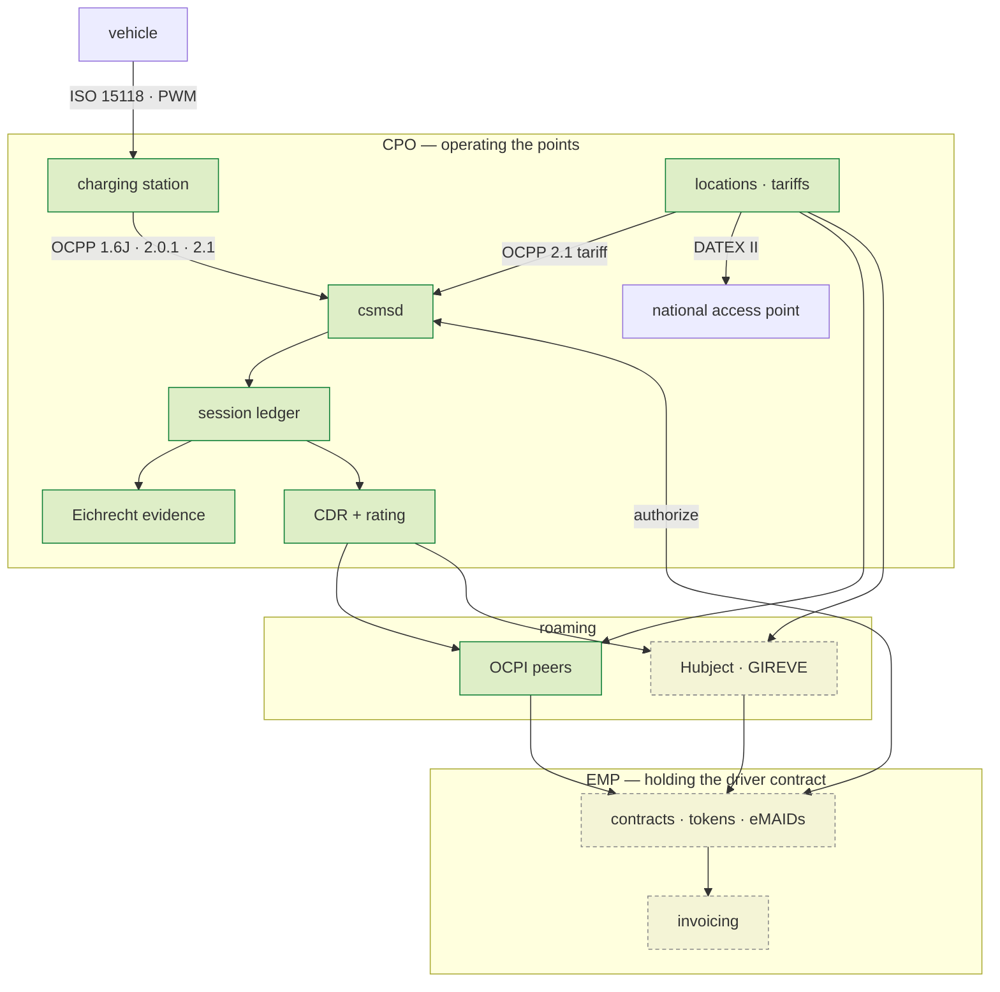

+++
title = "Architecture"
weight = 9
description = "What is built, what is designed, how emob sits beside the protocol kits it consumes, and the roaming stance that decides how the rest gets written."

[extra]
nav = "Architecture"
+++

# Architecture

## Two roles, one platform

A German charging business usually wears both hats at once: it **operates**
charge points, and it **sells** charging to drivers as a provider. Those are
different regulatory subjects with different duties, and a stack that models only
the first can be faultless at every point it owns and still in breach as a
provider.



Solid is built; dashed is designed and not yet written.

A session between an operator's own EMP and its own CPO is **self-roaming
through the same canonical model** — same validation, same pricing, same
evidence — so going multi-party changes the transport and never the arithmetic.

## What exists today ✅

| Crate | Holds |
|---|---|
| `emob-core` | Identifiers in both grammars, text-preserving; exact energy and money; the settlement grid; the charge-point, provider **and undertaking** profiles; the obligation calendar over all three; and `Crossing`, the account a value owes when it is carried onto somebody else's wire |
| `emob-eichrecht` | The **law** over the format: the station key registry, a chain that answers energy/duration/identity/direction separately, the evidence record, and the transparency file the driver checks the bill with. The format itself — parsing, verification, the tables, the OBIS code, the container — is the [`ocmf`](https://crates.io/crates/ocmf) crate's, written from the whole S.A.F.E. reference corpus with OpenSSL as an oracle |
| `emob-session` | Authorisation paths, cumulative meter series, a timestamped state machine, and the quarter-hour split that conserves exactly |
| `emob-cdr` | The record, **its price**, idempotent acceptance, and pre-flight validation |
| `emob-tariff` | Period-based rating with tiers and a VAT breakdown, the display derived from the rating tariff, the AFIR shape check, validity windows and a content fingerprint |
| `emob-ocpp` | The OCPP seam, both ways: signed meter values lifted out of transaction events with no field a float could arrive in, and the tariff carried onto OCPP 2.1's *Tariff and Cost* block so the price on the station's screen is the object that rates the CDR |
| `emob-poi` | The register and the national access point feed: DATEX II AFIR Recharging, publishing the tariff that rates the session rather than a copy of it |
| `emob-roam` | The roaming edge: a canonical CDR, tariff and location onto OCPI 2.3.0 and down to 2.2.1, each crossing returning the value **and** the account of what it cost; routing read out of the contract identifier's own issuer |
| `csmsd` | The CSMS socket: OCPP on `ocpp-kit` transport, the two ledgers side by side |
| `emob-billing` | The last seam: rated records become an EN 16931 invoice whose rounding happens once, at the line, and whose residual is reported; the VAT treatment derived from the parties, so a roaming settlement is taxed where the reseller is established `[UStG §3g]`; a SEPA collection; and postings addressed by role rather than by account number |
| `emob-thg` | The greenhouse-gas quota: `[38k §6(3)]`'s **four** conditions as four fields in the paragraph's own order, a notification built only from energy a meter signed, and no factor held as a constant — the emissions value is announced annually in the Bundesanzeiger, so it is an argument carried with the notice |
| `emob-service` | The shell every daemon shares, and the three parts of it that are about charging: an OCPI-party authority model, the CloudEvents catalogue, one webhook signature |
| `agentd` | The advisory plane on `agentplane`: specialists that correlate across many exact answers, and cannot move money by construction. Three — evidence triage, the tariff sweep, and a compliance sweep that judges duties which have not started binding yet against the estate as it stands |
| `emob-sim` | A deterministic fleet, assembled from OCPP transaction events: virtual stations that **sign genuine OCMF**, a rated power per post, eight seeded faults, and a reference day whose energy reconciles exactly |

**842 tests**. The domain crates do no I/O, read no clock and hold no binary floats;
`emob-service` is the one shared place that stops being true, and everything
above it is a daemon. `just ci` green.

An end-to-end test drives the whole chain: OCMF records signed with a real key
at test time, verified, assembled into evidence, matched against a session, split
across quarter hours, built into a CDR, priced from those same quarter hours,
validated as a partner would, accepted exactly once, serialised, and exported as
a transparency file — with the displayed price asserted equal to the charged one
and the taxable amount an invoice needs asserted beside it. It also proves the
failures: one changed digit, a deleted middle record, a substitute reading, an
unregistered station and an unsynchronised clock each stop the part of the chain
they should, each with a reason that names what went wrong.

A second end-to-end test takes that same session **out of the building**. It
settles at the same money over three paths — self-roaming, OCPI 2.3.0 and OCPI
2.2.1 — the signed records arrive verbatim and re-verify at the far end against
the *receiver's* registry rather than the key the document carries, and every
crossing reports what it cost by JSON Pointer into the partner's own copy.

A third closes a **month**. Three genuinely signed sessions become an EN 16931
invoice whose own subtotals reproduce its own lines, a pain.008 that draws the
total to the cent, and postings that balance before an account is named — and
the same three sold to an e-mobility provider in another member state come out
as a reverse charge, with no VAT on the document and none in the books.

### The account a crossing returns

Translating a record into another company's model is where roaming money goes
missing, because a `From` impl makes each of those decisions once, silently, and
the consequence surfaces weeks later as two companies holding two numbers for
one session. So each translation returns a `Crossing`: the value, and the note,
by JSON Pointer into the document the **recipient** will be reading.

The type lives in `emob-core`, beside the settlement grid, for the same reason
that one does: three seams now owe an account. OCPI in `emob-roam`, the DATEX II
national access point feed in `emob-poi`, and OCPP 2.1's tariff in `emob-ocpp`
answer one question, and a partner reading what a version downgrade cost and an
operator reading what a charge point's screen cannot show should be reading the
same kind of sentence.

The sharpest note is arithmetic this stack has met before. OCPI carries
`total_time` and every period's `TIME` in **hours**, and `3600 = 2⁴ · 3² · 5²` —
so a duration has an exact decimal spelling exactly when nine divides its
seconds. Twenty-one minutes does (`0.35`); twenty does not. It is the same factor
of three that makes an occupancy fee of €2.50 an hour unlawful
`[AFIR Art. 5(4)]`, one layer out — and it bites because the money was computed
from whole seconds, so a partner re-deriving it from the rounded figure gets
something else and no document says why. The quarter-hour grid this workspace
settles on is always exact, which is precisely why the failure stays invisible
until a session starts or stops between two boundaries.

Where a note would be a lie, the crossing refuses instead. `ENERGY_EXPORT` is
*Session Only* in OCPI and `total_energy` carries no sign, so a V2G discharge
would arrive as an ordinary draw and settle backwards — the provider paying for
energy the driver supplied. An unrated record cannot cross because `total_cost`
is required and 0.00 means *free of charge*. And a tariff element cannot be
published stripped of a restriction nobody can evaluate: that does not narrow
the element, it widens it, and the partner then prices the session under
conditions nobody checked.

## The daemon shell, and why it is emob's own

Two sibling workspaces extracted one and they disagree about how much belongs in
it. `mako-service` is eighteen modules — Cedar, OIDC, CloudEvents with a
transactional outbox, webhooks, metrics, rate limiting. `hems-service` is eight
small ones, and it says why it did not take mako's: that layer's OIDC carries a
market-role claim and its Cedar schema is built on **Marktrollen** a household
energy manager does not have.

The same reasoning decides it here and adds a term. emob is neither a market
participant nor a box on a wall: its principals are **OCPI parties**, and the
question the shell exists to answer is one neither sibling has a reason to ask.

### A valid token is not permission to read somebody else's session

A roaming node holds several companies' sessions in one process, and its worst
failure is not losing one. It is serving party A's CDRs to party B — a
competitor's charging volumes, its tariffs, its drivers' movements — out of an
endpoint that answered a perfectly good credential. A reverse proxy cannot catch
it, because the proxy does not know which party owns a record.

```rust
let peer = Principal::peer(theirs, Role::Emsp, Capabilities::of([caps::CDR_READ]));

peer.may_act_for(caps::CDR_READ, &theirs);   // true
peer.may_act_for(caps::CDR_READ, &ours);     // false — valid token, somebody else's record
peer.may_act_for(caps::CDR_WRITE, &theirs);  // false — reaching it is not writing it
```

Three questions kept apart — **who**, **what**, **whose records** — because
collapsing any two is how every roaming leak has happened. Capabilities rather
than roles, because an agent has to be able to hold *less* than the operator it
acts for, and `attenuate` returns nothing rather than clamping when a request
would widen either axis.

An empty grant permits nothing, an empty readiness set is not ready, and a
webhook verifier with no secret rejects. The state a misconfiguration falls into
is the safe one, because the deployment where somebody forgot is exactly the one
nobody would notice.

### The probe that does not lie, and the stop that does not drop a record

Almost every readiness endpoint in this industry returns `200` unconditionally.
An orchestrator then routes stations to a CSMS whose key registry has not loaded,
and every session for the next thirty seconds is refused for want of a key —
which looks like a fleet fault and is a deployment one.

So readiness is a set of named dependencies, each reporting for itself, and the
body of a `503` lists which are missing. Liveness stays separate: a liveness
probe that failed on a dependency would make a restart the cure for something
that was never in the process, and restarting a CSMS drops every station's
socket.

Stopping is two steps for the same reason. The daemon stops being **ready**, so
the orchestrator takes it out of rotation, and only then drains — because killing
a CSMS mid-transaction does not lose a request, it loses the `StopTransaction`
that carries the signed meter record.

### Cedar and MCP are dated rather than declined

A policy engine earns its weight when policies are operator-authored and change
without a deploy — which is `roamd` onboarding a partner at runtime, and `roamd`
is 📐. The authority model is deliberately Cedar-shaped: a principal, an action,
a resource with an owner. When it lands, the schema is those entity types and the
default is deny.

An MCP surface is what an agent reaches a daemon's read side through, and emob's
specialists read data a daemon already holds. When one lands the rule is `hems`'s
unchanged: **server side only** — a daemon that could *call* a model is a daemon
whose answers depend on one, and none of these answers may.

## An agent proposes; it cannot move money ✅

Every crate below answers a question about **one** thing: is this chain sound,
does this record add up, is this tariff lawful at this power. None of them
answers the question an operator has at eight in the morning, which is about a
**population**:

```text
[evidence-triage] BQ27400330016: the meter was in state Substitute at record 2,
                  which may not be billed
                  (3800.000 kWh at risk across 380) — a device fault rather than
                  a dispute: raise it with the station vendor…
[evidence-triage] BQ99999999999: pagination jumped from 4 to 6
                  (20.000 kWh at risk across 20) — records are missing from the
                  middle of these sessions…
```

Four hundred refused sessions are four hundred support tickets or one meter
fault, and the difference is whether anybody grouped them. Ranked by the
workspace's own quantities — kilowatt-hours that cannot be billed, points in
breach — and never *across* kinds, because there is no exchange rate between a
kilowatt-hour and a euro this daemon is entitled to invent.

**"Advisory only" is a property rather than a promise.** The output type is a
leaf: nothing in the workspace consumes an `Advice`, so there is no path from an
agent's answer into a document. And a specialist's principal comes from
`attenuate`, which refuses to widen, so no agent principal can hold a capability
that writes — asserted for every write capability the workspace names.

The specialists are deterministic functions and none calls a model. What
`agentplane` provides for one is not inference but the **journal**: the run, its
input, its answer and every effect in an append-only hash-chained log, and a
replay that re-executes the logic while reading each effect back rather than
performing it again. "Why did the queue say that in March" becomes a replay
instead of an argument.

## What is designed 📐

| Crate | Holds |
|---|---|
| `emob-roam` (eMIP) | GIREVE legacy, beside the OCPI and OICP halves that are built. Only if a partner forces it — GIREVE speaks OCPI |
| `emob-pnc` | Plug & Charge contracts, certificate pools, multi-PKI |
| `emob-smart` | Site load management, OCPP charging profiles, DER control, the § 14a guard, V2G |
| `emob-sim` (the rest) | Virtual EVs with 15118 PnC handshakes, MockHubject, an OCPI peer-in-a-process |

Services — `csmsd`, `agentd`, `poid` and `tarifd` are built; `roamd`, `empd`,
`pncd`, `billd`, `opsd` and an optional edge `sited` are 📐.

## One inventory, three audiences

A charge point is described to the outside world three times — to a roaming
partner, to the public through the national access point, and to the driver
standing in front of it — and so is its price. Almost every stack generates each
from a different source, so they drift and nobody compares them.

Here `emob-poi` holds one inventory and `emob-tariff` one price, and the three
crossings read them rather than copying them. That is why the roaming crate
depends on the location crate, which looks like a layering mistake and is the
whole argument: one inventory, several audiences.

[Locations and the national access point](@/docs/locations.md) covers the feed —
the register that gates what it may say, the dangling reference that takes a
charger off every map with no error anywhere, and the two things the profile's
price vocabulary cannot express.

## A hundred stations, and nothing unaccounted for

A verifier tested against its own fixtures proves the code agrees with itself. A
*fleet* tested the same way proves nothing at all — so `emob-sim` runs a
reference day and asserts the one thing a silent failure cannot satisfy.

```rust
let outcome = ReferenceDay::builder()
    .stations(100)
    .sessions_per_station(4)
    .faults(FaultPlan::everything(Rate::one_in(9)))
    .build()
    .run();

// 400 sessions: 197 settled (8969.120 kWh), 203 refused (9555.738 kWh),
//               metered 18524.858 kWh
assert!(outcome.reconciles());              // billed + refused == metered, exactly
assert!(outcome.every_refusal_has_a_reason());
```

The assertion is **not** "everything billed". It is that every kilowatt-hour a
meter moved either reached a settled record or was refused with a reason —
`Σ allocated + residual = total` over a day rather than a session. A run
asserting "no errors" would pass by throwing sessions away.

The stations are imaginary; their **signatures are not**. Every session is signed
with a real ECDSA key over the real payload bytes, verified through the real
verifier, split on the real settlement grid, priced by the real rating engine and
accepted by the real ledger. Eight faults are seeded — a substitute reading, a
dropped record, a tampered byte, an unsynchronised clock, an export register
billed as a draw, a `TX=X` exception, an unregistered station, and a **tariff the
post may not offer** — and the run asserts that **each one is actually
exercised**.

The eighth is nothing to do with the meter, and it is why the fleet carries a
rated power: half the posts are 22 kW and half 150 kW, and a per-minute-only
tariff is an ordinary product on the first and unlawful on the second
`[AFIR Art. 5(4)]`.

One seed is one day, with no clock and no entropy source, so a failing run is
reproduced from its seed alone.

### What it found

The first fleet run produced a **settled record for a forged session**. A CDR's
energy comes from the session's meter series rather than from its evidence, so a
record could be built and priced off a register nothing verified while carrying
an evidence reference that made it look checked. Every unit test passed; the
composition did not.

Evidence that is present and **failed** is worse than evidence that is absent,
and is refused. Testing the pieces is not testing the seam between them, and the
seams are where money is made.

## The seam, and why it is a crate

OCPP carries two kinds of meter value and only one of them is money. The numeric
ones — `meterStart`, `meterStop`, a `SampledValue.value` — answer whether every
event arrived. They are exact rather than floating point on a current protocol
library, and **exact is still not billable**: the Open Charge Alliance's own
example carries `meterStop: 108814`, correct to the digit and reporting the
meter's *lifetime* register, beside a signed data set reporting `0.636 kWh` for
the transaction.

`emob-ocpp` makes that structural rather than remembered: **its input vocabulary
has no numeric meter value in it at all**, so there is no field a float could
arrive in and no path from one to a CDR. [The OCPP seam](@/docs/ocpp.md) covers
the three envelopes, the retry that looks like a missing record, and the tariff
that goes back the other way.

**Why it stays a crate of its own.** Folding it into `emob-cdr` would put a
protocol implementation in the dependency graph of every crate that decides
money. `emob-core`, `emob-session`, `emob-eichrecht`, `emob-tariff` and
`emob-cdr` build with no OCPP anywhere in their tree, and the seam is the only
crate on both sides.

That is also why the **price** crosses here and the dependency points this way:
`emob-ocpp` depends on `emob-tariff`, never the reverse. It is the only place
both vocabularies are in scope, in either direction.

## The socket

`csmsd` is the CSMS a station connects to: an OCPP 1.6J / 2.0.1 / 2.1 endpoint on
`ocpp-kit` transport. It is deliberately the thinnest thing in the repository.

**Thin is about rules, not about care.** Every rule that could be *wrong* lives
in `emob-ocpp` and is tested there. What stays behind is the daemon's own error
handling, which is where a thin layer's bugs live: every mutex is taken through
one `lock()` that recovers from poisoning, because the guarded values are plain
collections and a CSMS that answers a panic elsewhere by quietly dropping the
record of what it billed is the worse failure.

**Two ledgers, side by side, doing different jobs.** `ocpp-kit`'s own
`csms::ledger` answers whether the traffic arrived — every event accounted for,
the sequence complete, a retry recognised as a retry — from the protocol's own
numeric register, which is exactly right for that question. The Eichrecht chain
answers what may be billed. They run beside each other, never one instead of the
other, and the type system keeps them apart: nothing in the billing path can see
a float, because `emob_ocpp::TransactionEvent` has no field for one.

**One funnel, three versions.** `observe_v16`, `observe_v201` and `observe_v21`
all produce the same observation, so the billing path is one function for all
three generations. The only per-version difference left is the transaction id,
because 1.6 assigns it in the *response* and therefore makes it the CSMS's
problem. An observation also carries warnings, and one of them decides money: a
station that declares `format: SignedData` and sends an unparseable document
looks, to anything reading only the billable events, exactly like a station
sending none — so that transaction is refused **by name**, on its first session
rather than after a month of unbillable ones.

**The two bindings a station may not supply for itself.** The `Identity` in a
WebSocket URL is whatever the station was configured with, so an unprovisioned
one is answered **404** rather than admitted `[OCPP 2.0.1 Part 4 §3.1.1]` —
otherwise its sessions are attributed to a charge point nobody provisioned. The
binding is made once, at authentication, and travels with the connection, so no
later lookup can disagree with it. And the public key comes from a type
approval, never from the `publicKey` a station sends beside its own signed
values.

**The test that proves it** runs a real `ocpp-kit` station against a real
`ocpp-kit` CSMS over a real TCP WebSocket, with `csmsd` as the handler. The
station sends the Open Charge Alliance's own published `StopTransaction.req`
from a DZG GSH01.1K2L; its `meterStop` says **108814** watt-hours of lifetime
register, and the record that comes out bills **0.636 kWh**.

## Standing on the kits

emob does not implement charging protocols. Five sibling workspaces already do,
and they are the hard sixty per cent of a platform:

| Sibling | What emob takes |
|---|---|
| `ocpp-kit` | OCPP 1.6J / 2.0.1 / 2.1 payloads, a sans-I/O engine, transport, the CSMS ledger |
| `ocpi-kit` | OCPI 2.1.1 / 2.2.1 / 2.3.0 models, client and server, hub pieces, the tariff engine |
| `oicp-kit` | Hubject, both halves, delta-sync, CDR pre-flight, and a mock hub for CI |
| `iso15118` | The EXI codec, the -2/-20 message sets, the Plug & Charge signature profile. Already a **dev**-dependency of `emob-core`: it owns the unambiguous spelling of a vehicle-communication generation, and a test asserts ours is its spelling — the DATEX II profile's own literal `iso15118` means -20 and has no name for -2, so an ambiguous one published in the official record is a claim of compliance with a 2027 duty |
| `eebus` | The § 14a wire at a site's grid connection point |

The billing half comes from `en16931` (+ formats) and `sepa`, with
`doubleentry` reserved for the daemon that holds a journal; the
market-communication half — German pass-through charging under NZR-EMob — from
`mako`. Three siblings are deliberately **not** taken: `billing`, because the
hard part of an OCPI tariff is which element prices which second and a second
pricing engine is the drift `emob-tariff` exists to prevent; `rubo4e`, because
the seam it would serve consumes `mako-emob`'s own `Ladevorgang` rather than a
BO4E object; and `rutmf`, because the contract model a TM Forum surface would
expose does not exist yet. Each is recorded with its reason in the concepts, so
nobody reaches for it twice.

### Why the CDR depends on the Eichrecht crate

Three of the builder's checks read facts that only the signed records know: how
strongly the user was identified, whether the clock can carry a duration at all,
and which way the OBIS register says the energy went. `EvidenceRef::from_evidence` reads them off a verified `Evidence` rather
than taking them as arguments, because a hand-filled field can be filled with
whatever value makes the record build — which is the opposite of a check.

### Why the CDR depends on the tariff

A CDR is what two companies settle against, so it carries what they settle: the
energy *and* the money. Rating lives in `emob-tariff` and the record holds its
result, rather than the two being joined in a service where nothing checks that
the euros and the kilowatt-hours came from the same view of the session.

It is also what makes tiers work. The quarter-hour slots the split produces are
the periods the rating walks, so the arithmetic that settles the energy is the
arithmetic that prices it.

### Why `emob-core` has its own identifiers

`ocpi-kit` and `oicp-kit` each carry an `EvseId` that is correct for its own
wire. A platform that speaks both needs one type its handlers are written
against, or the translation layer becomes a web of conversions between two
vocabularies that already agree.

They do have to agree, though, and that is a test rather than a hope:
`oicp-kit` documents `DE*ABC*E123 == deabce123`, so `emob-core` asserts the same
equality. The two meet in the roaming layer, and an id that compares equal on
one side and not the other routes a session to nobody.

Agreeing is not the same as being permissive. `*` is optional throughout an EVSE
id and every one of them is stripped; `-` is **not** a separator here, unlike in
a contract id, because the eMI3 grammar does not define one and eating it would
make `DE-AB7-E840` parse as a charge point.

## The roaming stance

One canonical model; every wire native; translation cost recorded.

| Wire | Partner | Via | State |
|---|---|---|---|
| OCPI 2.3.0 (2.2.1 translated at the edge) | peers, most hubs | `ocpi-kit` | ✅ |
| OICP 2.3 | Hubject | `oicp-kit` | ✅ out — the transport is `roamd`'s |
| eMIP | GIREVE legacy | only if a partner forces it — GIREVE speaks OCPI | 📐 |
| OCHP | e-clearing.net | not planned; the spec froze in 2016 | ✖ |

Three rules carry over from the kits and become platform invariants:

**Nothing a peer sent is thrown away.** Unknown fields and enum values survive a
round trip, because a hub that damages a vendor extension is how real data gets
lost.

**Identity is text-preserving.** Identifiers compare canonically and write back
verbatim.

**Routing comes out of the identifier.** A contract id names its issuer in its
first five characters, and that is the party holding the driver who will pay.
Routing settlement off a hand-maintained map from something else is where
roaming money reaches the wrong company — and OCPI warns outright that a party
id has no direct link with the contract's issuer, so the prefix is the default
and a partner's declared namespaces beat it.

**Translation cost is reported.** A 2.2.1 partner has no `tax_included`; a 2.3.0
one requires it. Every crossing yields the value *and* a note of what was
assumed. Disputes are won with that note.

**What cannot be evaluated is not assumed open.** A tariff element carrying a
restriction this build does not understand never matches, and the rating says so
in a note that travels with the record. Treating an unknown condition as absent
applies a price under conditions nobody checked — the translation-layer analogue
of billing on an unverified signature. That rule is already enforced in
`emob-tariff`, before any wire adapter exists to exercise it.

## Purity, and why it is a build failure

The domain crates never read a clock, open a socket or touch the filesystem.
Every instant is an argument and the key registry is handed in already
populated.

That is not architectural taste. A dispute about a session from two years ago is
answered by replaying the verification exactly as it ran — same records, same
keys, same instant — and the replay stops being a replay the moment any part of
it consults the ambient world. `just purity` fails the build if a domain crate
reaches for one.

## The guards

| Guard | Prevents |
|---|---|
| `no-floats` | a workspace exact everywhere it was reviewed and approximate in the helper nobody read |
| `check-citations` | a rule citing a document nobody can produce — in the prose as well as the code: the READMEs, this site, and every comment that names a paragraph. The documents themselves are third-party and not in this repository, so on a clone the guard cannot ask whether each is *indexed* and says so — while the half that asks whether a citation is a form the workspace recognises at all runs from a table compiled into the binary, and therefore runs in CI |
| `check-manifests` | a `cargo publish` that fails after the version is spent |
| `purity` | a domain crate that reaches for a clock, a socket or the filesystem in **its own** source |
| `check-graph` | the other half: a clock, a socket or a database reaching a domain crate through a **dependency**, which `purity` greps past — a `uuid`/`v7` identifier is `SystemTime::now` behind a manifest line |
| `check-prose` | a sentence a person reads with a hole in it. Rust joins a `\`-continued string literal with no separator, so dropping the backslash moves the continuation's indentation *inside* the string: it still compiles, every test matching a substring still passes, and the message reaches an operator with a run of spaces in the middle of it. The six that had accumulated were all in refusal texts — the longest strings here, and the only thing a person sees when the platform says no |
| `check-wire` | a date or an instant in a serialisable type going out as `time`'s derived **nine-element array** instead of RFC 3339. Nothing fails when it does — a round trip through the same library succeeds either way — so every such field has to name the module it writes with |
| `check-concepts` | a design document that states a count it does not hold — how many decisions the log records, how many rules the README heads, how big the test suite is, and how many tests each crate's own row claims — and a `D` number that repeats or leaves a gap. Prose has no test, and a claim nothing holds drifts one-directionally and silently. The per-crate column is the lesson: a guard on a total is not a guard on the figures that make it up. It also checks the **shape** of every Markdown table, because Markdown drops a surplus cell and blanks a missing one without complaining, and a paragraph that moves one row down a table is simply gone. The internal notes it is named for are not in this repository, so the half that reads them skips **by name** and the half over published prose runs anyway: a guard that skips in silence reads exactly like one that passed |
