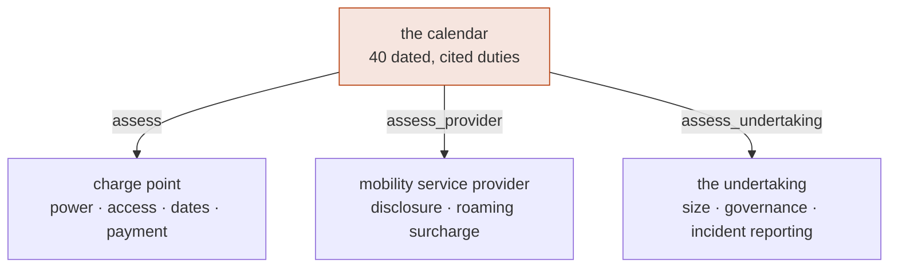

+++
title = "The obligation calendar"
weight = 8
description = "AFIR, DA-656, LSV 2026, MessEG, the THG preconditions and the NIS2/CRA cybersecurity regime as dated, cited, executable rules over three subjects — why applicability and satisfaction stay separate questions, and why a duty has to know who it binds."

[extra]
nav = "Compliance"
+++

# The obligation calendar ✅

European charging regulation is a set of duties with dates attached. Most of
them arrive between 2024 and 2028, several bind only some points, some bind the
*provider* rather than the point, some bind the **undertaking** rather than
either, and a few carve out explicit exemptions. "Are we ready?" is therefore a
question with a date, a subject and an answer per duty — which is a query, not a
document.

```rust
let report = assess(&point, date!(2027-01-01));

for finding in report.failing() {
    println!("{}  {}", finding.obligation.citation, finding.obligation.remedy);
}
```

## Three subjects, because the law binds three



Every duty is answered by **exactly one** of the three, and a test asserts it —
so no duty can be quietly unassessable, and adding a fourth subject cannot leave
one behind. An operator whose every charge point is faultless can be in breach as
a provider, and in breach again as a company.

## What is in it

Forty duties over three subjects.

| Duty | Source | From | Reads |
|---|---|---|---|
| Ad-hoc charging without a contract | `[AFIR Art. 5(1)]` | 13.04.2024 | public; **a free point satisfies it outright** |
| A payment instrument widely used in the Union | `[AFIR Art. 5(1)]` | 13.04.2024 | public ∧ paid ∧ **deployed** ≥ 13.04.2024 |
| …retrofit at ≥ 50 kW on TEN-T **or a safe and secure parking area** | `[AFIR Art. 5(1)]` | 01.01.2027 | reaches points deployed before 13.04.2024 |
| The right *not* to use automatic authentication | `[AFIR Art. 5(2)]` | 13.04.2024 | public ∧ offers it |
| **Prices must not discriminate** between end users and providers, or between providers | `[AFIR Art. 5(3)]` | 13.04.2024 | public; differentiation only if proportionate and objectively justified |
| At ≥ 50 kW the ad-hoc price is **based on a price per kWh** | `[AFIR Art. 5(4)]` | 13.04.2024 | deployed ≥ 13.04.2024 |
| At ≥ 50 kW the €/kWh and any occupancy fee shown at the station | `[AFIR Art. 5(4)]` | 13.04.2024 | deployed ≥ 13.04.2024 |
| Below 50 kW every component available, **in the prescribed order** | `[AFIR Art. 5(4)]` | 13.04.2024 | **no deployment-date limit** |
| Provider: disclose every component, e-roaming costs included | `[AFIR Art. 5(5)]` | 13.04.2024 | the provider profile |
| Provider: **no** extra charge for cross-border e-roaming | `[AFIR Art. 5(5)]` | 13.04.2024 | the provider profile |
| Every public point is a **digitally-connected** recharging point | `[AFIR Art. 5(7)]` | 14.10.2024 | public |
| **Smart-recharging capable** | `[AFIR Art. 5(8)]` | 13.04.2024 | built after 13.04.2024 ∨ renovated after 14.10.2024 |
| **Fixed cable** on every public DC point | `[AFIR Art. 5(10)]` | 14.04.2025 | public ∧ DC |
| A **third-party owner** must supply a point whose characteristics let the operator meet 5(2), (7), (8), (10) | `[AFIR Art. 5(11)]` | 13.04.2024 | public ∧ the operator does not own it |
| Static data free of charge | `[AFIR Art. 20(2)]` | 14.04.2025 | public |
| Dynamic data free of charge | `[AFIR Art. 20(2)]` | 14.04.2025 | public ∧ **paid** |
| A free, unrestricted **API registered with the NAP** | `[AFIR Art. 20(3)]` | 14.04.2025 | public |
| …the German feed in the **DATEX II Recharging profile** | `[DATEX-II-Profil]` | 14.04.2026 | public |
| EN ISO 15118-1…-5 | `[DA-656 Anh. 2.1.1]` | 08.01.2026 | public ∧ **installed or renovated** ≥ 08.01.2026 |
| EN ISO 15118-20, public | `[DA-656 Anh. 2.1.2]` | 01.01.2027 | public ∧ installed or renovated ≥ 01.01.2027 |
| EN ISO 15118-20, **private Mode 3/4** | `[DA-656 Anh. 2.1.3]` | 01.01.2027 | private ∧ not Mode 2 ∧ installed or renovated ≥ 01.01.2027 |
| Automatic authentication ⇒ **both** -2 and -20 | `[DA-656 Anh. 2.1.2]` | 01.01.2027 | AutoCharge counts, not only PnC |
| Every point meets the **technical requirements** (§ 49(1) EnWG) | `[LSV26 §3]` | 01.01.2026 | public — the duty § 5(1)–(3) are exercised over |
| …and the operator can **prove** it on request | `[LSV26 §4]` | 01.01.2026 | § 4(2) |
| Commissioning notified **within two weeks** | `[LSV26 §4]` | 01.01.2026 | a date compared to a date — § 4(3) runs it from the day a point *became* public |
| Decommissioning notified **unverzüglich** | `[LSV26 §4]` | 01.01.2026 | § 4(1) Nr. 2 |
| An operator change notified by **both** operators | `[LSV26 §4]` | 01.01.2026 | § 4(1) S. 2 — one notice is not enough |
| Conformity-assessed meter for energy billing | `[MessEG §33]` | standing | bills by energy |
| Verifiable measured values | `[PTB-A 50.7]` | standing | bills by energy |
| AC metering before the rectifier only in DC stations placed on the market before 2018 and **at most** 50 kW | `[REA 6-A]` | 16.03.2017 | the same number as AFIR's threshold, pointing the other way |
| …and only where the rectification belongs to **one** session | `[REA 6-A]` | 16.03.2017 | a shared rectifier fails it |
| …and the customer must be told the rectification loss is inside the value | `[REA 6-A]` | 16.03.2017 | a value nobody can interpret is one nobody can check |
| THG-Quote: publishable register entry, lawful metering, issued operator code | `[38k §6(3)]` | standing | public |
| The undertaking gives the authority its details | `[NIS2 Art. 3(4)]` | 06.12.2025 | `UndertakingProfile` — an Annex I type of at least medium size |
| …and takes **all ten** risk-management measures | `[NIS2 Art. 21(2)]` | 06.12.2025 | a conjunction, not a score |
| …and can warn the CSIRT **within 24 h** | `[NIS2 Art. 23(4)]` | 06.12.2025 | then 72 h, then a report within a month |
| The **management body** approves and oversees the measures | `[NIS2 Art. 20(1)]` | 06.12.2025 | the same paragraph makes its members liable |
| …and its members attend cybersecurity training | `[NIS2 Art. 20(2)]` | 06.12.2025 | required for the body, called for for all staff |
| A **manufacturer** reports an exploited vulnerability within 24 h | `[CRA Art. 14]` | 11.09.2026 | only where products with digital elements are placed on the market |
| …and places only conformity-assessed products on the market | `[CRA Art. 13]` | 11.12.2027 | Annex I Part I ∧ the Part II vulnerability handling |

## Six properties that make it trustworthy

### Every duty carries its citation

`cargo xtask check-citations` walks the source, finds every citation, and fails
the build if one names a document `specs/README.md` does not index. A rule
citing a Verordnung nobody can produce is indistinguishable from a rule somebody
invented, and this is the difference made mechanical.

The `specs/` directory itself is gitignored — the documents are third-party and
copyrighted — but the index that lists them, with a retrieval URL each, is
tracked. The corpus rebuilds from a fresh clone.

### Every duty carries its window

`applies_from`, and `applies_until` for the duties that get superseded. Asking
the calendar about a date is the *only* way to use it, so a duty cannot be
applied a year before it exists:

```rust
// DATEX II starts on 14.04.2026.
assert_eq!(status_on(date!(2026-04-13)), Status::NotYetInForce);
assert_eq!(status_on(date!(2026-04-14)), Status::Failing);
```

This is also what the Eichrecht reform now in flight will need: the revised MID
gains an Annex Va for charging infrastructure, and when it lands it is a data
change rather than a redesign.

### Applicability and satisfaction are different questions

A private depot is **not failing** the ad-hoc payment duty. The duty does not
bind it. So the calendar has six outcomes, not two:

| Status | Meaning |
|---|---|
| `Satisfied` | binds this subject, and it is met |
| `Failing` | binds this subject, and it is not |
| `NotApplicable` | does not bind this subject |
| `NotYetInForce` | has not started binding yet — work to plan |
| `NoLongerInForce` | bound once, since superseded — nothing to do, ever |
| `DifferentScope` | binds a different *kind* of subject |

Merging the middle two produces reports that cry wolf, which is how compliance
dashboards come to be ignored.

Three exemptions in the AFIR text are easy to miss, and each is modelled as
`NotApplicable` rather than as a pass:

**A free charge point owes no payment instrument — and no dynamic data.** The
payment régime "shall not apply to publicly accessible recharging points that do
not require payment for the recharging service", and the *same words* appear
again in `[AFIR Art. 20(2)]` for point (c), the dynamic data. That is why the
static and dynamic data duties are two obligations rather than one: they have
different exemptions. The ad-hoc *access* duty, meanwhile, is `Satisfied` for a
free point rather than failing — a charger that costs nothing is contract-free
by construction.

**A QR code satisfies the duty only below 50 kW.** Art. 5(1) lists three
acceptable instruments and restricts (c) — an internet-connected device such as
one generating a QR code — to points below 50 kW. The same equipment is
compliant on a 22 kW post and non-compliant on the 150 kW charger beside it.

**The 2027 retrofit reaches safe and secure parking areas**, not only the TEN-T
road network — and it explicitly covers points deployed *before* 13.04.2024,
which is the whole purpose of the subparagraph.

### Failing a duty and forgoing an entitlement are different answers

Thirty-nine of the forty entries are duties: a regulator can fine an operator,
order a retrofit, or forbid the operation of a point. One is not. The four
conditions between a public kilowatt-hour and the German greenhouse-gas quota are
worth money and break no law when unmet — the entry's own remedy ends *"…or forgo
the quota"*. In one bucket, an estate that meets every legal duty in Europe and
declines a subsidy reads as non-compliant. So each entry carries what failing it
costs (D219):

```rust
report.verdict();      // Compliant — nothing unlawful
report.breaches();     // what a regulator can act on
report.forgone();      // money left on the table, which is not a breach
report.failing();      // the union, for a caller that wants both
```

### Every duty is assessable against something

`[AFIR Art. 5(5)]` binds the **mobility service provider**, not the point. A
calendar that kept it in the table with an applicability test always returning
`false` could only ever report "different scope" — which looks assessable and is
not, and is worse than leaving it out.

It is judged against a `ProviderProfile`:

```rust
let mut provider = ProviderProfile::bare(PartyId::new("DE", "MSP")?);
provider.discloses_all_price_components = true;
provider.discloses_electronically = true;

// Still failing: the e-roaming cost is a component the article names explicitly.
assert_eq!(
    assess_provider(&provider, today).status_of(ObligationId::AfirMspPriceDisclosure),
    Some(Status::Failing),
);

provider.surcharges_cross_border_roaming = true;
// And this one the article forbids outright, rather than merely capping.
assert_eq!(assess_provider(&provider, today).verdict(), Verdict::Failing);
```

An operator whose every charge point is faultless can still be in breach as a
provider. In Germany one company usually wears both hats, and the provider half
is the half nobody checks.

### …and a third subject, because cybersecurity law binds the company

`[NIS2 Anh. I]` names this industry in the Energy sector by its role, in as many
words: *"Betreiber von Ladepunkten, die für die Verwaltung und den Betrieb eines
Ladepunkts zuständig sind und Endnutzern einen Aufladedienst erbringen, auch im
Namen und Auftrag eines Mobilitätsdienstleisters"*. Precisely the operator whose
points the profile above describes — and **none of what it asks is a fact about
a point**. Size, governance, whether an early warning can leave the building
inside a day: those are facts about the undertaking.

```rust
let mut operator = UndertakingProfile::bare(PartyId::new("DE", "CPO")?);
operator.operates_recharging_points = true;
operator.employees = 400;
operator.risk_management = RiskManagement::complete();
operator.risk_management.supply_chain_security = false;

assert_eq!(operator.nis2_class(), Some(Nis2Class::Essential));
assert_eq!(operator.risk_management.missing(), vec!["(d) supply-chain security"]);
assert_eq!(
    assess_undertaking(&operator, today).status_of(ObligationId::Nis2RiskManagement),
    Some(Status::Failing),
);
```

Seven duties: five from NIS2 — registration, the ten risk-management measures,
the 24-hour early warning, the management body's approval, and its training —
and two from the Cyber Resilience Act, which bind only an undertaking that
places a product with digital elements on the market. The ten measures are a
**conjunction**, because the article says the measures "shall include at least
the following": nine of ten is not ninety per cent of a duty.

Two things in that regime are easy to get wrong and both are tested.

**The financial half of the size test is an `and`.** `[NIS2 Art. 2(1)]` reaches
an entity that qualifies as medium-sized under Recommendation 2003/361/EC or
exceeds those ceilings, and the Recommendation defines an SME as *fewer than 250
staff **and** (turnover ≤ €50 M **and/or** balance sheet ≤ €43 M)*:

```text
exceeds the ceilings  ⇔  employees ≥ 250  ∨  (turnover > €50 M ∧ balance sheet > €43 M)
```

Every secondary source checked writes "250 employees or €50 million turnover"
and drops the balance-sheet conjunct, which puts an asset-light operator turning
over €60 M on a €20 M balance sheet in the essential class it is not in.

**A directive binds from the day the Member State transposed it.** `[NIS2 Art.
41]` obliged Member States to apply the rules from 18.10.2024. A directive binds
nobody directly: Germany's NIS2UmsuCG came into force on 06.12.2025, with no
general transitional period, and that is the day the calendar uses. Dating the
duties from the Directive would report every German operator in breach for
fourteen months in which no German authority could act.

The Cyber Resilience Act beside it is a **Regulation**, so `[CRA Art. 71]`'s own
dates are the dates in every Member State — 11.09.2026 for the reporting duty,
11.12.2027 for the rest — with no transposition in between. Treating "the EU
date" as one thing is how a compliance model gets both instruments wrong.

A test asserts that **every duty in the calendar is answerable by exactly one of
the three profiles**, so none can go quietly unassessable again — and so that
adding a fourth subject cannot leave a duty behind.

## The two paragraphs the Regulation itself names

`[AFIR Art. 5(6)]` tells Member States what to watch: "Member States shall
ensure that their authorities regularly monitor the recharging infrastructure
market, and in particular, that they monitor the compliance of operators of
recharging points and mobility service providers **with paragraphs 3 and 5**."

Two paragraphs, two subjects. Paragraph 5 binds the provider — the disclosure
duty and the cross-border-surcharge ban — and is judged against a
`ProviderProfile`. Paragraph 3 binds the **operator**: prices must be
reasonable, comparable, transparent and non-discriminatory, and "the level of
prices may be differentiated, but only if the differentiation is proportionate
and objectively justified".

A calendar carrying one and not the other checks half of what the regulator was
told to look at, which is how a dashboard comes to be green on the day an
inspection is not. So the operator half is a duty with a real test — and
differentiation is not itself the breach, **unjustified** differentiation is.
The comparability and transparency limbs of the same paragraph are enforced
where they are checkable: the display duties of Art. 5(4), and the
[tariff shape check](@/docs/pricing.md).

## And the paragraph that binds neither

`[AFIR Art. 5(11)]`: "Where the operator of a recharging point is not the owner
of that point, the owner shall make available to the operator … a recharging
point with the technical characteristics which enable the operator to comply
with the obligations set out in paragraphs 2, 7, 8 and 10."

Host-owned hardware is the normal case — a hotel, a supermarket or a
municipality buys the charger and a CPO operates it — and the operator is then
held to the automatic-authentication, digital-connection, smart-recharging and
fixed-cable duties on equipment it cannot change. The article puts that on the
owner, which is only any use to an operator that wrote it into the contract. The
remedy the calendar returns says exactly that, because the fix is not technical.

## The dates the text actually gives

Three wordings appear in Article 5 and they are not interchangeable. This is
where most implementations go wrong:

| Wording | Reads | Duties |
|---|---|---|
| "deployed from 13 April 2024" | `commissioned_on` | 5(1), 5(4)¶1–2 |
| "built after … **or renovated after** …" | both, with **different dates** | 5(8) |
| "installed **or renovated** from …" | `installed_or_renovated_on()` | `[DA-656 Anh. 2.1]` |

A renovation is not a deployment. Reading it as one drags untouched 2019
hardware into duties written for new equipment:

```rust
point.commissioned_on = date!(2019-01-01);
point.renovated_on = Some(date!(2026-03-01));

// The card-reader duty binds points *deployed* from 13.04.2024. This one wasn't.
assert_eq!(status(ObligationId::AfirPaymentInstrument), Status::NotApplicable);

// The smart-recharging duty says "renovated after 14 October 2024" in as many
// words, so it does bind.
assert_eq!(status(ObligationId::AfirSmartRecharging), Status::Failing);
```

Art. 5(4) adds a fourth subparagraph that limits **only its first two**
subparagraphs to points deployed from 13.04.2024. The third — the ordered
components below 50 kW — carries no such limit, so it reaches the whole
installed base.

## The exemption that is a date, not a technology

`[DA-656]`'s recitals exempt existing low-level-communication points from the
ISO 15118 duties, and the Annex expresses that as a date: 2.1.1 binds points
"installed or renovated **from 8 January 2026**".

Testing the *technology* as well — "not applicable if the point only does PWM" —
would let a PWM-only point installed in 2026 escape the duty **because it fails
it**. Exactly backwards, so the test is the date alone.

```rust
// A PWM-only point installed in June 2026: the non-compliant case.
assert_eq!(status(&fresh, ObligationId::Da656Iso15118Dash2), Status::Failing);

// A 2019 point: out of scope, by date.
assert_eq!(status(&legacy, ObligationId::Da656Iso15118Dash2), Status::NotApplicable);
```

The date carries the exemption; the technology is what is being asked about.

The 2027 generation is three duties rather than one, because the Annex has three
provisions: **2.1.2** for public points, **2.1.3(b)** for private **Mode 3/4**
points — a domestic socket with an in-cable box is Mode 2 and gets EN IEC
61851-1 instead — and 2.1.2's second sentence for points offering **automatic
authentication**, which is the trigger the Annex names rather than Plug & Charge
specifically, so AutoCharge counts.

## The three duties the regulator actually audits

`[LSV26 §5]` names Art. 5(1), (2), **(7), (8) and (10)** as the paragraphs the
Bundesnetzagentur may inspect, demand a retrofit for, and forbid the operation of
a point over. The last three are the ones compliance models normally omit:

- **5(7)** — every public point must be a *digitally-connected* recharging
  point, from 14.10.2024. Without it neither the data nor the smart-charging
  duties can be met at all.
- **5(8)** — smart-recharging capable, with the two-date "or" above.
- **5(10)** — every public **DC** point must have a fixed cable, from
  14.04.2025.

## A deadline is not a flag

`[LSV26 §4]` does not ask whether a point is registered. It requires the
operator to notify commissioning to the regulator **at the latest two weeks
after** it happens — and § 5(3) lets the regulator forbid the operation of a
point whose notice was never filed. A boolean cannot express a late filing:

```rust
point.commissioned_on = date!(2026-03-01);

point.registration = Registration::notified_on(date!(2026-03-22));
assert_eq!(status(ObligationId::Lsv2026CommissioningNotice), Status::Failing);

point.registration = Registration::notified_on(date!(2026-03-10));
assert_eq!(status(ObligationId::Lsv2026CommissioningNotice), Status::Satisfied);
```

## The Ladesäulenverordnung is more than one notice

`[LSV26 §5]` lets the Bundesnetzagentur inspect, demand a retrofit for and
**forbid the operation of** a point over "eine technische Anforderung nach § 3".
A calendar that carries the regulator's powers without the duty they are
exercised over names the consequence and omits the cause, so § 3 is a duty now —
every publicly accessible point must meet the applicable technical requirements,
"insbesondere die Anforderungen an die technische Sicherheit von Energieanlagen
nach § 49 Absatz 1 des Energiewirtschaftsgesetzes".

§ 4 is **four** duties rather than one, and three of them were missing:

| Duty | Text | The trap |
|---|---|---|
| Commissioning notice | § 4(1) Nr. 1 — "spätestens zwei Wochen nach der Inbetriebnahme" | § 4(3) applies the régime afresh "wenn ein bestehender Ladepunkt öffentlich zugänglich wird", so a depot charger that opens to the public owes its notice from **that** day. Reading the deadline off the commissioning date reports it as years late on its first day and never lets it become compliant |
| Decommissioning notice | § 4(1) Nr. 2 — "unverzüglich" | A point the register still shows as live is one the operator is still answerable for |
| Operator-change notice | § 4(1) Nr. 3 and S. 2 | "Anzeigen … durch den bisherigen **und** den neuen Betreiber" — **two** notices. An incoming operator that files its own and assumes the outgoing one did the same has a point § 5(3) may close, over a notice it never saw and did not owe |
| Evidence on request | § 4(2) | Being compliant and being *able to prove* it are different duties, and the second is failed quietly: nothing goes wrong until the request arrives, and by then the documents either exist or they do not |

### `Unverzüglich` has no number, so the number is a documented choice

Nr. 2 and Nr. 3 say *unverzüglich* — `[BGB §121]`'s *ohne schuldhaftes Zögern* —
and give no figure. Inventing one would be a rule the text does not support;
leaving the duty untestable would make it a rule nothing enforces.

So the window is the one the legislator itself chose **in the same paragraph**
for the one event it did quantify: two weeks. That is the reading with the best
support inside the text, and it is a separate constant
(`Registration::PROMPT_NOTIFICATION_DAYS`) precisely so a deployment can see the
choice and argue with it. `Notice::delay_days` reports how late a filing was, so
a stricter policy does not have to re-derive the arithmetic.

## The quota's four conditions, and the one that is not the Anzeige

`[38k §6(3)]` puts **four cumulative conditions** between a public
kilowatt-hour and the greenhouse-gas quota it is worth a second time.
`QuotaPosture` is four fields in the paragraph's own order.

Nr. 1 asks whether the regulator has **published** the notified point, or the
third party has **consented** to publication. It does not ask whether the
Anzeige was made: `[LSV26 §4(1)]` requires the notice and says nothing about
publication, so a point can be duly notified, on the register, and not
publishable. Eligibility read off a notice date passes every point that has
one — which, in a compliant estate, is every point.

Nr. 2 wants the quantity determined in conformity with the measuring and
calibration law, which is what `emob-eichrecht` decides per record — so
`emob-thg` refuses a record with no evidence rather than summing it. Nr. 3
wants an identification code **issued** to the operator by an ID registration
organisation `[AFIR Art. 20(1)]`; a well-formed `EvseId` says the operator
*uses* a code, not that a registered organisation issued it.

Nr. 4's further identifying features exist only *"sofern die zuständige Stelle
solche durch Bekanntgabe im Bundesanzeiger bestimmt hat"*, and today none are
announced. `FurtherIdentifiers` has three states for that reason: `false` would
block every claim in the country and `true` would keep passing on the day an
announcement lands.

## Planning

```rust
// What lands on the fleet between now and the end of 2027?
for o in starting_between(date!(2026-09-01), date!(2027-12-31)) {
    println!("{}  {}", o.applies_from, o.title);
}
```

### …and which of them this estate will actually fail

That is what the *calendar* holds. `agentd`'s compliance sweep asks it of an
**estate**: every point against every duty, grouped by duty rather than by point
— four hundred posts missing a CSMS connection is one firmware programme, not
four hundred findings — and every duty that has not started binding judged *at
its own commencement date* against the estate as it stands.

```jsonc
{ "on": "2026-09-01", "points": [ /* the inventory */ ], "horizon_days": 540 }
```

A point renovated in March 2027 that speaks only EN ISO 15118-2 is compliant
today and in breach on new year's day, and that forecast is the only compliance
advice arriving before the breach rather than after it. The horizon is the
caller's; the date is an argument rather than a clock, so a run in March replays
to the same answer in September.

## What is not here 📐

The Cyber Resilience Act's *artefacts* — the SBOM, the declared support period,
the update channel — are a build pipeline rather than a calendar entry; the
calendar carries the duty that requires them. The AFIR TEN-T flag is an input:
resolving which points sit "along" the network from corridor data is an
operations question, not a domain one. And the NIS2 supervision regimes
(`[NIS2 Art. 32]` against `[NIS2 Art. 33]`) differ by class rather than by
duty, so the class is reported and the duties are judged the same for both.
