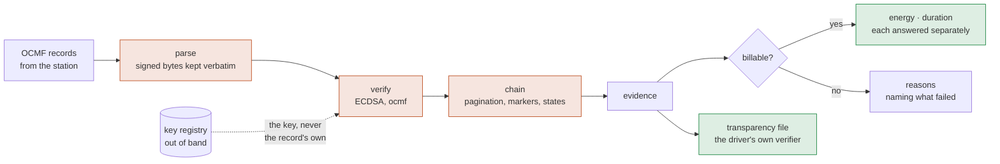

+++
title = "The Eichrecht chain"
weight = 2
description = "How a signed meter value becomes an invoice line: the questions kept apart, which quantity each failure takes away, and the reason a valid signature is not enough."

[extra]
nav = "Eichrecht"
+++

# The Eichrecht chain ✅

German calibration law makes a kilowatt-hour bill valid only if the customer can
verify the measured value against a conformity-assessed meter, arbitrarily long
after the session — `[MessEG §33]`, `[PTB-A 50.7]`, `[REA 6-A]`. This page is
how `emob-eichrecht` implements that, and why each piece is separate from the
others.

## The promise

> **A value that does not verify does not bill.**

Not a convention, a type. `Evidence::billable_energy()` is the only route to a
billable quantity, and it returns `None` whenever any check failed. A caller who
wants to bill anyway has to write code that visibly ignores the answer.

Five gates stand between a station's records and a quantity an invoice may use.
Each is a separate question with a separate answer, and each can refuse on its
own:



The transparency file hangs off the evidence rather than off a successful
outcome, because a dispute is exactly the case where the session did **not**
bill and the driver still has to be able to check it.

What happens to a verified quantity next is
[sessions and settlement](@/docs/settlement.md); what turns it into money is
[tariffs](@/docs/pricing.md).

## The format is `ocmf`'s, and that is the point

Parsing OCMF is the hard part, and it is not this crate's part. The
[`ocmf`](https://crates.io/crates/ocmf) crate does it — and it does it against
evidence a hand-rolled parser never has: the whole **S.A.F.E. Transparenzsoftware
reference corpus**, 256 records from eleven manufacturers and 705 readings, with
**OpenSSL's verdict on each one** as an independent oracle, plus a published
162-case conformance suite.

The rule everything follows from is that the signature covers the payload section
**exactly as written**:

> Between signing and validation, the payload section must not be manipulated
> (removing and adding white spaces), otherwise positive validation is not
> possible.

So a parser that deserialises the JSON and re-serialises it to hash has already
lost — key order, insignificant whitespace, number formatting and Unicode escapes
are all free to change under a round trip, and each of them changes the digest.
`Record::signed_bytes()` returns a **slice of the input**, and there is no API in
that crate that produces signable bytes from a typed value.

### What the corpus says about the specification

This is the argument for not writing it twice:

| Measured | Count | What a hand-rolled parser does with it |
|---|---:|---|
| Records omitting `MS`, which `[OCMF Tab. 3]` marks `1..1` | 229 / 256 | strict cardinality rejects nine real records in ten |
| Readings omitting `TM`, relying on carry-forward | 205 / 705 | a reading read independently of its neighbours is wrong |
| Readings writing `RV` as a JSON **string** | 23 | a typed deserialiser refuses them |
| Records whose payload is pretty-printed | 9 | any re-serialisation destroys the signature |
| OBIS codes written the way `[OCMF Tab. 25]` specifies | **0** | a canonical-form check refuses every record ever sent |

Not one record in the corpus writes the OBIS code the way the table does: a
reader built from the tables is a reader built against a document nobody sends.

So departures are **reported, never swallowed**: parsing runs in a profile and
every deviation from the specification becomes a typed finding carrying the
offending value and the table it is measured against. A strict parser rejects
nine real records in ten and a lawful session becomes unbillable for a schema
reason; a lenient one accepts everything and an operator never learns their fleet
emits records the official tool will reject.

### Numbers keep their scale

The same reasoning reaches inside the JSON. OCMF says a reading value's
representation "must not be transformed by further handling methods … since this
would change the representation of the physical quantity and thus potentially
the number of valid digits". `2935.600 kWh` is a meter stating three decimals of
resolution, and a parser that routes numbers through `f64` silently turns it into
`2935.6`.

```rust
assert_eq!(record.payload().readings()[0].value().unwrap().as_str(), "2935.600");
```

### An omitted field is unchanged, not absent

"For the readings, fields that have an identical value to the previous reading
are omitted. However, this only applies within a signed record"
`[OCMF Tab. 7 preamble]`. The rule is over **fields**; `RI` and `TX` are its
examples, not its list. `RU`, `RT`, `ST` and `EF` carry forward on the same
footing — and 205 of the corpus's 705 readings depend on it.

`EF` is the one that decides money: reading the omission as "no fault" would
clear something the station signed.

## The questions, kept apart

| Question | Answered by | Whose | Skipping it means |
|---|---|---|---|
| Did *this key* produce *these bytes*? | `ocmf::verify` | the format's | anyone can bill you |
| Are any records missing? | `ocmf::session` | the format's | a session with a hole in it bills |
| Is this key *this charge point's* key? | `KeyRegistry` | **ours** | the record vouches for itself |
| Which quantity does each failure take away? | `chain::validate` | **ours** | one boolean throws away what the format kept apart |
| May these readings be billed? | `MeterState`, error flags | both | a substitute value becomes an invoice |
| May the **duration** be billed too? | `TimeStatus`, the `t` flag | both | an occupancy fee is billed off an unsynchronised clock |
| Which way did the energy go? | the OBIS code | both | a V2G discharge is billed as consumption |
| Who was charging, and did it hold? | `IdentificationLevel` | both | a rejected certificate becomes a customer |
| Can the **customer** repeat all of it? | `transparency::to_xml` | both | the law's actual requirement is unmet |

The split is the whole design. `ocmf` says so in its own documentation —
*"whether a session may be invoiced depends on tariffs, on a key registry binding
each record to this charge point, and on law — none of which is in scope"* — and
that sentence is `emob-eichrecht`. A format crate can say a record is missing;
only law can say what a missing record costs you, and the answer is not one
boolean.

### Signatures cannot see a deletion

This is the one people miss. Each record is signed independently, so removing
the middle of a session leaves a sequence in which every remaining signature
still verifies. The specification assigns the check to a separate "check
component": pagination must be contiguous within one context, the first record
must open the transaction, the last must close it, and nothing may be added or
removed in between.

```rust
// Every signature genuine; the session still does not bill.
let report = chain::validate(&[record_pg1_begin, record_pg3_end]);
assert!(report.findings.contains(&ChainFinding::PaginationBreak { after: 1, found: 3 }));
assert!(!report.is_billable());
```

The chain also holds every record to one signing component
`[OCMF §Relation of Serial Numbers]`, taking its reference from the first record
that *names* one rather than from the first record. OCMF lets a station omit
`MS`, and a check whose anchor the assembler chooses is a check the assembler can
switch off.

Pagination parsing refuses `T007` alongside `T7` for the same reason: two
spellings of one counter value would break the "increments by exactly one"
property the whole check rests on.

### The key binding travels out of band

A verifier that reads the public key from the record it is checking has verified
nothing. OCMF says so:

> The public keys to the charging point must be transmitted to the verification
> component by means other than this protocol (out-of-band) …

`KeyRegistry` is populated from type approval documents or a provisioning
system, and it models the identification rules the specification actually gives:
a meter serial when the meter signs, a gateway serial when a gateway signs for
one point, and **both** when one gateway serves several — because then neither
alone is unique.

Keys carry validity windows. Without them a registry holds only the current key,
and the day a meter is exchanged every historical session becomes unverifiable —
which is the same failure as an undefendable invoice, arriving late.

```rust
registry.key_at(&component, datetime!(2026-01-15 12:00 UTC));  // the original key
registry.key_at(&component, datetime!(2026-09-15 12:00 UTC));  // the one after the swap
```

The windows are **half-open**, `[from, until)`. Two inclusive bounds leave the
swap instant covered by both keys, and the registry then answers with whichever
was inserted first — so the same session verifies or does not depending on
insertion order, which is not a property anybody wants to defend in a dispute.
Half-open windows partition the timeline exactly, which is what a key history is.

The partition is enforced rather than assumed: `insert` refuses a window that
overlaps one the component already holds — two unbounded keys for one meter being
the ordinary form of the mistake.

It also refuses an **empty** one. A window with `until <= from` — a transcribed
date, two fields swapped in a provisioning run — covers no instant at all, and
the overlap sweep cannot see it, because an empty interval overlaps nothing. It
would register cleanly, verify nothing, and leave the component reading as
unprovisioned at every instant — which is indistinguishable from a component
nobody registered, in the one place an operator goes to ask.

A *gap* between two windows stays a gap. A record from a month with no
registered key fails to resolve rather than falling through to a neighbouring
key, because inventing a binding is how a forged record verifies.

### A substitute value is not a measurement

`ST=S` means the meter produced a number because it could not measure one.
Legitimate telemetry; never a basis for an invoice. Only `ST=G` is billable, and
an `ST` code this build has never heard of is an error rather than an optimistic
pass — a signature component reporting an unknown state is exactly when billing
should stop.

The same holds for the `EF` error flags. An unrecognised flag character blocks
billing rather than being skipped, so a future OCMF revision cannot widen what
gets invoiced by adding a character an old implementation ignores.

## Four quantities, not one

OCMF distinguishes them and so does this. `EF` flags energy (`E`) and time (`t`)
separately `[OCMF Tab. 7]`, `TM` states how far the clock can be trusted
`[OCMF Tab. 19]`, `IL` states how the user was identified `[OCMF Tab. 11]`, and
the OBIS code states which way the energy went `[OCMF Tab. 25]`. Collapsing them
into one boolean throws away exactly the distinctions the format was shaped to
carry.

```rust
// The same session, clock status `U` — unsynchronised.
assert_eq!(report.billable_energy.unwrap().to_string(), "29.500 kWh");
assert!(!report.is_billable_for_time());
```

A session on an unsynchronised clock has perfectly good energy and a duration
nobody can defend — so a per-kWh tariff bills it and the per-minute occupancy fee
`[AFIR Art. 5(4)]` permits must not. A faulty register is the mirror image: no
energy, and the car was still plugged in for twenty minutes.

And a register from the range `[OCMF Tab. 25]` **reserves and does not define** —
`B4`–`BF`, `C4`–`C7` — is a third case, taking the energy and leaving the clock.
An unrecognised manufacturer code is still evidence and still bills; a reserved
one is a billing-relevant quantity the specification has claimed and not
published.

`ChainFinding::disqualifies()` says which quantity each finding takes away, and
a test asserts that every finding takes away at least one — a finding that
disqualified nothing would be a finding that changes no answer. The gate is
enforced one layer up too: `emob-cdr` refuses to price a per-minute tariff
against evidence that cannot carry a duration, and names the fix.

### A user assignment can fail

`MISMATCH`, `INVALID`, `OUTDATED`, `UNKNOWN` are not weak assignments. The UIDs
did not match; the certificate did not check out; the trust anchor had expired.
The energy was measured and there is nobody provably behind it, so they block —
and they are deliberately kept **off** the ordered strength scale. Putting them
at the bottom of it would make "the certificate was rejected" compare as slightly
worse than an RFID UID, and some `>=` would then bill it.

The strength that *is* on the scale — `HEARSAY` to `SECURE` — is read off the
records and taken as the **weakest** any of them asserted, then handed to the
CDR cross-check. Taking it from a field a caller filled in would make that check
a formality.

### The register states the direction

`[OCMF Tab. 25]` reserves a range of OBIS codes: `B0`–`B3` is import, `C0`–`C3`
export, with the scope (one transaction or the meter's lifetime) and the
measurement point (at the meter or at the vehicle) in the same nibble.

```rust
assert_eq!(ObisCode::new("01-00:C2.08.00*FF").direction(), Some(Direction::Export));
```

A workspace whose founding claim is that import and export **never net** cannot
hold that as an opaque string and take the direction from the session model
without ever comparing the two — a record claiming a draw over a `C2` register is
a V2G discharge billed as consumption, and nothing downstream of the register
could see it. `emob-cdr` refuses it, and so does the pre-flight on a partner's
record.

A code the crate cannot classify states *no* direction rather than defaulting to
import.

Reading the code is also what makes the cable-loss rules checkable. `CL` may be
reported "only when RI is indicating an accumulation register reading" and "must
be reset at TX=B" `[OCMF Tab. 7]` — a transaction opening on a non-zero
cumulated loss is carrying compensation from the previous session into this one.
The loss is never subtracted (the compensation is already inside `RV`) but it is
carried onto the report, because a partner disputing the energy will ask how much
of it was cable — and it reaches them: the figure travels on the CDR, and the
OCPI crossing states it as a note because the wire has no field for it and
`[REA 6-A §3.2]` makes telling the affected party what is inside a measured
value a duty rather than a courtesy.

And it comes back as an `Energy`, not a bare decimal: `CL` "is given in the same
unit as RV which is specified in RU" `[OCMF Tab. 7, CL]`, and `RU` is `Wh` on
ordinary German hardware. Reported raw beside a `billable_energy` in kWh, a
420 Wh cable loss reads as 420 kWh — a figure a thousand times larger than the
session it exists to explain, in the middle of a dispute about that session.

### An exception marker stops the arithmetic

`TX=X` is "error during charging, transaction continues, time and/or energy are
no longer usable **from this reading (incl.)**". The transaction carries on; the
numbers may not be billed across it.

### Two transactions can hide in one chain

Two `TX=B` markers mean two charging processes were concatenated. Pagination
stays contiguous across the join, so nothing else sees it, and subtracting the
last register value from the first spans both sessions — a number larger than
either and belonging to neither.

## The records also state the shape of the session

Eight of `[OCMF Tab. 7, TX]`'s ten markers are structure. Two are facts nothing
else in the evidence carries, and they are the intervals money turns on: `S`
("Suspended = Transaction active, but currently not charging") and `T` (a tariff
change).

```rust
for (from, to) in evidence.suspended_intervals() { /* signed occupancy */ }
```

`[AFIR Art. 5(4)]` prices those minutes per minute, and the only other account of
them is OCPP's `chargingState` — a protocol field asserted by the same party that
issues the invoice. `emob-ocpp` compares the two.

A **note, never a refusal**: `S` is optional, so its absence says nothing and
most of the fleet never emits one. Its presence against a contrary protocol claim
is two stories about one event, and only one of them is signed.

## The transparency file

`[MessEG §33]` does not say a measured value must be **correct**. It says the
affected party must be able to **check** it. A platform that verifies internally
and reports "verified" has satisfied nobody: the customer cannot repeat the
check, and repeating it is the entire requirement.

What they repeat it with, in Germany, is the S.A.F.E. Transparenzsoftware — an
independent verifier the industry maintains. It reads an XML container:

```xml
<values>
  <value transactionId="120" context="Transaction.Begin">
    <publicKey encoding="hex">3059301306072A8648CE3D…</publicKey>
    <signedData format="OCMF" encoding="plain">OCMF|{…}|{"SD":"…"}</signedData>
  </value>
  <value transactionId="120" context="Transaction.End">…</value>
</values>
```

```rust
let xml = transparency::to_xml(&evidence)?;   // hand this to the driver
```

The key comes first, because the verifier's own `values.xsd` sequences it first.
The format's prose example shows the other order, and both unmarshal today only
because the reference implementation does not validate against its own schema.

Each record appears **verbatim** — a reassembled one hashes differently, which
is why the parser keeps the whole `OCMF|…|…` string and not only the span the
signature covers. Beside it is the key it was checked against: the one the
registry supplied out of band, never one chosen later to make the file verify.
That is why the export takes an `Evidence` rather than a pile of records — a
function taking keys as arguments could be handed the convenient key.

A record that did **not** verify has no key binding and therefore no `<value>`;
`reasons()` explains that to the operator. And a session that does not bill still
gets a file, because the customer's right to check does not depend on the answer
and a dispute is exactly when it matters.

### One id per transaction, not one per record

`transactionId` is what the verifier **groups** by, and that is the whole of its
job: `MainView` collects `getValues(currentTransactionId)` and hands the list to
`verifyTransaction`, which is where the begin/end pairing and the energy
difference happen. The reference data set carries one id across both halves of a
session.

Writing each record's pagination counter there instead is schema-valid, distinct,
and degrades one session into N single-record transactions the driver cannot
pair — the exact failure `[MessEG §33]` is about, produced by the code written to
prevent it. OCMF has no transaction number of its own, so `to_xml` derives one
from the counter the transaction opened at, and `to_xml_with_transaction_id`
takes the operator's own when there is one.

The `context` label follows the same reading. It is a statement about the whole
data set, so a record carrying `TX=B` **and** `TX=E` — the `MR` configuration,
and the shape of the eBZ LD3 reference record — is neither half of a transaction
and is labelled neither. The attribute is optional and the reference samples omit
it for exactly that shape.

### Reading one back

The export is half of `[MessEG §33]`. The other half arrives when a driver
disputes a bill and sends the file back: an operator then has to parse it, check
the records against **its own registry**, and say whether the key inside it is
the key the station was provisioned with.

```rust
let values = transparency::from_xml(&their_file)?;
```

The key inside a `<value>` is a **claim made by the artefact under
examination**, never "the key": verifying a record against a key the same file
supplied proves only that whoever wrote the file owned a private key, because the
binding travels out of band `[OCMF §Relation of Serial Numbers]`. What it is good
for is the comparison — a file whose key differs from the registered one is a
dispute with an answer.

The reader is strict on purpose — no comments, no CDATA, no namespaces, no
entity it does not know. A transparency file is machine-generated, and a
verifier that silently accepts a shape it half-understands is the failure the
file exists to prevent, pointed inward.

## Tested against meters that exist

Every other fixture on this page is signed at test time with a key the test also
holds, which proves the code agrees with itself — not the question anybody is
asking. So the suite runs records from four sources `emob` did not write, each
checked against the key it is published with:

```rust
// an eBZ LD3 from the S.A.F.E. reference data set
assert_eq!(evidence.billable_energy().unwrap().to_string(), "0.268 kWh");
assert!(!evidence.is_billable_for_time());   // its clock is only informative
```

Each one exercises something a self-signed fixture cannot reach:

| Record | What only a real meter produces |
|---|---|
| eBZ LD3 (secp192r1) | a curve the default toolbox does not carry, and a DER wrapper a strict reader rejects — both below |
| DZG DVH4013 / Nano (secp256k1) | a signature with `s` in the **high half** of the curve order, which the secp256k1 library refuses on Bitcoin's malleability rule and plain ECDSA allows |
| DZG + TwinCharger Pro | `RV` written as a **quoted string**, padded with spaces |
| TwinCharger Pro | `FV` and `CT` written as **numbers** where the tables say String |

The secp256k1 case is the sharpest. A self-signed fixture uses a signer that
naturally produces low `s`, so no amount of self-signed corpus contains the
high-`s` case — and the failure it produces is a signature mismatch, the
diagnostic for **tampering**, on a meter that has done nothing wrong. A verifier
that reports it has told an operator to investigate a fraud that did not happen,
and will keep doing so for every session that meter signs.

Three defects from four records is not a rate that suggests the list is
finished, which is why every format this workspace claims to read carries at
least one third-party sample in its tests.

## What the customer is paying for, when it is not only electricity

`[REA 6-A §3.2]` permits a DC station to meter on the **AC side, before the
rectifier**. The rectification losses are then inside the number the customer is
billed for — and the regulation allows it on three conditions, each of which a
real fleet can quietly fail:

1. the station was **placed on the market before 2018** and is rated **at most
   50 kW**. Note the direction: AFIR's fast-charger duties begin *at* 50 kW
   counting up, this allowance still applies *at* 50 kW counting down, and a
   50 kW station is on the strict side of one rule and the permissive side of
   the other;
2. the rectification "kann einem einzelnen Ladevorgang ausschließlich und
   eindeutig zugeordnet werden" — which a **multi-outlet cabinet sharing one
   rectifier does not**, and shared rectifiers are the normal way such cabinets
   are built;
3. the customer is told: "Die von einem Messwert oder einer Rechnung Betroffenen
   sind in geeigneter Weise darauf hinzuweisen, dass die … Energie für die
   Gleichrichtung … Bestandteil des angegebenen Messwerts ist."

The third is the one this workspace has no excuse for missing. A platform whose
central claim is that the customer can **check** the value owes them the fact
that part of it is loss — a number nobody can interpret is a number nobody can
check.

### …and the third condition binds two documents

The sentence names both: *"Die von einem Messwert **oder einer Rechnung**
Betroffenen"*.

**The invoice** is discharged by construction. Where a record's evidence states a
compensated loss `[OCMF Tab. 7, CL]`, `emob-billing` puts the figure and the
sentence on the line carrying the measured value — BT-127, EN 16931's line note —
from the signed record rather than from a field somebody sets.

**The notice at the point** is a fact about the world with nothing here to
evidence it, so it stays a field on the charge point's profile —
`rectification_loss_disclosed`, which says which of the two halves it covers.

"Placed on the market" is also not commissioning: a station sold in 2017 may
have been commissioned in 2019, and the allowance turns on the first. Where it
is unknown the profile falls back to commissioning, which is the later of the
two — so the exemption fails rather than being granted on a date nobody stated.

## A span too short to resolve is not a span to bill

`[REA 6-A §3.1]` sets an error limit on a station's clock and then a floor
under it:

> Die kürzest mögliche Zeitspanne, für die diese Fehlergrenze erfüllt wird, darf
> nicht mehr als 60 Sekunden betragen … **Messwerte unterhalb der kürzest
> möglichen Zeitspanne werden nicht für Abrechnungszwecke verwendet.**

So a thirty-second session billed per minute is billing a number the clock
cannot defend. It is the mirror of the unsynchronised-clock rule above, arriving
from the other end: there the clock cannot be *placed*, here the span cannot be
*resolved*, and both leave a duration an invoice may not use while the register
is untouched.

The manufacturer states the real figure in the instructions and it may be far
below sixty seconds. A platform that does not have it has not been told the
device is better than the worst case the regulation permits, so
`ClockResolution` defaults to the cap and a station that knows better says so —
the same reasoning that makes an unevaluable tariff restriction never match.

The two rules are answered differently, on purpose. A clock that cannot be
placed vouches for no duration at all, so a tariff that charges for one is
refused by name. A span below the resolution is one *measured value* the
regulation says not to use, so the rating drops that line — and only that line —
with `RatingNote::DurationBelowResolution` saying why, and the kilowatt-hours
bill. The distinction bites on every fast charger: a car sits `EVConnected` for
thirty seconds before its charge begins, an occupancy fee prices those seconds,
and refusing the record over five cents of occupancy would make the most common
transaction shape on a 2.0.1 estate unbillable.

## Curves, and the meter that named the gap

`[OCMF Tab. 22]` names seven algorithms. **Four** verify in pure Rust —
secp256r1 (the default since OCMF 0.4), secp384r1, secp256k1 and secp192r1 — and
the three that do not are refused **by name**, so an operator learns what their
fleet needs rather than seeing a signature mismatch. `ocmf` reaches all three
through OpenSSL; the blocker here is the dependency rather than the arithmetic,
because OpenSSL is a C library that opens files and a domain crate promising
replay may not link one. A daemon may link the backend and hand a verdict in.

secp192r1 is on the list because it was missing. The **eBZ LD3** data set the
S.A.F.E. Transparenzsoftware ships as a reference sample — ordinary German
charging hardware — is signed `ECDSA-secp192r1-SHA256`, and this build
recognised the algorithm and refused it. Every session from such a fleet would
have been unverifiable, and therefore unbillable. A curve list assembled from
what looks modern rather than from what is deployed fails on the day it matters.

## Real signatures are not canonical DER

`SM` says the signature is a DER-encoded ASN.1 `SEQUENCE { INTEGER r, INTEGER
s }`, and DER requires each integer to be minimal and signed. Meters do not
oblige. The eBZ firmware pads both to a fixed 24 bytes regardless of sign, so
its `r` begins `e1` with no `0x00` in front — which a strict reader must treat
as a **negative number** — and its `s` carries a leading `0x00` it does not
need.

The signature is perfectly good; the wrapper is not. Rejecting it rejects a
record the reference verifier accepts, for a reason that has nothing to do with
whether the meter value was tampered with. So each integer's contents are read
as an unsigned magnitude and re-emitted minimally before verification: lenient
about **encoding**, strict about **structure**.

One subtlety worth knowing if you implement this yourself: OCMF pairs
**SHA-256 with every curve it names**, and only two of them have a 32-byte
field. The usual typed digest APIs require the hash to be exactly the field
width, so neither a 32-byte digest against secp384r1's 48-byte field nor the
same digest against secp192r1's 24-byte field even compiles. Verification goes
through the prehash path instead, which applies the X9.62 conversion in both
directions.

## A cable loss belongs to the register it was measured on

`CL` is a property of the register beside it `[OCMF Tab. 7, CL]` — "given in the
same unit as `RV`", accumulating across the transaction, reset at `TX=B`. A meter
reporting two registers reports two `CL` series, and taking the last value seen
against the first `TX=B` seen crosses them: `CL_end(C2) − CL_begin(B2)` is not a
quantity, and nothing in the format says those two numbers are about the same
thing.

So the register is chosen first and the compensation read on **that** one; a
chain with no billable register reports none rather than one belonging to
nothing. The two `CL` findings are raised once per register, not once per
reading — a quarter-hourly session carries ninety-six of them.

## What is not here 📐

The retention windows per artefact: MessEV and PTB give them and the reading is
not settled, so nothing here expires an artefact. The verification half, the
money that comes off it and the file the customer checks it with are built.
