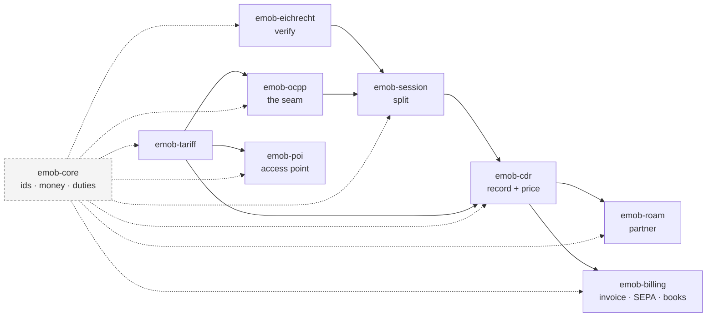

+++
title = "Getting started"
weight = 1
description = "Install the crates that exist, verify a charging session under German calibration law, split it across quarter hours, build a CDR, price it, publish that price to a roaming partner, to the national access point and to the charge point's own screen, close a month into an e-invoice and a SEPA collection, ask the obligation calendar whether you are ready for 2027, and run a hundred-station fleet that reconciles exactly."

[extra]
nav = "Getting started"
+++

# Getting started

Twelve crates are built from this workspace today, with four daemons on top of
them. Everything on this page runs. ✅

```console
cargo add emob-core emob-eichrecht emob-session emob-cdr emob-tariff \
          emob-ocpp emob-poi emob-roam emob-billing emob-thg emob-service \
          emob-sim
```

## Which one do I need?

They compose, but each answers on its own — take the one whose question is
yours, and its dependencies come with it.

| I want to… | Crate |
|---|---|
| Check that a signed meter value is genuine, and say why if it is not | `emob-eichrecht` |
| Give a driver a file their own verifier accepts | `emob-eichrecht` |
| Split a session across the quarter hours the market settles on | `emob-session` |
| Turn a session into a record another company will pay against | `emob-cdr` |
| Price a session, and show the same price before it starts | `emob-tariff` |
| Ask whether a charge point, a provider or the company is ready for a date in the regulation | `emob-core` |
| Parse an eMAID or EVSE id without losing how it was written | `emob-core` |
| Lift a signed value out of an OCPP transaction | `emob-ocpp` |
| Put the price on the charge point's own screen, over OCPP 2.1 | `emob-ocpp` |
| Publish locations and prices to the national access point | `emob-poi` |
| Send a record to a roaming partner, or check one that arrived | `emob-roam` |
| Turn a month of records into an e-invoice, a SEPA collection and postings | `emob-billing` |
| File the year's THG-Quote notification, and find out which points are not eligible | `emob-thg` |
| Write a daemon: settings, a readiness probe, a graceful stop — and decide whether a credential may reach a record | `emob-service` |
| Test all of the above against a fleet that signs for real | `emob-sim` |

Every **domain** crate does no I/O and reads no clock — instants and keys are
arguments. That is what makes a two-year-old dispute answerable by replaying the
check exactly as it ran, and it is enforced by a build guard rather than by
review. `emob-service` is the one shared place that stops being true, and it is
where the daemons live.



The rest of this page walks that chain left to right.

## Verify a charging session

A station emits OCMF records — signed meter values — at the start and end of a
session, and often at quarter-hour boundaries in between. Turning them into a
number you may invoice takes four checks, and `Evidence::assemble` runs all of
them in the order that makes each one meaningful.

```rust
use emob_core::IdentificationStrength;
use emob_eichrecht::{ComponentRef, Evidence, KeyRegistry, RegisteredKey};
use ocmf::{Curve, PublicKey, Record};

// The key binding arrives out of band — from the station's type approval or
// your provisioning system. Never from the record you are about to check.
let mut registry = KeyRegistry::new();
registry.insert(
    ComponentRef::Meter { serial: "BQ27400330016".into() },
    RegisteredKey::unbounded(
        PublicKey::from_text(station_public_key, Some(Curve::Secp256r1))?,
        "type approval 2026-01",
    ),
)?;   // refuses a window overlapping one this component already holds

// The texts outlive the records: a `Record` borrows the bytes its signature
// covers, which is the format's central rule rather than an inconvenience.
let records = raw_records
    .iter()
    .map(|r| Record::parse(r))
    .collect::<Result<Vec<_>, _>>()?;

let evidence = Evidence::assemble(&records, &registry, session_start);

match evidence.billable_energy() {
    Some(energy) => println!("bill {energy}"),
    None => for reason in evidence.reasons() {
        eprintln!("blocked: {reason}");
    },
}
```

`billable_energy()` returns `None` whenever *anything* is wrong, and
`reasons()` says what. There is no other way to reach the number, which is the
point: the rule "a value that does not verify does not bill" is enforced by the
type rather than remembered by a developer.

The energy is not the only answer. A duration is a separate claim with separate
flags, and so is who was charging:

```rust
assert!(evidence.is_billable_for_time());     // the clock was synchronised
assert_eq!(evidence.identification_strength(), Some(IdentificationStrength::Trusted));
assert_eq!(evidence.direction(), Some(Direction::Import));  // from the OBIS code
```

A session on an unsynchronised clock has a register an invoice may use and a
duration it may not — so a per-kWh tariff bills it and a per-minute occupancy fee
must not.

## Hand the driver the file they check it with

`[MessEG §33]` does not require the value to be *correct*, it requires the
affected party to be able to **check** it. So the deliverable is a file the
independent S.A.F.E. Transparenzsoftware reads:

```rust
use emob_eichrecht::transparency;

let xml = transparency::to_xml(&evidence)?;
```

Each record verbatim, beside the public key it was checked against — the one the
registry supplied out of band, never one chosen later to make the file verify.
A session that does *not* bill still gets a file, because a dispute is exactly
when it matters.

### What blocks a session

Each of these is a real message the workspace can produce, and each corresponds
to a check some production platform has been found not to make:

```text
record 2: the signature does not match the payload
pagination jumped from 1 to 3: a record is missing or duplicated
the chain does not open with TX=B
the meter was in state Substitute at record 2, which may not be billed
record 2 flags its energy value as unusable (EF contains 'E')
record 2 reports the user assignment as Invalid: the energy was measured, but nobody is provably behind it
2 transactions open in this chain: two charging processes were concatenated
the register ran backwards: 2965.100 then 2935.600
the opening and closing readings are on different registers
the signing component changed mid-session: BQ1 then BQ2
no public key is registered for signing component "meter:BQ1"
```

The pagination one deserves attention. Every signature in that session is
genuine — dropping records does not invalidate the ones that remain. Only the
chain check sees it.

## Split a session across quarter hours

```rust
use emob_session::split;

let split = split::into_quarter_hours(&series)?;   // the grid alone
let split = session.split(Direction::Import)?;     // …and the state changes too

assert!(split.conserves());        // exactly, for every session
assert!(split.fully_measured());   // …and every boundary had a reading on it
```

The sum equals the session total to the last digit, whatever the ratios work out
to — see [Sessions and settlement](@/docs/settlement.md) for why that is by
construction rather than by reconciliation.

## Build a CDR

```rust
use emob_cdr::{Acceptance, CdrBuilder, CdrLedger, EvidenceRef};
use emob_core::TimeZone;
use emob_tariff::{Dimension, PriceComponent, Tariff, TariffKind, describe};

// A tariff's time-of-day restrictions are local civil time at the charge point,
// so the tariff carries the zone they are read in.
let berlin = TimeZone::new("Europe/Berlin")?;

let tariff = Tariff::simple(id, Currency::EUR, TariffKind::AdHoc, berlin, vec![
    PriceComponent::new(Dimension::Energy, dec("0.49")).with_vat(dec("19")),
    PriceComponent::new(Dimension::ParkingTime, dec("6.00")).with_vat(dec("19")),
]);

// What the driver is shown, before anything happens, in the order AFIR
// prescribes — derived from the tariff that is about to rate them.
assert_eq!(describe(&tariff, session.started_at).one_line(),
           "0.49 EUR / kWh · 0.10 EUR / min");

let cdr = CdrBuilder::from_session(&session, Direction::Import)?
    .key(party, "cdr-1".parse()?)
    // Read off the verified records — never filled in by hand, or the
    // cross-checks below become a formality.
    .evidence(EvidenceRef::from_evidence(&evidence, "OCMF"))
    .rated_with(&tariff)          // priced from its own quarter hours
    .build()?;

assert_eq!(cdr.total_cost().unwrap().to_string(), "8.82 EUR");

let mut ledger = CdrLedger::new();
assert_eq!(ledger.accept(cdr.clone()), Acceptance::Stored);
assert_eq!(ledger.accept(cdr), Acceptance::Duplicate);  // a retry, not a second invoice
```

The record carries its own price, computed from its own charging periods — so
every euro traces to a quarter hour that traces to a signed reading, and a
tiered tariff prices the quarter hours the split produced rather than repricing
the whole session at whichever tier it ended in.

Three things the builder refuses, all read off the evidence rather than passed
in: a session claiming stronger authorisation than its signed record supports, a
per-minute price on a session whose clock cannot carry a duration — that one
names the fix in the message, because the energy is unaffected — and a record
whose claimed direction contradicts the OBIS register the meter signed.

## Get the numbers an invoice needs

```rust
let rated = &cdr.cost.as_ref().unwrap().rated;

for line in rated.tax_summary() {
    println!("{} %: net {} + tax {} = {}", line.rate, line.net, line.tax, line.gross);
    // 19 %: net 7.41 + tax 1.41 = 8.82
}
assert_eq!(rated.net().amount() + rated.tax().amount(), rated.gross().amount());
```

EN 16931 wants the taxable amount per VAT rate, not one gross number — a session
whose electricity and service fee sit in different categories has two of each.

And whether the tariff is one this charger may lawfully offer at all:

```rust
use emob_tariff::check_afir;

assert!(check_afir(&tariff, dec("150")).is_lawful());
```

## Ask whether a charge point is compliant

```rust
use emob_core::obligation::{assess, Verdict};
use emob_core::station::{AdHocPayment, ChargePointProfile, V2gCommunication};
use time::macros::date;

let mut point = ChargePointProfile::bare("DE*AB7*E840*6487".parse()?, date!(2026-06-01));
point.ad_hoc_payment = AdHocPayment::CardReader;
point.v2g = V2gCommunication::both_generations();

let report = assess(&point, date!(2027-01-01));

for finding in report.breaches() {
    println!("{}  {}", finding.obligation.citation, finding.obligation.remedy);
}
assert_eq!(report.verdict(), Verdict::Failing);  // the data and register duties are still open
```

`breaches()` rather than `failing()`, because one entry in the calendar is not a
duty: the greenhouse-gas quota's preconditions are worth money and break no law
when unmet, so they are `forgone()` and the verdict does not read them.

Duties that bind the **provider** rather than the point — `[AFIR Art. 5(5)]`'s
disclosure obligation and its outright ban on cross-border roaming surcharges —
are asked of a `ProviderProfile` instead:

```rust
use emob_core::obligation::assess_provider;
use emob_core::station::ProviderProfile;

let mut provider = ProviderProfile::bare(PartyId::new("DE", "MSP")?);
provider.surcharges_cross_border_roaming = true;

assert_eq!(assess_provider(&provider, date!(2026-09-01)).verdict(), Verdict::Failing);
```

An operator whose every charge point is faultless can still be in breach as a
provider — and in Germany, where one company usually wears both hats, that is
the half nobody checks.

And the **company itself** is a third subject. `[NIS2 Anh. I]` names charge point
operators in the Energy sector by their role, and nothing it asks is a fact about
a point:

```rust
use emob_core::obligation::{assess_undertaking, ObligationId, Status};
use emob_core::station::{RiskManagement, UndertakingProfile};

let mut operator = UndertakingProfile::bare(PartyId::new("DE", "CPO")?);
operator.operates_recharging_points = true;
operator.employees = 400;
operator.risk_management = RiskManagement::complete();
operator.risk_management.supply_chain_security = false;

// Nine of ten is not ninety per cent of a duty: the article says the measures
// "shall include at least the following".
assert_eq!(operator.risk_management.missing(), vec!["(d) supply-chain security"]);
assert_eq!(
    assess_undertaking(&operator, date!(2026-09-01))
        .status_of(ObligationId::Nis2RiskManagement),
    Some(Status::Failing),
);
```

`ChargePointProfile::bare` starts every flag at its **non-compliant** value on
purpose. A fixture that starts compliant hides the obligation it was written to
exercise.

### Planning ahead

```rust
use emob_core::obligation::starting_between;
use time::macros::date;

// What lands on the fleet between now and the end of 2027?
for obligation in starting_between(date!(2026-09-01), date!(2027-12-31)) {
    println!("{}  {}  {}", obligation.applies_from, obligation.citation, obligation.title);
}
```

## Identifiers that survive a round trip

```rust
use emob_core::EvseId;

let separated: EvseId = "DE*AB7*E840*6487".parse()?;
let packed: EvseId = "DEAB7E8406487".parse()?;

assert_eq!(separated, packed);                          // one charge point
assert_eq!(separated.to_string(), "DE*AB7*E840*6487");  // written back verbatim
assert_eq!(separated.operator_id(), "AB7");

// `-` is a separator in a contract id and not in an EVSE id: eating it would
// make this parse as a charge point and compare equal to a real one.
assert!(EvseId::parse("DE-AB7-E840-6487").is_err());
```

Hubject compares the identifier in a URL against your TLS client certificate as
*text*, and answers a mismatch with `017 Unauthorized Access`. So equality is
canonical and `Display` is verbatim, and the two never get confused.

## Run a fleet

Everything above is one session. `emob-sim` runs a day of them — virtual posts
that **sign genuine OCMF**, driven through the same verifier, split, rating and
ledger, with faults seeded on purpose.

```rust
use emob_sim::{FaultPlan, Rate, ReferenceDay};

let outcome = ReferenceDay::builder()
    .stations(100)
    .sessions_per_station(4)
    .faults(FaultPlan::everything(Rate::one_in(9)))
    .build()
    .run();

println!("{}", outcome.summary());
// 400 sessions: 197 settled (8969.120 kWh), 203 refused (9555.738 kWh),
//               metered 18524.858 kWh

assert!(outcome.reconciles());                  // billed + refused == metered
assert!(outcome.every_refusal_has_a_reason());
assert!(outcome.every_record_conserves());
```

The assertion is deliberately **not** "everything billed" — a run that threw
sessions away would pass that. It is that every kilowatt-hour a meter moved
either reached a settled record or was refused with a reason.

One seed is one day: no clock, no entropy source, so a failing run is reproduced
from its seed alone.

```rust
for refusal in &outcome.refused {
    println!("{}: {}", refusal.session_id, refusal.reasons.join(" | "));
    // sim-00001-000: the signed records this record rests on do not support
    //                billing its energy [MessEG §33] … | record 2: the
    //                signature does not match the payload
}
```

A refusal names its session, the energy its meter moved anyway, the faults that
were injected and every reason the chain gave — in the order it gave them, so
the gate that fired first is the first thing read. A residual nobody can explain
is a leak with a total attached.

## Send it to a roaming partner

A CDR settles between two companies, and getting it to the other one means a
translation. `emob-roam` returns the translated record **and** the account of
what the translation cost:

```rust
use emob_roam::{Partner, PartnerRegistry, Reach};

let registry = PartnerRegistry::new("DE*CPO".parse()?)
    .with(Partner::hub("DE*HUB".parse()?))
    .with(Partner::emsp("NL*TNM".parse()?).on_signed_data());

// Routed by the issuer the contract identifier itself names — not by a map
// somebody maintains beside it.
let Some(Reach::Direct(party)) = registry.route(&"NL-TNM-C00122045-K".parse()?)
else { unreachable!() };

let crossing = emob_roam::ocpi::cdr::to_ocpi(&cdr, registry.get(&party).unwrap(), &context)?;

assert_eq!(crossing.value.total_energy.get().to_string(), "18.000");
for reason in crossing.reasons() {
    eprintln!("{reason}");
}
```

The notes are the point. OCPI carries `total_time` and every period's `TIME` in
**hours**, and `3600 = 2⁴ · 3² · 5²` — only the twos and fives divide out, so a
duration has an exact decimal spelling exactly when nine divides its seconds.
Twenty-one minutes does: `0.35`. Twenty does not:

```text
/total_time: 1200 s is 0.3333 h rounded to 4 places: an hour has 3600 seconds
             and 3600 has two factors of three, so most durations have no exact
             decimal in hours. The cost beside it was computed from whole
             seconds, so re-deriving it from this figure will not reproduce it
```

That is the same factor of three that makes an occupancy fee of €2.50 an hour
unlawful under `[AFIR Art. 5(4)]`, met one layer out — and without the note, a
partner whose re-rating disagrees with yours has nothing in either document to
explain the gap.

Where a note would be a lie, the crossing refuses. OCPI's `ENERGY_EXPORT` is
marked *Session Only* and a CDR's `total_energy` carries no sign, so a V2G
discharge would arrive as an ordinary draw and settle backwards:

```rust
to_ocpi(&discharge, partner, &context)
// Err: ENERGY_EXPORT is Session-only and `total_energy` has no sign, so the
//      partner would read 3.400 kWh as a draw and pay the wrong way round
```

An unrated record is refused for the same reason — `total_cost` is required and
the specification gives 0.00 its own meaning, *free of charge* — and so is a
tariff element published without a restriction this build cannot evaluate, which
does not narrow the element but widens it.

## Publish it to the national access point

`[AFIR Art. 20(2)]` obliges an operator to publish static and dynamic data
through the national access point, free of charge — in Germany the Mobilithek, in
the DATEX II Recharging profile, from **14 April 2026**.

```rust
use emob_poi::{Feed, rate};
use emob_poi::datex::{InformationStatus, Publisher};

// The feed publishes the tariff that rates the session, not a copy of it.
let (published, notes) = rate::publish(&tariff, "rate-1");
for note in &notes { eprintln!("{note}"); }

let json = Feed { publisher, information_status: InformationStatus::Test,
                  table, table_name, sites, rate_for: &|_| Some(published.clone()) }
    .table(published_at)?
    .to_json()?;

assert!(json.contains(r#""value": 0.49"#));        // exact decimal, end to end
assert!(json.contains(r#""maxPowerAtSocket": 150000"#));   // and watts, as asked
```

A point the register knows is decommissioned cannot be published as `available`:
the type that carries a status has no constructor for that pair, so the document
cannot be built. See [Locations](@/docs/locations.md).

## Put the price on the charge point's own screen

`[AFIR Art. 5(4)]` regulates the price a driver is shown **before** they start,
and the place they see it is the station. OCPP 2.1's *Tariff and Cost* block is
the first structured way to put it there:

```rust
use ocpp_kit::v2_1::SetDefaultTariffRequest;

let crossing = emob_ocpp::to_ocpp(&tariff, at)?;      // the same Tariff that rates
for reason in crossing.reasons() {
    eprintln!("{reason}");
    // /energy/prices/0: OCPP 2.1 quotes prices excluding tax and carries at
    //                   most eighteen decimals: 0.49 at 19 % is …
}
let request = SetDefaultTariffRequest::new(0, crossing.value);  // evseId 0 = all
```

The station selects the tier the CDR will be rated at **by construction**: OCPI
picks the first element with a component for a dimension whose restrictions
match, OCPP picks the first price inside that dimension whose conditions match,
and projecting one onto the other in order is the projection the rating engine
already performs.

Four things are refused rather than noted, because they would widen the price
against the driver invisibly — a time price with no exact per-minute spelling
(OCPP's field *is* per minute), a dimension charged at two VAT rates, a session
fee conditioned on a quantity, and an unevaluable restriction. Everything else
crosses with an account, and the finished document goes through `ocpp-kit`'s own
schema validator before it is returned.

## Close a month

A CDR is a claim; an invoice is a demand, and it is the document a tax authority
reads. `emob-billing` is the seam, and its one real decision is **where the
rounding happens**: EN 16931 states its totals as sums of the line amounts, so it
happens at the line — and what that costs is reported rather than absorbed.

```rust
use emob_billing::{Counterparty, InvoiceBuilder, TaxStatus, en16931, payment, postings};

let crossing = InvoiceBuilder::new("R-2026-0001", issued, (from, to), cpo, driver)
    .supplied_from("DE", dec("19"))   // the points' country, and its rate
    .ledger(&ledger)          // `live`, never `iter`: a correction is a new record
    .due_on(due)
    .build()?;

let invoice = crossing.value;
assert!(invoice.reconciles());                     // subtotals reproduce the lines
assert_eq!(invoice.gross_total().to_string(), "31.04 EUR");
for reason in crossing.reasons() { eprintln!("{reason}"); }
// /totals/taxable: the records came to 26.0800840336… exactly and this invoice
//                  states 26.08 EUR: a difference of −0.0000840336…

// The European document, and the verdict on it before anything is sent.
let crossed = en16931::to_en16931(&invoice, en16931::CEN_CORE)?;
assert!(crossed.value.is_valid());

// …and the books, balanced before an account is named.
assert!(postings::postings_for(&invoice).balances());
```

Sell the same three sessions to an e-mobility provider in another member state
and the document changes shape, because `[UStG §3g]` taxes a supply of
electricity to a **reseller** where the reseller is established:

```rust
let emsp = Counterparty::new("Mobilité SAS", "Lyon",
                             TaxStatus::reseller("FR", "FR12345678901"));
// …
assert_eq!(invoice.treatment.category, VatCategory::ReverseCharge);
assert_eq!(invoice.tax_total().to_string(), "0 EUR");
assert!(!postings_for(&invoice).roles().iter()
    .any(|r| matches!(r, Role::VatPayable { .. })));   // not our liability
```

Every date is an argument — the issue date, the due date, the collection date,
the pain.008 timestamp — so two runs of one billing job produce the same bytes.
See [Sessions and settlement](@/docs/settlement.md).

## Building the workspace

```console
just            # list every recipe
just ci         # fmt, clippy, purity, tests, guards, deny, docs
just guards     # no-floats, check-citations, check-manifests
just purity     # no clock, no I/O, no unsafe in the domain crates
just msrv       # the crates that promise 1.94 still build on 1.94
```

`just ci` is what CI runs, in CI order.

The MSRV is checked separately because it is not one number. Everything that
decides money promises **1.94** — the floor the sibling workspaces carry and
consume — while `emob-roam` declares 1.96, because `ocpi-kit` does. Raising the
shared floor to take one wire would make every downstream pay for a protocol it
does not use.

## Where next

| If you want to know… | Read |
|---|---|
| why a signed meter value is harder than it looks | [The Eichrecht chain](@/docs/eichrecht.md) |
| how the protocol's numbers stay out of the money | [The OCPP seam](@/docs/ocpp.md) |
| why the quarter-hour split conserves exactly | [Sessions and settlement](@/docs/settlement.md) |
| why the price shown is the price charged | [Tariffs and price transparency](@/docs/pricing.md) |
| what a feed can and cannot say about a price | [Locations and the national access point](@/docs/locations.md) |
| what a crossing costs, and when it refuses | [Roaming](@/docs/roaming.md) |
| where an invoice's rounding happens, and who owes the VAT | [Sessions and settlement](@/docs/settlement.md) |
| which of three subjects a duty binds | [The obligation calendar](@/docs/compliance.md) |
| how the crates fit together, and why | [Architecture](@/docs/architecture.md) |
