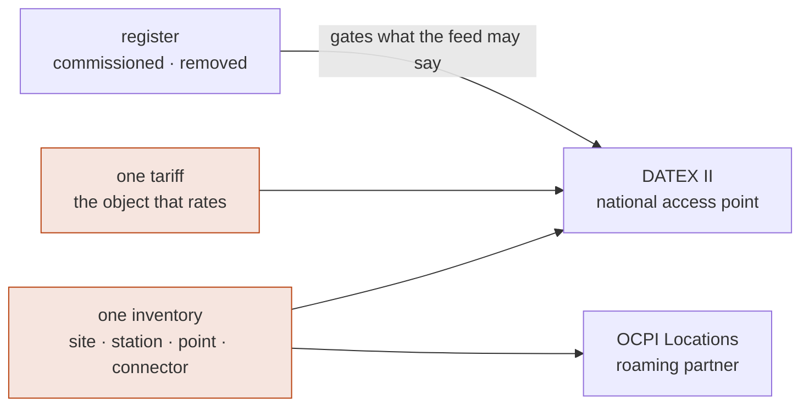

+++
title = "Locations and the national access point"
weight = 6
description = "The charge point register, and the DATEX II feed a regulator and every route planner read — generated from the same inventory a roaming partner sees and priced with the same tariff that rates the session."

[extra]
nav = "Locations"
+++

# Locations and the national access point ✅

A charge point is described to the outside world three times: to a roaming
partner, to the public through the national access point, and — since OCPP 2.1 —
to the driver standing in front of it. `[AFIR Art. 20]` makes the second of those
a duty with a date: static and dynamic data, free of charge, through the national
access point, which in Germany means the **Mobilithek** in the DATEX II
Recharging profile from **14 April 2026**.

Almost every stack generates the feed from a different inventory than the one the
roaming module publishes, so the two drift and nobody compares them. Here there
is one inventory and two audiences.



## One number, two duties

`[AFIR Art. 5(2)]` makes the price a driver is shown before a session the price
they may be charged for it. `[AFIR Art. 20(2)(c)]` makes that same ad-hoc price
data an operator must publish, free of charge, through the national access point.

Two duties about one number, and the usual arrangement computes it twice: once in
the billing system that rates the CDR, once in the export job that fills the feed.
Two computations is two chances to be wrong, and the failure is **asymmetric** —
the feed is read by route planners and comparison sites, and nobody ever
reconciles it against an invoice.

So this layer has no price model at all. It publishes the
[tariff](@/docs/pricing.md) itself, in exact decimal from the object to the JSON
number:

```rust
let (rate, notes) = emob_poi::rate::publish(&tariff, "rate-1");
// …reaches the feed as `"value": 0.49`, not 0.49000000000000000222.
```

## What the profile cannot say, and is told to say anyway

The profile offers six price types: `basePrice`, `flatRate`, `free`, `other`,
`pricePerKWh` and `pricePerMinute`. Four consequences follow, and all of them
are reported rather than papered over.

**There is no per-hour price type.** A tariff is written and displayed per hour;
the profile only counts minutes. The conversion is a division by sixty, and
publishing the hourly number under `pricePerMinute` overstates the price
sixtyfold. Where the division does not terminate — €2.50 an hour is €0.041666… a
minute — the exact hourly figure goes into `additionalInformation` beside the
rounded one and a note says so. It is the same factor of three that makes such a
fee unlawful under `[AFIR Art. 5(4)]` and unrepresentable on
[OCPP 2.1](@/docs/ocpp.md#what-the-wire-cannot-say-is-a-refusal-not-a-note),
met from a third direction.

**There is no occupancy price type.** The Regulation explicitly permits a fee per
minute for time connected and *not* charging, at points of 50 kW and above. The
profile's only hook for it is a **boolean** saying whether charging and parking
are one fee — not what the parking costs. The one surcharge the Regulation names
cannot be published as a number under the profile the same Regulation requires.
It goes out as `other` with a sentence, and the note is what keeps the gap from
being forgotten.

**And a delivery fee cannot say whether tax is in it.** Every `EnergyPrice` in
the profile carries `taxIncluded` and `taxRate`; `EnergyRate`'s
`minimumDeliveryFee` and `maximumDeliveryFee` are a bare `AmountOfMoney` with
neither. So the one figure on a rate that is a session **total** rather than a
unit price is the one a consumer cannot qualify — and reading a net minimum as
gross is out by the whole VAT rate, on the number a driver comparing two
operators looks at first. The fee is published in the basis the tariff states,
and a note says which that is.

**A tier is published with the band it applies in.** A tariff charging the first
ten kilowatt-hours at one price has two prices, and a price published without its
condition reads as unconditional. The profile has the fields — an energy band and
an elapsed-time band — but both are **non-negative integers** and a tariff's
thresholds are not. The two roundings are not equally wrong: a lower bound of 10
for a tier that begins at 10.5 claims the price applies over `[10, 10.5)`, where
it does not. So a lower bound rounds **up** and an upper bound rounds **down**,
the published band is a subset of the real one, every statement in the document
stays true, and a note carries the figure that had to move.


**And the zone a daily window is read in is typed as a fixed offset.**
`FacilityLocation.timeZone` exists, the Mobilithek's own reference instance
populates it, and the profile types it as a string that "identifies a time zone
by specifying the difference to UTC in hours and minutes, as defined in
ISO 8601" — so the reference instance writes `"+01:00"` for a site in Aachen.
An offset cannot express a zone that observes summer time: that value is wrong
for that site from the last Sunday in March to the last Sunday in October, and
it is the field a consumer would read a published `22:00` night rate against.

There is no honest fixed value, so the table publishes the offset **in force at
the instant of publication** — the one reading that is true of the document when
it is issued — and `RateNote::DailyWindowHasOnlyAnOffset` names the real zone
beside it. This is the first of the four gaps that the profile gets *wrong*
rather than merely omits.

## The register is upstream of the feed

`[LSV26 §4(1)]` makes three events notifiable — commissioning, decommissioning,
and a change of operator — so an operator meeting its notification duty knows,
for every point, which lifecycle state it is in. The profile has a literal for
two of them.

Those facts usually live in different systems, and the feed is usually generated
from the one that does not know. That is why decommissioned points stay published
as `available` for months, and it is the commonest defect in European charging
data. A schema validator has nothing to say about it.

```rust
Report::new(point, Lifecycle::Decommissioned, PointStatus::Available)
// Err(StatusContradictsRegister)
```

There is no other constructor. The document cannot be built.

## The silence between the two publications

A status message carries no infrastructure. Every object in it is a *reference* —
a class, an id and a version — into a table publication sent separately, on a
different schedule, usually by a different job.

A reference that does not resolve is **not an error**. The consumer has nothing
to attach the status to, so it drops it, and the point's availability disappears
from every map that reads the feed. No HTTP status changes, no schema validation
fails, nobody is told. Bump a facility's version in one job and not the other and
that is exactly what happens.

Both publications are built from one inventory, so the references are right by
construction; a separate check exists for a deployment whose table is exported by
a different system and wants the disagreement to be an error rather than a
silence.

## Two more things a validator would accept

**A station's total power is bounded by its own points.** The field is mandatory
and a route planner decides on it. Below the largest point the station holds, it
is turning traffic away from capacity it has; above the sum of its points, it is
advertising capacity the sockets cannot deliver whatever the transformer is rated
at. Load management makes the interval between those two genuinely free — two
150 kW points behind a 200 kW connection is the normal case, not a mistake — so
the check is the interval, not a single number.

**`iso15118` in this profile means ISO 15118-20.** The dictionary says so in as
many words, and the enumeration has no literal for the 2016 generation at all. A
point that speaks only `-2` and publishes `iso15118` is claiming readiness for
exactly the duty that phases in from 2027 — in the record a regulator reads to
check it, in a document no schema validator will object to. It goes out as
`other`, and so does a DIN SPEC 70121 point, because `none` means *"no
communication between vehicle and the grid"* and that is false about a charger
talking to the car over powerline.

The ambiguity is in the profile's vocabulary, not in the protocol — which is why
the spelling of a protocol generation has an owner here rather than being written
out by whichever adapter needs it, and why a test asserts that the names this
workspace emits are the names the ISO 15118 library defines.

## Checked against the profile's own reference

There is no XSD in the profile release. The two published example instances are
the only artefact that says what a conformant message looks like, so they are what
the tests run against: **every JSON path this layer emits is a path the reference
instance also contains**, with array indices collapsed so a path names a shape
rather than an occurrence. A misspelled key, a level of nesting too few, an
attribute hung on the wrong class — all of them fail there.

A short list of attributes is attested by the profile's *dictionary* instead,
because the example does not exercise them; each one names the class and
multiplicity it comes from.

## No I/O, no clock

Nothing here opens a socket, reads a file or asks the time. The publication time
is an argument, so an export replayed two years later produces the same bytes.
Pushing the snapshot is a service's business; a publication here is a value and a
string.

## What is not here yet 📐

The daemon that publishes on a schedule and pushes the snapshot, and the
availability fan-out behind it. OCPI's own Locations module is built for the
purpose the CDR needs it for — the location a partner's record names — and lands
in full with the roaming service.
