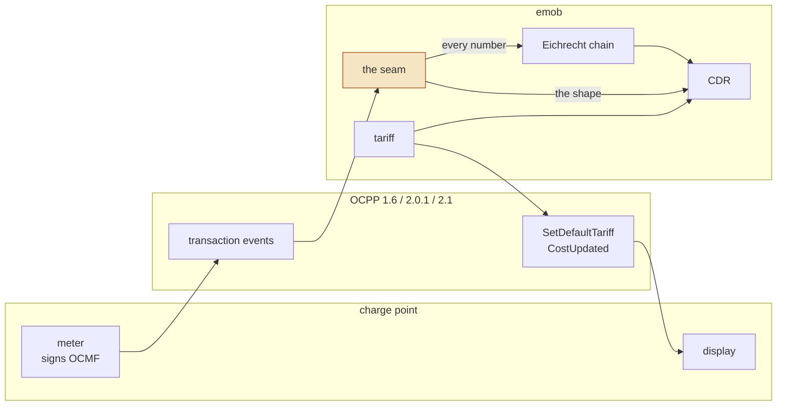

+++
title = "The OCPP seam"
weight = 3
description = "The seam between the OCPP wire and the money: signed meter values lifted out of transaction events, and the tariff carried onto the charge point's own screen."

[extra]
state = "built"
nav = "OCPP seam"
+++

OCPP is how a charge point and a backend talk. It is **not** how a kilowatt-hour
becomes a euro, and the difference is the whole content of this page.



## Two kinds of meter value, and only one is money

OCPP carries the register twice.

The **numeric** fields — `meterStart`, `meterStop`, a `SampledValue.value` — are
operational telemetry. They answer whether every event arrived and whether the
sequence is complete. They are exact rather than floating point on a modern
stack, and **exact is still not billable**: the Open Charge Alliance's own
example message carries `meterStop: 108814`, correct to the digit and reporting
the meter's *lifetime* register in watt-hours, beside a signed data set reporting
`0.636 kWh` for the transaction. A backend billing the protocol's number would
bill a figure nothing signed, taken from a register that is not the session's.

The **signed** one is a `SignedMeterValueType` carrying an OCMF data set, and it
is the only thing here that becomes a billed kilowatt-hour.

That is a property of the types rather than a rule somebody remembers: **the
seam's input vocabulary has no numeric meter value in it at all.** A transaction
event carries signed values, instants and whether energy was flowing. There is no
field to put a float in, so there is no path from one to a record — and a build
guard fails the workspace on an `f32` or an `f64` anywhere outside a test.

## Three envelopes, and 1.6 is the awkward one

What a station sends is an OCMF data set wrapped three deep, and each layer is
somewhere an implementation goes wrong.

OCPP 2.x has a typed field. **OCPP 1.6 serialises the whole object into the
`value` string** of a `SampledValue` whose `format` is `SignedData` — a string
holding JSON holding Base64 holding the record. The `publicKey` beside it is
Base64 over a colon-separated envelope, `oca:base16:asn1:<hex>`, whose last
component is the key *as printed on the certified meter* — and the same
application note's own example then sends Base64 over plain hex with no envelope
at all, so a reader that implemented only the specification would reject the
specification's own example. Both are read.

None of that lives in this workspace: it is protocol knowledge every OCPP backend
doing Eichrecht has to reimplement, which is the definition of something
belonging in the protocol library. One `match` covers all three generations here.

The public key is a **claim** wherever it is decoded. OCMF is explicit that the
key travels out of band, and a key arriving on the same socket as the record it
signs proves only that whoever holds that socket owns a private key. The key that
decides anything comes from the registry — see
[Eichrecht](@/docs/eichrecht.md#the-key-binding-travels-out-of-band).

## A retry is not a reading

OCPP guarantees delivery by retrying. A `MeterValues` request that does not get
its confirmation in time is sent again, and the same signed record arrives twice
— with the same pagination counter, because the meter produced one. A backend
that appends both hands the chain a duplicate, and the chain answers
`PaginationBreak`: a transport retry reported as a *missing record*, on a session
that is perfectly intact.

Records are de-duplicated by the digest of the bytes their signature covers. Two
that hash the same **are** one record — that is what the digest means — and two
that differ are both kept, because a station that reused a counter for different
content is exactly the fault the chain exists to find.

## What comes from where

Two sources describe one charging process and neither is sufficient alone.

| Fact | Source | Why not the other |
|---|---|---|
| The register, and its scale | the **signed record** | OCPP's numbers are telemetry |
| When the transaction opened and closed | the **OCPP events** | OCMF's clock is often *informative*, and the backend knows when it authorised |
| Charging, or merely connected | the **OCPP events** | the meter cannot tell a taper from an occupancy, and the two are priced differently |
| Whether a reading is clock-aligned | the **OCPP reading context** | nothing in the record says why it was taken |

So a transaction is assembled with its **shape** from the protocol and every
**number** from the signature.

### …except where the signature has a second opinion

One row is not quite a monopoly. OCMF defines a transaction marker `S` —
*"Suspended = Transaction active, but currently not charging"* — so a signature
component can state the occupancy interval too, and some do.

It does not replace the protocol's account: `S` is optional, so its absence says
nothing and most of the fleet never emits one. Where it **is** emitted and
disagrees, that is worth an operator's attention rather than a silent preference
for either side — `[AFIR Art. 5(4)]` prices those minutes differently, and the
party that issues the invoice controls only one of the two accounts. The
comparison is reported, not resolved.

## The seam runs both ways

The money comes **in** across this seam, out of a signature. The **price** goes
out across it.

`[AFIR Art. 5(4)]` requires the ad-hoc price to be *"known to end users before
they initiate a recharging session"*, and the place a driver learns it is the
charge point's own display. Until OCPP 2.1 there was no structured way to put it
there — 2.0.1 could send a display string and a running cost number, both
computed somewhere else — so the price on the screen came from a field somebody
typed while the price on the invoice came from the tariff engine. That is
precisely the drift the [tariff model](@/docs/pricing.md) exists to make
unrepresentable, surviving in the one place the article regulates.

OCPP 2.1's *Tariff and Cost* block closes it:

```rust
let crossing = emob_ocpp::to_ocpp(&tariff, at)?;       // the same Tariff that rates
let request = SetDefaultTariffRequest::new(0, crossing.value);   // evseId 0 = all

for reason in crossing.reasons() {
    eprintln!("{reason}");
    // /energy/prices/0: OCPP 2.1 quotes prices excluding tax and carries at
    //                   most eighteen decimals: 0.49 at 19 % is …
}
```

### The two tariff models are one model

OCPI orders *elements* and picks, per dimension, the first whose restrictions
match. OCPP 2.1 orders *prices* inside each dimension and picks the first whose
conditions match — *"an entry with no conditions always matches, so it should be
placed last as a fallback"*, which is OCPI's own advice written from the other
side.

Projecting the element list onto one price list per dimension, **in order**, with
each element's restrictions becoming that price's conditions, is exactly the
projection the rating engine already performs. So the station selects the
component the invoice is built from *by construction* rather than by agreement —
and had the two rules differed, the honest answer would have been to refuse the
crossing entirely. A charge point showing a different tier from the CDR is worse
than a charge point showing nothing.

OCPP 2.1 also requires the station to **display** the tariff's own description,
and that is the full disclosure the article asks for: every tier with its
conditions, in the order it prescribes. The display duty and the rating travel in
one object.

### What the wire cannot say is a refusal, not a note

The line is the same one the [roaming edge](@/docs/roaming.md) draws: **a loss in
the driver's disfavour that the document does not show is a refusal**, because a
note attached to a number the receiver is entitled to read at face value is not
something they can act on.

| Refused | Why |
|---|---|
| a time price with no exact per-minute spelling | OCPP's field **is** `priceMinute` — the article's own unit — and €2.50 an hour is €0.041666… a minute. A rounded figure is a price the station charges and the tariff does not |
| a dimension charged at two VAT rates | OCPP carries one tax-rate list per dimension, so the second tier would be taxed at the first tier's rate |
| a session fee conditioned on a quantity | the conditions for a fixed fee carry the wall clock and nothing else, so published stripped the fee is not narrower but **wider**: the station charges it on every session |
| an unevaluable restriction | for the reason the OCPI crossing refuses it |

What is merely *visible* is carried with an account: a block size OCPP has no
field for, a version expiry it has no field for, the residual a gross price
leaves when the wire quotes net, and the tiers past the tenth its ten-line
description cannot hold. That last one is a note rather than a refusal because it
changes nothing that is *charged* — and a station displaying no price at all is a
worse breach of the same article than one displaying ten tiers of twelve.

The finished document is then handed to the protocol library's own schema
validator. The bounds above are a list somebody maintains; the schema is the
library's to own, and a tariff a station would refuse is refused here instead.

### The running cost is the invoice's own figure

`CostUpdated` carries the cost *including taxes*, so it is the rated session's
gross — rounded the way an invoice rounds it, per VAT category and then summed. A
station showing a running total computed any other way is showing a number the
invoice will not match, which is the failure this seam exists to prevent, arriving
during the session instead of after it.

## Why this is a crate of its own

It is a boundary rather than a quarantine. Folding it into the record layer would
put a protocol implementation in the dependency graph of **every crate that
decides money**. The identifier, session, evidence, tariff and record crates build
with no OCPP anywhere in their tree, and this seam is the only one on both sides.

That is also why the price crosses *here* and the dependency points this way: the
seam depends on the tariff model, never the reverse. It is the only place both
vocabularies are in scope, in either direction.

## The socket

`csmsd` is the daemon a station actually connects to — an OCPP 1.6J / 2.0.1 / 2.1
endpoint. It is deliberately the thinnest thing in the workspace, and
[Architecture](@/docs/architecture.md#the-socket) covers what that means: every
rule that could be *wrong* lives here and is tested here, so the daemon is
sockets, routing and bookkeeping.

## What is not here 📐

Smart charging profiles and OCPP 2.1 DER control are a separate crate.

Deciding *when* a version takes effect is `tarifd`'s and the socket is `csmsd`'s.
The one thing the payload itself cannot carry is a version's expiry — the 2.1
tariff object has no field for it — so it is reported with the crossing's other
costs, and retiring a version is a separate `ClearTariffs` call.
