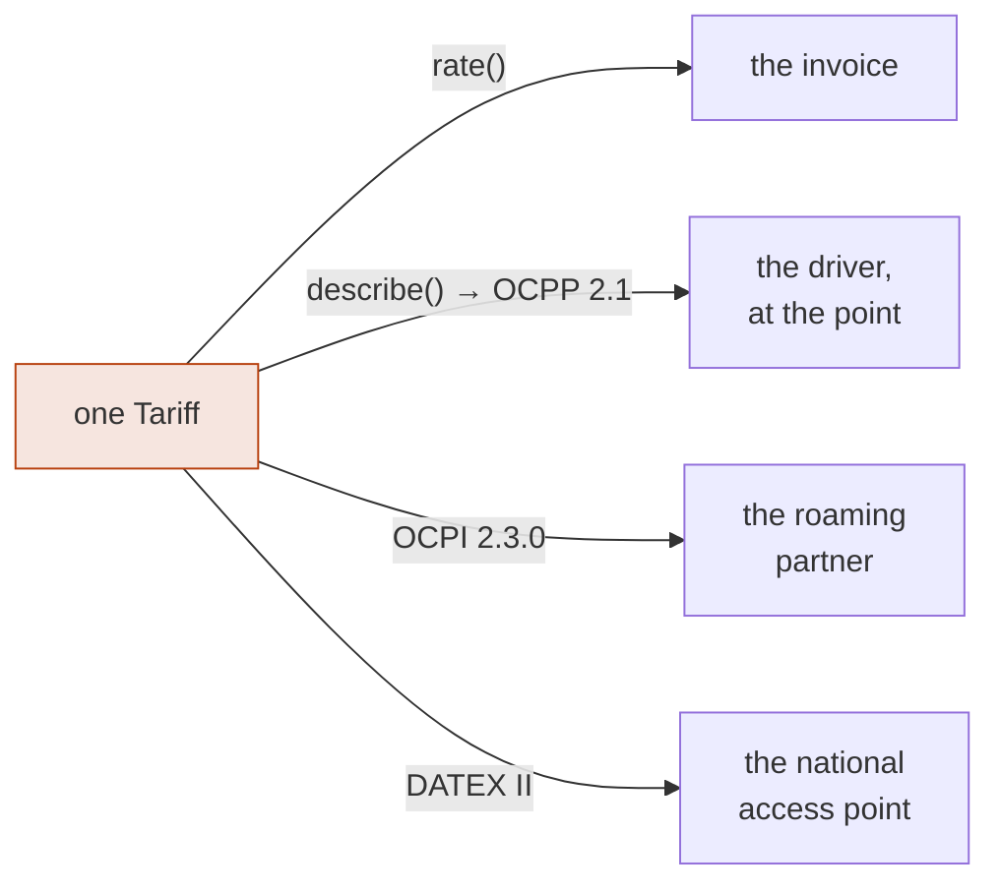
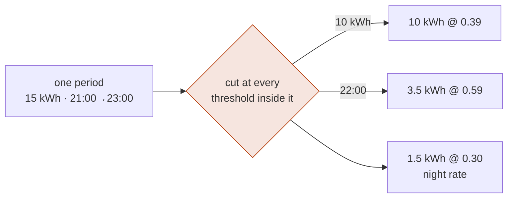

+++
title = "Tariffs and price transparency"
weight = 5
description = "Why the price a driver is shown, the price a partner settles against, the price in the national access point feed and the price they are charged all come from one object, why rating has to walk the session's periods for tiers to mean anything, and why a per-minute-only tariff is unlawful above 50 kW."

[extra]
nav = "Tariffs"
+++

# Tariffs and price transparency ✅

`[AFIR Art. 5(4)]` regulates the ad-hoc price at a public charge point more
tightly than most implementations realise. Four rules, each a checkable property
of a tariff rather than an opinion about one.

## The price shown is the price charged

A charging tariff has two jobs that platforms normally implement twice: it
**rates** a finished session, and it is **displayed** before the session starts.
When those come from two places they drift — the screen reads a field somebody
typed into a CMS, the invoice reads the tariff engine, and one of them was
updated. That is the price-transparency breach the article exists to prevent,
and it is almost never malice.

Here `describe()` and `rate()` read the same `PriceComponent` values off the
same `Tariff`, **and select the applicable price through the same function**:

```rust
// The zone the tariff's wall-clock restrictions are read in — see below.
let berlin = TimeZone::new("Europe/Berlin")?;

let tariff = Tariff::simple(id, Currency::EUR, TariffKind::AdHoc, berlin, vec![
    PriceComponent::new(Dimension::Flat, dec("0.50")),
    PriceComponent::new(Dimension::Energy, dec("0.49")),
]);

// What the driver sees, before anything happens.
assert_eq!(describe(&tariff, at).one_line(), "0.49 EUR / kWh · 0.50 EUR / session");

// What the driver pays, from the same numbers.
assert_eq!(rate(&tariff, &session).gross().to_string(), "14.96 EUR");
```

Two implementations of "which price applies" would be exactly the drift this
crate exists to prevent, one level down — so `describe` asks the same question
`rate` asks about a session's first period, and the price shown is the price the
first kilowatt-hour is billed at.

## One price, three audiences

The same number leaves this workspace three times, and each departure is its own
duty:

| Audience | Wire | Duty |
|---|---|---|
| the driver, at the point, **before** they start | OCPP 2.1 `SetDefaultTariff` | `[AFIR Art. 5(4)]` |
| the roaming partner who will settle against it | OCPI 2.3.0 `Tariff` | the number two companies reconcile |
| the national access point | DATEX II `EnergyRate` | `[AFIR Art. 20(2)(c)]` |

Almost every stack computes it three times, in three systems, and reconciles
none of them against the invoice. The failure is asymmetric: the screen is read
by the driver who pays, the feed by route planners and comparison sites, and the
invoice by nobody until it is disputed.



```rust
let ocpp = emob_ocpp::to_ocpp(&tariff, at)?;                       // the screen
let ocpi = emob_roam::ocpi::tariff::to_ocpi(&tariff, &party, at)?; // the partner
let (nap, _) = emob_poi::rate::publish(&tariff, "rate-1");         // the feed

assert_eq!(ocpp.value.energy.unwrap().prices[0].price_kwh.to_string(), "0.59");
assert_eq!(ocpi.value.elements[0].price_components[0].price.get(), dec("0.59"));
assert_eq!(nap.prices[0].value, dec("0.59"));
```

Until OCPP 2.1 the first of the three had no structured wire at all — 2.0.1
could send a display string and a running cost number, both computed somewhere
else — so the one audience the article actually names was the one served from a
field somebody typed. OCPP 2.1's *Tariff and Cost* block closes it.

**The station selects the tier the invoice is built from, by construction.**
OCPI orders *elements* and picks, per dimension, the first whose restrictions
match. OCPP 2.1 orders *prices* inside each dimension and picks the first whose
conditions match — the same rule read from the other side. Projecting the
element list per dimension, in order, is the projection the rating engine
already performs, so the crossing is a re-shaping rather than a second
implementation of "which price applies".

And OCPP 2.1 requires the station to **show** the tariff's own `description`,
which is `describe().full_disclosure()`: every tier with its conditions, in the
order the article prescribes. The disclosure duty and the rating travel in one
object.

Each of the three crossings returns the value **and an account of what it cost**,
and each draws the same line: a loss in the driver's disfavour that the document
does not show is a **refusal**, not a note. What that means on each wire is
covered where the wire is — [the OCPP seam](@/docs/ocpp.md#what-the-wire-cannot-say-is-a-refusal-not-a-note)
for the station, [Roaming](@/docs/roaming.md#some-crossings-are-a-falsehood-and-those-are-refused)
for the partner, and
[Locations](@/docs/locations.md#what-the-profile-cannot-say-and-is-told-to-say-anyway)
for the access point.

## The price is chosen per dimension, not per element

`[OCPI 2.3.0 §Tariff]` states the selection rule in one sentence:

> …the first Tariff Element with a Price Component **for that dimension** in the
> list with matching Tariff Restrictions will be used. Only one Price Component
> per dimension can be active at any point in time, but multiple Price
> Components for different dimensions can be active at once.

So several elements are in force at once, at most one per dimension — which is
why the specification advises one unrestricted default element *per dimension*
after the restricted ones:

```rust
let elements = vec![
    element(dec("0.29"), Dimension::Energy, after_22),          // the night rate
    TariffElement::unrestricted(vec![flat(dec("0.50"))]),        // the defaults,
    TariffElement::unrestricted(vec![energy(dec("0.49"))]),      // one per dimension
];

assert_eq!(rated.amount_for(Dimension::Energy), Some(dec("4.90")));
assert_eq!(rated.amount_for(Dimension::Flat),   Some(dec("0.50")));
```

Stopping at the first matching element bills the session fee and drops every
kilowatt-hour — and *nothing failed to match*, so nothing is reported either.

A dimension no element matched is not an error: the specification answers it
with "there will be no costs for that Tariff Dimension". It is a **quantity**,
so `RatingNote::Unpriced` carries how much went unpriced. "No element matched at
10:15" is not something a settlement dispute can be conducted with; "4.5 kWh of
this session were not priced" is.

## A session is a sequence of periods

This is the one that decides whether tiers mean anything.

"The first 10 kWh at 0.39, the rest at 0.59" is a restriction on how much has
been delivered **so far**. Rate the session against one element chosen from its
*total* and a 30 kWh session reprices all thirty at 0.59 — including the ten the
driver was quoted at 0.39. The tariff is legal; the invoice is wrong.

So `rate` walks the periods in order, carrying the cumulative energy and
duration, and asks which price applies at the start of each one:

```rust
let session = Chargeable::new(vec![
    Period::charging(t0, t1, kwh("10")),
    Period::charging(t1, t2, kwh("10")),
    Period::charging(t2, t3, kwh("10")),
])?;

let rated = rate(&tiered, &session);
assert_eq!((rated.lines[0].unit_price, rated.lines[0].quantity), (dec("0.39"), dec("10")));
assert_eq!((rated.lines[1].unit_price, rated.lines[1].quantity), (dec("0.59"), dec("20")));
assert_eq!(rated.quantity_for(Dimension::Energy), dec("30"));  // and nothing is lost
```

The quarter-hour slots the [settlement layer](@/docs/settlement.md) already
produces are exactly the right periods. **The split that conserves energy is the
input that prices it** — and a session that crosses into a night rate is priced
on both sides of the boundary rather than wholly at whichever rate it started
under, which a whole-session reading cannot express at all.


### …and the period is cut at the threshold

Walking the periods is not enough on its own. Asking only at the **start** of
each one leaves the tier boundary wherever the caller's periods happened to
land: hand `rate` one period of 15 kWh under "the first 10 kWh at 0.39" and all
fifteen are charged at 0.39, while the same session as three periods of five is
charged correctly. A price that depends on the granularity of the input is not a
price.

So the thresholds themselves become the cut points: every energy, duration and
wall-clock restriction in the tariff, applied to every period that crosses one.



Each kind of threshold is cut in the quantity it is *about*:

- **Energy exactly at an energy threshold**, because energy is what is being
  tiered and what is being settled.
- **Time exactly at a clock threshold**, because 22:00 is 22:00 — read on the
  wall clock of the tariff's own zone, never the offset the timestamps happen
  to carry, and on every day the period spans.
- **The local midnight a weekday restriction turns on**, which is the one
  threshold the tariff never names: without it a session running Friday 23:00 to
  Saturday 01:00 arrives as a single period and is priced for both hours at
  Friday's rate, invisibly, because nothing failed to match.
- **The other quantity in proportion, to the second.** Splitting a quarter hour
  at a kilowatt-hour boundary assumes constant power across it, which a tapering
  curve does not deliver; the residual is under a second of a per-minute fee, and
  sub-second boundaries would lose whole seconds and stop the durations summing.
- **The energy even where there is no second to hold it.** A second of a 350 kW
  charge is a tenth of a kilowatt-hour, so a short slice can carry a whole tier
  boundary at an instant no whole second names. The cut is placed on the register
  alone and the slice it opens has no duration and an exact energy — because a
  boundary dropped for want of a second reprices the whole slice in the tier it
  began in, systematically and with nothing failing to match. Such a slice has no
  average power either, so an element restricting on one cannot price it: the
  energy is named in an `Unpriced` note with its quantity and its instant, which
  is a line somebody answers for where the wrong tier would not have been.

```rust
// One period of 30 kWh, three of ten, or ninety-six quarter hours:
assert_eq!(rate(&tiered, &session).exact_total().amount(), dec("15.70"));

// …and one period 21:00→23:00 under "0.30 from 22:00" is the same money
// as two periods cut at 22:00.
assert_eq!(rate(&night, &coarse).exact_total(), rate(&night, &fine).exact_total());
```

The pieces are differences of cumulative values, so they telescope back to the
period's own total to the last digit — the same construction, and since D222 the
same *function*, the quarter-hour split uses.

And the claim is stated as a property rather than only as examples: two thousand
generated tariffs and sessions, each rated at three resolutions, asserting one
price. That is what found the tier boundary that only tiered where a period was
long enough to hold it.

Which cut binds depends on where the periods come from. A quarter-hour-split
session is already on the settlement grid, and a lawful price change is on that
grid too `[PTB-A 50.7 §3.1.7.2]`, so its slots never span a clock boundary. Every
other caller needs it: a price quote rating a whole session as one period, and a
partner's CDR sliced however the sender chose.

### Charging time and occupancy are stated, not inferred

A period that moved energy is charging time. One that did not may or may not be
occupancy, and guessing is how a **taper** gets billed at the parking rate: a
car at 100 % state of charge can leave a quarter hour at exactly `0.000 kWh`
while the session's own state machine says it was charging. `Period::activity`
carries the answer rather than deriving it, and the CDR takes it from the
session history.

### …and "not charging" is two facts, which is why it is not a boolean

`[OCPI 2.3.0 §mod_cdrs_chargingperiod_class]` corrected its own definition of
`PARKING_TIME` — from "time not charging" to "time during which the **vehicle is
not requesting power**" — and said why: under the old reading drivers "would be
exposed to penalizing loitering fees … when the EVSE is not offering energy to
the vehicle while the vehicle is still requesting power".

So an activity has three values, and only one of them owes a fee:

| | priced as | energy transferred |
|---|---|---|
| `Charging` | `TIME` | ✅ |
| `Parked` — the vehicle stopped asking | `PARKING_TIME` | |
| `Withheld` — the point stopped offering | *nothing* | |

`Withheld` is a charging profile at zero, a `[EnWG §14a]` dimming, a grid limit,
a fault. OCPP has distinguished it since 2.0.1 — `SuspendedEV` against
`SuspendedEVSE` — and it is priced by **neither** dimension, because OCPI's two
are "time charging" and "time the vehicle was not requesting power" and a
withheld minute is neither of them.

```rust
// Same duration, same energy, same tariff. One driver left a full car on the
// post; the other was curtailed by the operator.
assert_eq!(full_battery.total().to_string(), "12.00 EUR");
assert_eq!(curtailed.total().to_string(),   "10.00 EUR");
```

## The order is the regulation's, not a designer's

Below 50 kW the article prescribes it in as many words:

> The applicable price components shall be presented in the following order:
> — price per kWh; — price per minute; — price per session; and — any other
> price component that applies.

`Dimension` is declared in exactly that order and derives `Ord`, so **sorting
the components is complying with the article**. A list in any other order is not
a styling choice, it is a breach — and because the rating sorts the same way, an
invoice and a price display show the same things the same way round without
either knowing about the other.

Note *per minute*. Tariffs are stored per hour because that is what OCPI
carries; the conversion happens once, in the display layer, so nobody keeps the
same rate twice in two units.

## A tariff with tiers cannot be described by one set of numbers

The same subparagraph asks for "all its price components", and a tariff that
charges the first ten kilowatt-hours at one price has two. Showing only the one
that applies at the moment of asking is how a driver arriving at 21:58 is quoted
the day rate for a session billed at the night one.

```rust
assert_eq!(describe(&tariff, at_noon).full_disclosure(), vec![
    "0.29 EUR / kWh (22:00–06:00)",
    "0.49 EUR / kWh",
]);
```

Each `Tier` carries its conditions in words and says whether it `applies_now` —
true when any of its components is the one in force for its dimension, since
more than one element is in force at a time. `describe()` takes the instant too,
so a display can answer *what will this cost at 22:00* rather than only *what
does it cost now*.

## A price bound is two ceilings, not one ceiling in two spellings

`[OCPI 2.3.0 §mod_tariffs_pricelimit_class]` gives `min_price` and `max_price` a
figure **before** taxes and a figure **after** them, and prints the same NOTE
under each:

> As the taxes on a Charging Session might be different for different parts of
> the Session, there might be situations where the maximum cost after taxes is
> reached earlier or later than the maximum price before taxes. So as a rule,
> **they both apply**.

One figure with the other derived works while the tariff has one VAT rate. A
session fee at the standard rate beside energy at a reduced one — the shape the
specification's own `max_price` example uses — makes the two ceilings
non-proportional, and keeping one lets the total past the other: **€11.05 gross**
under a published maximum of €11.00.

So `PriceLimit` carries both. Both are optional here and `before_taxes` is
mandatory on the wire, so the **crossing** derives it at the tariff's own rate,
where the residual is a note. OCPP 2.1's `Price` carries both, in `exclTax` and
`inclTax`.

### …and the two limits bind together

The same sentence is true one level up: `min_price` and `max_price` both apply.
A rating that answers whichever it was asked about first gets each right on its
own and the pair wrong — a minimum can lift a total **above** the maximum, and a
maximum can cut one **below** the minimum, which is invisible before the cut
because a floor only shows itself once the ceiling has been taken.

Every limb of both limits is a bound on the same number: the movement the total
needs. The minimum's limbs give a floor, the maximum's a ceiling, and the answer
is the movement closest to zero inside the interval they leave — so there is no
order to get wrong. An interval with nothing in it is a tariff contradicting
itself, reported as a note, and the **maximum** is the one applied: a published
ceiling is what the driver was shown, and raising it is what
`[AFIR Art. 5(4)]` and `[PAngV]` exist to prevent.

A maximum deeper than the session's own total is held at zero, because a cap
below nothing is a payment to the driver that no tariff asked for.

### …and it is decided on the exact total, not the rounded one

Reaching the limb the lines are *not* quoted in needs the other basis's total.
The VAT breakdown is the wrong place to read it: it states one taxable amount per
rate and **rounds each**, which is what a document's totals have to be sums of
and the wrong input for a computation whose own output is a term of the exact
total. Half a cent of document rounding becomes a whole cent of price — and,
because an apportioned energy's last digits depend on how finely the session was
cut, a price that depends on the cutting.

The bound reads the unrounded totals. The consequence is stated rather than
chased: the tariff's total rounds once and is the figure a cap is a promise
about, while the invoice's gross rounds per VAT category and can sit a minor unit
above it. Closing that last cent would mean deciding the cap from rounded
categories again.

## A reservation is priced, and it is not a period of the session

`[OCPI 2.3.0]` prices a reservation through a **restriction** rather than a
dimension — `TariffRestrictions.reservation`, either `RESERVATION` or
`RESERVATION_EXPIRES` — with `FLAT` and `TIME` components, *"where `TIME` is for
the duration of the reservation"*. Its window *"starts when the reservation is
made, and ends when the driver starts charging on the reserved EVSE/Location, or
when the reservation expires"*, so it has already run before the session begins.

`rate_reservation` is its own entry point over that window, sharing the
session's arithmetic. Rated as a period it would collide: a tariff whose
unrestricted element prices `TIME` and whose reservation element prices `TIME`
would have the two competing for one dimension, and the per-dimension rule drops
one of them silently.

Three rules come from the worked examples rather than the prose:

- **An expired reservation is priced by the reservation elements and nothing
  else** — tariff 18 bills € 9.00, not € 9.50: there is no session for the
  session fee to be the fee of.
- **On an expiry both kinds apply**, in list order, so `RESERVATION_EXPIRES`
  takes a dimension it states and `RESERVATION` supplies the rest.
- **`min_price` and `max_price` do not** — they bound *"a Charging Session"*.

The cost travels in `total_reservation_cost` and inside `total_cost`, which is
what makes a partner's own sum of the parts close, and it becomes its own group
of lines on the EN 16931 invoice. It reaches no document that has no
reservation in it: OCPP 2.1's *Tariff
and Cost* block refuses the element by name, `[DATEX-II-Profil]`'s `EnergyRate`
omits it with a note, the `[AFIR Art. 5(4)]` shape check reads only the session
elements, and a tier's condition puts the word *reservation* first so a driver's
display cannot read a hold fee as a charging rate.

A window that ends before it starts is the one input `rate_reservation` refuses,
and it refuses it by **collapsing** rather than by returning nothing: no minutes
are priced, a `FLAT` fee with no duration in it is still owed, and a note travels
with the record. A silent zero on a visibly broken document is the answer nobody
queries.

## A tariff can be unlawful on its own

At 50 kW and above:

> the ad hoc price charged by the operator **shall be based on the price per
> kWh** for the electricity delivered. In addition, the operators of those
> recharging points **can charge an occupancy fee as a price per minute** to
> discourage long occupancy.

So the same tariff is lawful on one post and unlawful on the next:

```rust
let by_the_minute = /* Dimension::Time only */;

assert!(check_afir(&by_the_minute, dec("22")).is_lawful());   // fine on a 22 kW post
assert!(!check_afir(&by_the_minute, dec("150")).is_lawful()); // unlawful beside it
```

`check_afir` catches the subtler shape too. An energy price *plus* a charge for
**charging time** passes the "is it energy-based" test and still breaches,
because the article permits a fee for *occupancy* — sitting there after charging
has finished — not a rate for the transfer dressed up as time.

And the trap inside the same article: it **does** list "price per session" — in
the subparagraph that governs points *below* 50 kW. At 50 kW and above the
station must show "the ad hoc price per kWh and any possible occupancy fee
expressed in price per minute", which is two components and no more, so a
per-session fee could not lawfully be displayed — and a charge the driver could
not have been shown before starting defeats the comparison the whole article
exists to enable. The lawful component set on a fast charger is exactly `{kWh}`
or `{kWh, occupancy}`:

```rust
let with_session_fee = Tariff::simple(/* … */ vec![
    PriceComponent::new(Dimension::Energy, dec("0.49")),
    PriceComponent::new(Dimension::Flat, dec("0.50")),
]);

assert!(check_afir(&with_session_fee, dec("22")).is_lawful());   // named below 50 kW
assert!(!check_afir(&with_session_fee, dec("150")).is_lawful()); // and not above it
```


### …and unlawful in a unit rather than a shape

The article asks for a **price per minute**. OCPI carries time prices per hour.
Sixty has a factor of three, so an ordinary occupancy fee of €2.50 an hour is
€0.041666… a minute and has no exact decimal spelling at all — and `describe`
was handing a station twenty-eight digits to show a driver.

Rounding it shows a price the tariff does not charge, which is the
display-versus-bill drift this crate exists to make unrepresentable; not
rounding it shows nobody anything. Neither is a price "known to end users before
they initiate a recharging session", so it is a breach with the remedy in the
message: quote an hourly rate divisible by three. €6.00 an hour is €0.10 a
minute.

On OCPI that can only ever be an objection: OCPI's unit is the hour, and the
document is well-formed either way. **OCPP 2.1's field is `priceMinute`** — the
article's own unit — so the same tariff has no representation on the wire that
reaches the driver, and the crossing refuses rather than writing a rounded
figure the station would then charge:

```rust
assert!(to_ocpi(&two_fifty_an_hour, &party, at).is_ok());     // OCPI has no objection
assert!(emob_ocpp::to_ocpp(&two_fifty_an_hour, at).is_err()); // the station cannot state it
```

The conversion lives in one function — `price_per_minute`, which returns
`Option` rather than dividing and hoping — and the display, the conformance
check and the wire all ask it.

A VAT rate of exactly −100 % is refused for the same kind of reason one layer
along: a gross amount is `net × (1 + rate/100)`, so at that rate there is no net
at all and an invoice under the tariff could state no taxable amount
`[UStG §14]`. It is also the one value that would divide by zero inside the
rating engine.

It also reports what is merely incoherent: a minimum above the maximum (no
session total satisfies both), and an element **every** one of whose dimensions
an earlier unrestricted element already prices, which can therefore never apply
— lawful, and almost always a mistake. Per dimension, because an unrestricted
element pricing only a session fee shadows nothing but the session fee, and
objecting otherwise would push an operator off the shape OCPI advises.

Contract tariffs are not judged by this rule. Art. 5(4) governs the ad-hoc
price; a provider's own contract price falls under Art. 5(5), which is a
disclosure duty rather than a shape duty, and which the [obligation
calendar](@/docs/compliance.md) assesses against a provider profile.

## Every term of the total is a line

```rust
assert!(rated.lines_sum_to_total());
```

One line per *distinct price* that applied, with its quantity, unit price and
amount — so a tiered session shows both tiers, which is what a tiered invoice
has to do. The total is their sum plus at most one `Adjustment`, the minimum or
maximum, which is a term a reader can see rather than a number that moved. There
is no term in the total that is not one of those two things.

Rounding a quantity up to a `step_size` block produces a note as well, because
it is always against the customer. It applies once, to what was billed for a
price — rounding every quarter hour up to a block would bill a two-hour session
eight times over. OCPI 3.0 removes the field and advises setting it to 1, so a
tariff relying on it is one that will have to change, and `check_afir` says so
without calling it unlawful.

Notes serialise. "This total was rounded up to a block" and "this element could
not be evaluated" are exactly the facts a settlement dispute turns on, and a note
that stays behind in the process that produced it is a note nobody can invoke.

### The specification's own answers, as a test file

`tests/the_specification_states_its_own_answers.rs` holds the sessions
`[OCPI 2.3.0]` walks through in prose, with the totals its own breakdown tables
publish: the `step_size` transitions, the power and duration bands, the two-rate
breakdowns, the price limits, the reservations, and the rounding at a VAT rate
with a decimal in it.

Every other test here asserts what this engine does; these assert what the
document two companies settle against says the answer **is**. A change that keeps
the others green and moves one of these has changed what emob charges a driver.

## A tariff has an identity over time

A tariff id is a name, and names get reused. A CPO that edits a tariff in place
keeps the id, so a record naming only the id names something that no longer
exists — and a partner re-rating it gets a different total and cannot tell an
honest price change from a restated one.

The same answer the evidence chain gives one layer down: **name it by content**.

```rust
assert!(cdr.was_priced_with(&tariff));   // not "does the id match"
```

`Tariff::fingerprint()` is a SHA-256 over a canonical encoding of everything
that can change a price — the bounds, the window, and every element with its
restrictions and components **in order**, because the first matching element
that prices a dimension is the one that prices it. Scale is part of it: `0.49`
and `0.490` are numerically equal and are two different prices to show a driver.

And `[AFIR Art. 5(4)]` settles which version governs a session. The price must
be "known to end users **before they initiate** a recharging session", so a CPO
that raises its price at 10:15 has not raised it for the driver who plugged in
at 10:00:

```rust
let cdr = CdrBuilder::from_session(&session, Direction::Import)?
    .rated_with_history(&history)?      // the version in force at the start
    .build()?;
```

`TariffHistory` refuses overlapping versions at construction — an instant with
two prices has no rule for choosing — and reports gaps, because an interval
nothing can be priced in is worth knowing about before a session lands in one.
Windows are half-open, `[from, until)`, so consecutive versions partition the
timeline exactly.

The window is also constrained: `[PTB-A 50.7 §3.1.7.2]` says "Ein Tarifwechsel
ist erst mit dem Beginn der nächsten Messperiode durchzuführen", so a version
that begins or ends off the quarter-hour grid is **refused at construction**. A
change landing mid-period would put one settlement slot under two tariffs, and
the error names the *next* boundary rather than the nearest, because a price may
not start applying earlier than it was published.


## Tax is a breakdown, not a number

Electricity and a service fee can sit in different VAT categories, and EN 16931 —
mandatory between German businesses from 2027 `[UStG §14]` — wants the taxable
amount per rate. A total stating only the gross cannot be checked.

```rust
for line in rated.tax_summary() {
    println!("{} %: net {} + tax {} = {}", line.rate, line.net, line.tax, line.gross);
    // 7 %:  net 1.00 + tax 0.07 = 1.07
    // 19 %: net 42.02 + tax 7.98 = 50.00
}
assert_eq!(rated.net().amount() + rated.tax().amount(), rated.gross().amount());
```

`TaxIncluded::Yes` means the component prices are gross and the tax is stripped
out of them; `No` means they are net and it is added on. `total()` reports the
basis the tariff states; `gross()` reports what the driver pays.

The breakdown has a per-dimension sibling, and it exists because a wire that
states a cost per heading — OCPI's `total_energy_cost` and its three siblings —
needs one. One dimension can be charged at two prices, and two tiers can sit in
different tax categories, so reading a rate off the first line and applying it
to the summed amount taxes the second tier at the first tier's rate:

```rust
let energy = rated.tax_summary_for(Dimension::Energy);
// two entries, not one rate over a summed amount
```

A minimum charge that tops the total up is taxed at the rate of the largest line.
That is a choice rather than a derivation, so it is a **field on the adjustment**
that a reader can see and an accountant can argue with, rather than an assumption
buried inside a sum — and it is left out of the per-dimension view for the same
reason: a term of the total is not a term of any one heading.

## Rounding happens once, and division happens last

Every line is computed exactly and kept exact; only the total and the tax
breakdown round, to the currency's minor unit, half away from zero. Rounding per
line and then summing gives a different answer, and which of the two is correct
is a tax question rather than an arithmetic one — so the exact figures survive
and the caller can do either.

And the order of operations matters. 35 minutes at €6.00 an hour is

```text
6.00 × 2100 / 3600   = 3.50                              ✅
6.00 × (2100 / 3600) = 3.4999999999999999999999999998    ❌
```

Time therefore accumulates in whole seconds and converts to hours once, after
the multiplication by the price.

Which is why a line carries **two** quantities. `unit_price` is per hour, because
that is how a tariff is written, and twenty-five minutes is `0.41666…` hours — so
`quantity × unit_price` cannot be the amount. `base_quantity` is the whole
seconds, and it is what the amount comes from:

```rust
assert!(rated.lines_reconcile());   // base_quantity × unit_price / 3600 == amount
```

A billing layer that needs a quantity and a price whose product is the line total
quotes the seconds; the hours figure is what a driver reads.

## `step_size` is a property of the session, not of a price

`step_size` is the block a dimension is billed in — 500 Wh, fifteen minutes — and
the obvious implementation rounds each line up to its own.
`[OCPI 2.3.0 §mod_cdrs_step_size]` says otherwise:

> When calculating the cost of a charging session, `step_size` SHALL only be
> taken into account **once per session** for the `TariffDimensionType` `ENERGY`
> and **once for `PARKING_TIME` and `TIME` combined**.

Two families. Within one, the total is rounded with the block of the **last
relevant Price Component** and the surplus billed at that component's **price**:
25 minutes at €1.20 and 20 at €2.40, not 30 and 30. And where both time
dimensions are used, only the **total parking duration** is rounded — 21 minutes
charging then 16 parked, ten-minute blocks on both, bills 21 + 20.

Rounded per price instead, the specification's own tiered energy example costs
€1.31 where it should cost €1.18: an eleven per cent over-charge, in the
direction `[AFIR Art. 5(4)]` and `[PAngV]` exist to police.

And the ceiling is taken on a quantity that has been **rounded first**. It is the
only operation in the rating that is not continuous, so it is the only one where
a difference too small to state changes an answer: the same session summed from a
coarser and a finer set of periods differs in the twenty-seventh decimal place,
and 64.821 kWh is exactly 1271 blocks of 51 Wh one way and 1272 the other — 51 Wh
the driver did not take, against the customer. The block count is computed at the
scale a nanowatt-hour sets, which is where the engine already treats two cuttings
of one session as one session.

## …and the one restriction a period carries nothing to cut on

Cutting works because a period *contains* the fact about where the threshold was
crossed: one period of 15 kWh says by construction that the tenth kilowatt-hour
fell inside it. Energy, duration and the wall clock all accumulate.

Average power does not. It is `energy / duration` over whatever window is asked
about, and a period carries **no** information about the power inside it:

```rust
// 60 kWh in one hour, under "below 50 kW at 0.30, otherwise 0.60".
rate(&t, &one_period).total()    // 36.00 EUR — one window, averaging 60 kW
rate(&t, &two_halves).total()    // 34.50 EUR — 55 kWh then 5, averaging 110 and 10
```

Neither is an arithmetic error, and no cut recovers the second from the first —
the 60 kW figure does not contain it. The finer answer is a **better
measurement**, and what the engine cannot do is make a low-resolution input
behave like a high-resolution one.

So a total under such a tariff is a function of the session *at the resolution
its periods carry*. Rate the periods the meter produced — which is what
`Session::split` hands over — and the answer is stable;
`RatingNote::PowerJudgedPerPeriod` is why a partner's coarser document gives a
different total. Reported rather than refused, because `[OCPI 2.3.0 §Tariff]`
defines the restriction and a lawful partner document is not this crate's to
reject.

## The clock a time-of-day restriction is read against

"0.30 from 22:00" is **local civil time at the charge point**
`[OCPI 2.3.0 §mod_tariffs_tariffrestrictions_class]`, and OCPI carries the zone
on the Location — `time_zone`, an IANA name, cardinality 1
`[OCPI 2.3.0 §mod_locations_location_object]`. So a tariff carries one too.

**An offset is not a zone.** An offset is what a clock was written with; a zone
is the rule that decides the offset, including on the two days a year it
changes. Judged against the offset, one physical session costs a different
amount depending on how its timestamps were spelled:

```rust
// 20 kWh, 22:00–24:00 in Berlin, 0.30 at night against 0.60 by day.
rate(&tariff, &stamped_in_utc).total()     // 9.00 EUR — the first hour at the day rate
rate(&tariff, &stamped_in_berlin).total()  // 6.00 EUR — the price the driver was quoted
```

Same two hours. The first is what an eMSP gets for every session it re-rates from
a roaming partner, because OCPI carries its timestamps in UTC. With the zone on
the tariff, all three spellings of those instants — `+00:00`, `+01:00`, `+09:00`
— come to €6.00.

**A civil time is not always an instant.** A spring gap swallows an hour, so the
wall clock passes `02:30` once, at the transition; an autumn fold repeats one, so
it passes `02:30` **twice** and a night window ending there ends twice. Both
crossings are cut — cutting only the first leaves the repeated hour priced by
whatever applied before it, on a bill from the last weekend in October that
nobody re-reads.

**And it does not break a replay.** The database is compiled in, not read:
nothing opens `/usr/share/zoneinfo` or looks at `TZ`, so `just purity` holds and
two machines with different system `tzdata` agree. `Cargo.lock` pins the version,
and a tzdb release moves future offsets while the civil offsets of instants that
have already happened are frozen — which are the only instants a settled session
has.

## The three restrictions everybody gets wrong

**A window that wraps midnight** — `22:00` to `06:00` — is a night tariff, not
the empty range a naïve `start <= t && t < end` makes of it.

```rust
assert_eq!(rate(&t, &at_23_00).lines[0].unit_price, night);
assert_eq!(rate(&t, &at_03_00).lines[0].unit_price, night);
assert_eq!(rate(&t, &at_noon).lines[0].unit_price, day);
```

**An `end_time` of `00:00` is the end of the day, not the start of it.**
`end_time` is exclusive everywhere else, and the specification tells authors to
write exactly this: "to stop at end of the day use: `00:00`". Read as an
exclusive instant it closes the window before it opens — the element matches
nothing, prices nothing, and the whole session comes back unpriced, as a note
rather than an error. It hides behind the common shape, because
`{start_time: "20:00", end_time: "00:00"}` takes the wrap-around arm and comes
out right by accident.

**A restriction this crate cannot evaluate is not an absent restriction.**
`Restrictions::unevaluable` carries anything a wire adapter parsed and this crate
cannot judge — OCPI's `min_current`/`max_current`, a partner extension. An
element holding one **never matches**, and the rating says so in a note:

```rust
assert!(rated.reasons().any(|r| r.contains("cannot evaluate")));
```

Silently treating an unknown condition as absent applies a price under
conditions nobody checked — the same mistake as billing on an unverified
signature, one layer up. For an *ad-hoc* tariff `check_afir` calls it a breach
outright, because a price whose conditions cannot be checked cannot be shown
before the session either.

Beyond those, time of day, calendar date, cumulative energy, cumulative duration,
average power and weekday all select which elements apply.

## Publishing a version

*Which* version is in force is decided here, by its own window. *Telling people*
is `tarifd`'s, and the distinction is load-bearing: `[AFIR Art. 5(4)]` requires
the price to be known to end users **before they initiate** a recharging
session, so a publication that goes out when a version takes effect is already
late for everybody standing at a point at that instant. The service therefore
looks **forward** by a lead time, and asks a second, sharper question beside it —
which versions are in force right now that some audience was never told about.
The first is work; the second is a driver shown one price and billed another.

All three audiences or none. OCPP 2.1 refuses a tariff it cannot state without
widening the price against the driver, and publishing the other two anyway would
leave the national access point and every roaming partner quoting a price the
estate's own stations do not charge — a driver comparing on a map, misled by a
document this operator published. And a delivery is recorded only after the
answer comes back, so a push that failed stays visible rather than being
forgotten by a service that sent something once and believed itself.

## What is not here 📐

The invoice itself is `emob-billing`'s: the breakdown above is the input it
needs, and it becomes an EN 16931 document, a SEPA collection and a balanced set
of role-addressed postings there. Booking is an OCPI concept this crate carries
verbatim rather than evaluating, and `min_current`/`max_current` need an ampere
series a session does not hold.
