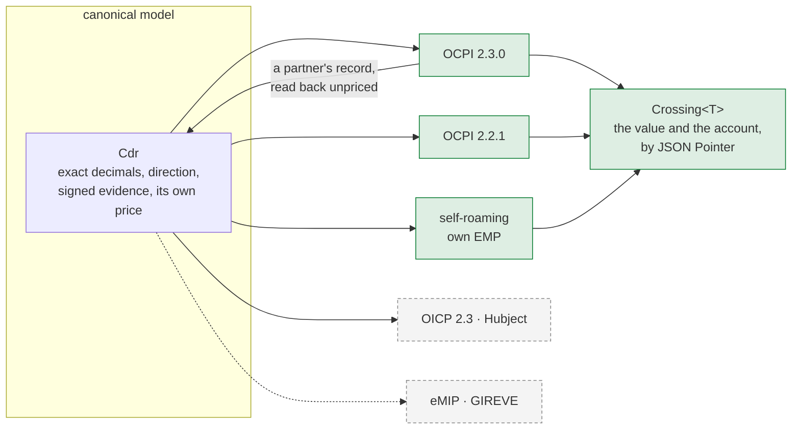

+++
title = "Roaming"
weight = 7
description = "One canonical record, every roaming wire native — OCPI 2.3.0 and 2.2.1 both ways, OICP 2.3 through Hubject, translation cost recorded rather than absorbed."

[extra]
state = "built"
nav = "Roaming"
+++

A driver plugs into somebody else's charger. The operator issues a record, the
driver's provider pays it, and the two companies have to agree on a number
neither of them can independently re-measure.

Everything on this page is about the gap between those two copies.

## One canonical model, every wire native

Almost every stack picks one protocol version as its internal model and converts
at the edges. The versions then disagree about what a field means, and the
internal one wins by accident — so a partner on an older version silently gets a
narrower record, and nobody can point at where it narrowed.

Here the canonical model is `emob`'s own, and each wire is a translation *out of*
it with the cost written down:



Solid is built; dashed is designed and not yet written.

A session between an operator's own CPO and its own EMP takes the same path as a
stranger's. Going multi-party then changes the transport and nothing else, which
is a property worth having before the first partner rather than after.

## Translation cost is recorded, not absorbed

A hand-written `From` impl makes every lossy decision once, silently, at the
moment nobody is looking. Six weeks later two companies hold two numbers for one
session and neither document explains the gap.

So every translation returns a `Crossing`: the value, and the account of what
reaching this partner cost — each note carrying a JSON Pointer into the document
the partner actually reads.

```rust
let crossing = ocpi::cdr::to_ocpi(&cdr, partner, &context)?;

for reason in crossing.reasons() {
    eprintln!("{reason}");
    // /total_time: 1200 s is 0.3333 h rounded to 4 places: an hour has 3600
    //              seconds and 3600 has two factors of three, so most durations
    //              have no exact decimal in hours. The cost beside it was
    //              computed from whole seconds, so re-deriving it from this
    //              figure will not reproduce it
}
```

### …and the rating's own account crosses with it

`RatingNote` is serialisable because it is meant to travel: *"a note that stays
behind in the process that produced it is a note nobody can invoke."* The invoice
has read it since it was written, and the wire did not.

OCPI states a quantity and a cost **per dimension** and has no field for the
distance between them. A partner receiving `total_energy: 30` beside a
`total_energy_cost` computed for twenty kilowatt-hours reads a document that does
not multiply out — and the reason is almost always a discount the operator gave
on purpose: a promotional first tier, a night-only energy price, any tariff whose
energy element is conditional. A `step_size` produces the same shape in the other
direction.

So the half of the notes that are *terms of the price the payer is being asked to
pay* — the same half `emob-billing` puts on the invoice, selected by the same
predicate — crosses as `Crossing` notes, each pointed at the dimension's own
total. The rest stay with the operator: a fault in this side's tariff is not
something a partner can act on.

### The version the registry records is the version that goes out

A `Partner` carries which OCPI version the peer speaks. Nothing read it: the
canonical crossing produced 2.3.0 for everybody and the downgrade was a second
call a sender had to remember, so a peer on 2.2.1 — the ordinary case in this
market — was one forgotten step from a document it cannot parse. `for_partner`
applies every refusal and then the recorded version, and returns a value that
names which one it wrote.

### The note nobody else reports

OCPI carries `total_time`, and every period's `TIME` and `PARKING_TIME`, as a
number of **hours**. An hour is 3600 seconds and `3600 = 2⁴ · 3² · 5²` — only
the twos and fives divide out, so a duration has an exact decimal spelling
exactly when nine divides its seconds. Twenty-one minutes does (`0.35`). Twenty
does not. Twenty-two does not.

It is the same factor of three that makes an occupancy fee of €2.50 an hour
unshowable per minute under `[AFIR Art. 5(4)]`, met again one layer out. The
money on the record was computed from whole seconds, multiplied before it was
divided; a partner re-deriving it from the rounded figure gets something else.

The quarter-hour grid this workspace settles on is always exact — 900 is
divisible by nine — which is precisely why the failure stays invisible until a
session starts or stops between two boundaries, which is every session.

## Some crossings are a falsehood, and those are refused

A note explains a number that is *approximately* right. Where the number would
be *wrong*, a note is worse than useless, because it attaches an explanation to
something a partner will act on.

| Refused | Why a note would not do |
|---|---|
| A **V2G discharge** | `ENERGY_EXPORT` is Session-only and `total_energy` carries no sign, so the partner reads a discharge as a draw and settles backwards — paying the operator for energy the *driver* supplied |
| An **unrated** record | `total_cost` is required, and the specification gives the obvious placeholder its own meaning: `0.00` is *free of charge*. Sending zero answers the question permanently, in the partner's favour |
| A tariff element stripped of an **unevaluable restriction** | Dropping a condition does not narrow the element, it *widens* it — at the partner it then matches wherever the rest holds, and their re-rating disagrees with ours in the driver's disfavour, from a document we published |
| A **gross price bound** on a tariff mixing VAT rates | `min_price`/`max_price` bound the cost *before taxes* and the field is mandatory. The gross figure written there is a minimum the partner enforces a VAT rate too high, against the driver. Where the components agree on a rate the bound is converted at it; where they state **none**, there is no tax to strip and the two figures are the same number; only where they state *different* rates is there no pre-tax figure, and inventing one is the failure |
| A restriction that does **not fit** its field | OCPI's local time and local date are narrower than the types a tariff restricts on, and a bound that will not fit has two silent outcomes: dropped, the element widens; **defaulted, it moves**. A start time falling back to midnight publishes a night tariff as an all-day one — not a wider price but a different one |
| The **zone** a time restriction is read in | OCPI writes those restrictions in local civil time at the charge point and carries the zone on the **Location** (`time_zone`, an IANA name, mandatory) rather than on the Tariff. The crossing cannot state it in the object it produces, so it names the tariff's own zone by JSON Pointer: every Location the tariff applies at has to publish the same one, and a partner evaluating `22:00` in any other zone prices the night rate at the wrong hours |

The unevaluable-restriction rule is the outward face of a rule
[the rating engine](@/docs/pricing.md) applies inward: a condition this build
cannot judge never matches, so it can neither price a session nor be published as
though it were absent.

### The same line, one wire along

[The OCPP seam](@/docs/ocpp.md#what-the-wire-cannot-say-is-a-refusal-not-a-note)
is not a roaming wire and draws the line in exactly the same place, because the
argument is not about roaming: **a loss in the driver's disfavour that the
document does not show is a refusal.** Three seams now return the same
`Crossing` — the roaming edge, the charge point's own screen, and the national
access point feed — and the type lives in the shared vocabulary crate for that
reason rather than in whichever one needed it first.


## Two `PARKING_TIME`s, and the specification defines both

`[OCPI 2.3.0]` uses the words twice with two definitions, and they are not the
same quantity. The `ChargingPeriod` **dimension** was corrected by an erratum to
the vehicle's own demand — "time during which the **vehicle is not requesting
power**", because the old reading exposed drivers "to penalizing loitering fees
… when the EVSE is not offering energy to the vehicle while the vehicle is still
requesting power". The CDR **field** `total_parking_time` was not corrected: it
is still "no energy was transferred between EVSE and EV".

The two differ by exactly the time the point withheld power, so computing one
from the other is wrong in whichever one you derived. The crossing takes each
from the question that defines it: the dimension from `Dimension::pricing`, the
field from `Activity::transfers_energy`.

A withheld period therefore crosses with its energy and **no time dimension at
all**, its seconds still inside `total_time`. Read back, a period stating neither
`TIME` nor `PARKING_TIME` and moving no energy is read as withheld rather than as
occupancy — OCPI's dimensions are volumes, so no time volume is no billable time.
It costs the driver nothing on a re-rating, it is noted, and this workspace's own
document round-trips exactly.

## …and the record comes back

`from_ocpi` reads a partner's CDR into the canonical model, and the test that
matters is the round trip: the record this crate writes is one it can read back
— same key, same window, same periods, same energy — and a pre-flight that
settles it.

The two directions are not mirror images:

| Canonical | OCPI | Coming back |
|---|---|---|
| a period's `end` | a start and no end | the next period's start, and the last from `end_date_time` |
| `activity` | the period's dimensions | `TIME` says charging and `PARKING_TIME` says the vehicle was not asking `[OCPI 2.3.0 §mod_cdrs_chargingperiod_class]`. A period stating **both** is reported, because the fallback — energy moved — reads a taper as occupancy. A period stating **neither** and moving no energy is read as time the point *withheld*, which is what this side writes for one and costs the driver nothing on a re-rating |
| `provenance` | nothing at all | interpolated, for every period: a number whose provenance nobody stated is not one this side may call measured |
| `auth_path` | three values for six paths | narrowed by the token type, and noted where it cannot be |
| `cost` | totals, no unit prices | **not** rebuilt |
| `supersedes` | nothing on the replacement | `None` — the pairing is the receiving ledger's, from the Credit CDR it saw first |

The last one is the argument. A canonical price carries one line per distinct
price, each reproducing its own amount from its own quantity and unit price.
Rebuilding that from totals means inventing the numbers that make it add up —
and then the pre-flight checks the arithmetic of a document *this* crate wrote
rather than the one that arrived. So the record comes back unpriced, the
partner's own figure comes back beside it, and an eMSP re-rates with its own
tariff and compares.

Verification stays where it belongs: the payloads come back for the Eichrecht
crate to check against **this side's** registry, and the verified result is an
argument to the conversion rather than something it produces.

### …and re-rating goes through the same door the issuer used

`Cdr::rerated_with` prices a partner's record with this side's own tariff, and
applies every gate the issuing side applies. That matters because the obvious
composition — `rate(&retail, &cdr.chargeable()?)` — skips all five: a chain that
did not verify against **this** side's registry, a tariff not in force when the
session ran, a version the meter says was superseded mid-session, a duration the
signed records do not vouch for, and the clock resolution under a per-minute fee
— which the record carries, so a replay cannot be told a different one. The
periods, the energy and the evidence stay the record's own, so the two prices are
about the same session by construction.

The first of those gates is the newest and it is the reason this door matters. A
partner's record is **assembled** into the canonical model rather than built from
a session, so it never passes `CdrBuilder`, and the gate lives at the door a
`Cost` is made through instead.
Re-rating a record whose payloads failed verification therefore priced a forged
session at this side's retail tariff and invoiced it to a driver, which is the
one outcome the EMP path exists to prevent.

`tests/the_other_hat.rs` runs the whole EMP half: a partner's OCPI document,
verified against **this** side's registry, re-rated at this side's retail price,
invoiced to a driver, and the books balanced.

### A correction is two documents, and neither is the other

OCPI has no way to amend a CDR. It reverses one with a Credit CDR — `credit =
true`, `credit_reference_id` naming the original, and **only** `total_cost`
negated — and then sends "a new CDR with a new unique ID and the fields `credit`
and `credit_reference_id` omitted". `to_ocpi_credit` writes the first; `to_ocpi`
writes the second from the superseding record and says in its account that the
replacement names nothing. Inbound, a Credit CDR is refused by name rather than
read: it repeats the original's kilowatt-hours with the money negated, and read
as a session it would put them in the ledger twice.

## Routing comes out of the identifier

A contract identifier names its issuer in its first five characters, and that is
the party holding the driver and paying the bill. A hand-maintained map from
anything else is where roaming money reaches the wrong company.

OCPI itself warns that a party id has no direct link with a contract's issuer, so
the prefix is the default and an explicit issuer list overrides it — which is how
an acquired partner is routed without editing every record.

The check digit is verified at that edge, because once the record has reached the
provider a transcribed identifier still parses, still routes, and bills somebody
else's contract while the operator has already been paid.

## The pre-flight an eMSP owes itself

A record arriving from a partner is not a canonical CDR yet. It is JSON that
decoded, and the questions worth asking are OCPI's own — asked of the document
that *arrived*, before any conversion has had the chance to repair it.

```rust
let report = ocpi::inbound::preflight(&arrived, SignedDataPolicy::Required);

if !report.is_settleable() {
    for reason in report.reasons() { eprintln!("blocked: {reason}"); }
}
```

It asks whether the periods sum to the stated total, whether the durations in the
document agree with its own timestamps, whether the parts of the cost add to the
whole, whether the periods are in order — OCPI gives a period no end, so a reader
derives every span from the *next* one's start, and out of order every duration
is silently wrong — and whether the contract identifier passes its own check
digit.

Findings are separated into blocking and warning, because settlement is a
business decision and a spelling deviation is not the same as a missing
kilowatt-hour. A warning must never carry a *quantity* out of the check, though:
`ENERGY_IMPORT` is read alongside `ENERGY` so that a partner using the wrong
dimension name cannot make their own energy invisible to the sum meant to find
it.

### Signatures are verified against *this* side's registry

The pre-flight verifies nothing itself. It hands back the signed records and the
key the document claims, and the Eichrecht chain checks them against the registry
**this** side holds — never the key travelling in the file, which is the artefact
under examination. A reader that verified against the document's own key would
have proven only that whoever wrote it owned a private key.

The claimed key is still worth reading. One that matches narrows a dispute to the
numbers; one that differs names a meter swapped without the registry hearing
about it. The checks themselves are [the Eichrecht chain](@/docs/eichrecht.md).

## What is proven

One genuinely signed session settles at the **same money** over three paths —
self-roaming, OCPI 2.3.0 and OCPI 2.2.1 — with the signed records arriving
verbatim and re-verifying at the far end against the receiver's own registry.

The same session also goes out over **Hubject**, through `MockHubject` — the
broker in a process, which validates a record the way the live one does — and
comes back with its energy and its evidence intact. That property is a different
sentence, because the wire is: see below.

The tariff crosses too, and the same session's price reads identically to the
partner, to the driver at the point and to the national access point — see
[Tariffs](@/docs/pricing.md#one-price-three-audiences).

eMIP (GIREVE legacy) is 📐: designed, not written. So are OCPI's Sessions and
Tokens modules, which are a service's publishing surface rather than a settlement
question.

## …and the half a crossing cannot decide

`roamd` is the node around the two wires, and everything in it is about a
**ledger of what was sent to whom**. A document is what a domain crate says it
is; who is owed it, whether it may go at all, when it is late and what to do with
one that arrives are not properties of any document.

**A record the partner has taken is sealed.** `[OCPI 2.3.0 §mod_cdrs]`: *"Because
a CDR is for billing purposes, it cannot be changed or replaced once sent to the
eMSP. Changes are simply not allowed. Instead, a Credit CDR can be sent."* And the
repair has an order — the reversal, then the replacement. Every piece of that was
already built: the Credit CDR the specification spells out, the `supersedes` link
on the record, a ledger that refuses to bill both halves. None of them knows
whether the original ever left the building, which is the one fact both rules turn
on.

**Late is per partner, not per node.** The same paragraph makes the cadence a
contract: *"if there is an agreement between parties to send them, for example,
once a month, that is also allowed by OCPI."* So a node peering with a monthly
settler and a same-day settler has two answers to one question, and a single
constant would report the first in breach every day.

**And a document that is wrong is a different answer from a claim that does not
hold.** Three checks run in the order that makes them mean something — the
document, the conversion, the record — and the verdict has five values rather
than one error:

| Verdict | Means | What the sender does |
|---|---|---|
| `Accepted` | the document holds up and the record is new | nothing; it is settled |
| `Disputed` | the document is fine, the claim does not hold here | talks to you |
| `Duplicate` | already held, unchanged | nothing; the retry was harmless |
| `Conflicted` | already held, and this one differs | a human answers |
| `Rejected` | it does not answer OCPI's own questions | fixes it and re-sends |

A partner told *"rejected"* when the truth is *"disputed"* retries something no
retry fixes. And a disputed record is deliberately not in the ledger: it has not
been settled, and putting it there would make the dispute look like an
acceptance.

## The second wire settles a different thing

OICP is hub-and-spoke where OCPI is peer-to-peer: every partner talks only to
Hubject, over mutual TLS, and Hubject calls back. That changes the transport and
almost nothing about the translation — except for one fact, which is large enough
that the crossing is built around it.

**An OICP charge detail record carries no money.** No `total_cost`, no price, no
per-dimension breakdown: the members are the session's four timestamps, the
register readings, `ConsumedEnergy`, the identification, the signed meter values
and a `PartnerProductID`. The amount is settled out of band, against a pricing
product the two parties agreed on.

```rust
let crossing = oicp::cdr::to_oicp(&cdr, &partner, &context)?;

// The energy, the evidence and the identity crossed…
assert_eq!(check_conserves(&crossing.value)?, kwh("18.000"));
// …and the €8.82 did not, which the account says on every record:
// "/PartnerProductID: this record priced at 8.82 EUR on the issuing side and
//  OICP carries no cost field of any kind…"
```

So the price reaches the partner separately, as a `PricingProductDataRecord` —
which has **one** base price per reference unit, a short list of named extras, no
tiers and no tax. An energy price beside a charging-time price has nowhere to put
the second; a kilowatt-hour tier has no spelling at all. Both are refusals by
name, because a product that prices a session differently from the tariff that
rates it is exactly the drift one canonical model exists to prevent.

### The same fact, a note on one wire and a refusal on the other

A **discharge** is refused on both: `ConsumedEnergy` has no sign, exactly as
`total_energy` has none.

**AutoCharge** differs, and the difference is the interesting one. OCPI collapses
Plug & Charge and AutoCharge into a single `AUTH_REQUEST` that names neither, so
the crossing there reports a lost distinction. OICP's
`PlugAndChargeIdentification` *names* ISO 15118 — so the same value would assert a
contract certificate that was never presented, and a note attached to a false
statement is not something a partner can act on. Which of the two it is depends
on how specific the field is, not on how important the fact is.

### …and one place a crossing gains

OICP has four timestamps where OCPI has two. The five minutes a car sits
connected before its charge begins — which an OCPI reader attributes to whichever
measured period precedes it — is a fact on this document rather than an
inference, and the account says so in the same voice it uses for what was lost.
