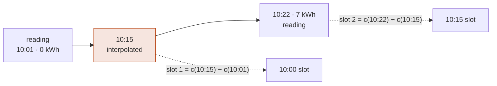

+++
title = "Sessions and settlement"
weight = 4
description = "The quarter-hour split that conserves exactly, the CDR two companies settle against, and the EN 16931 invoice and SEPA collection it becomes."

[extra]
state = "built"
nav = "Settlement"
+++

A session is what happened. A CDR is a claim about it, sent to somebody who was
not there and who will pay against it. Between the two sits arithmetic that has
to be exactly right, because the recipient will check it.

## The quarter-hour split

Germany's pass-through model settles a charging session against the quarter
hours it touched: the operator assigns each quarter hour's energy to the balance
group of the supplier the driver chose `[A6 §IV.1]`. A session running 10:01 to
10:22 touches two of them, and the boundary at 10:15 falls two thirds of the way
through.

Seven kilowatt-hours times two thirds does not terminate.

```mermaid
gantt
    title A session from 10:01 to 10:22, settled against two quarter hours
    dateFormat HH:mm
    axisFormat %H:%M
    section Settlement grid
    first quarter hour   :done, q1, 10:00, 15m
    second quarter hour  :done, q2, 10:15, 15m
    section Measured
    the session          :active, s, 10:01, 21m
    section Slots produced
    4.666… kWh           :crit, a, 10:01, 14m
    2.333… kWh           :crit, b, 10:15, 7m
```



Neither slot value terminates as a decimal, and the two still add to exactly
seven. That is the whole problem, and the next two sections are how.

### Why the obvious approach is wrong

Compute each slot independently and the sum comes out a few milliwatt-hours
short of the session total, because rounding happened once per slot. The usual
fix is to shove the difference into the last slot — which silently misattributes
energy to whoever held 10:15.

### What this does instead

Compute the **cumulative** value at each boundary once, and take differences:

```text
slot[i] = cumulative(boundary[i+1]) − cumulative(boundary[i])
```



Whatever `c(10:15)` was rounded to, it appears once with each sign and cancels.

The sum telescopes. Every interior boundary appears once positive and once
negative and cancels exactly, whatever it was rounded to. What remains is
`cumulative(end) − cumulative(start)` — the session total, to the last digit,
always.

```rust
let split = split::into_quarter_hours(&series)?;
assert!(split.conserves());   // for every session, whatever the ratio
```

A test runs 144 generated sessions — six start offsets × six durations × four
totals, chosen for awkward ratios — and asserts it on every one. A six-hour
session with readings only at its ends produces 24 slots, every interior
boundary interpolated, and still sums exactly.

### …and conservation is also a hiding place

Because the sum telescopes *whatever* each boundary was rounded to, an imprecise
boundary is invisible in the total. It does not disappear — it lands entirely on
the supplier who held that quarter hour, which is exactly the misattribution the
telescoping was introduced to prevent. So the interpolation multiplies before it
divides:

```text
delta × offset / gap     ✅ exact wherever the ratio terminates
delta × (offset / gap)   ❌ precision spent on the ratio first
```

The same rule the rating engine follows, for the same reason — and the invariant
this module is proudest of is exactly what would hide the difference.

## The grid settles the energy; it does not price the minutes

A quarter hour is where the energy settles `[A6 §IV.1]`. It is **not** where the
price changes: `[AFIR Art. 5(4)]` prices the time a vehicle is connected and not
charging **per minute**, and a vehicle stops charging when it stops charging
rather than at `:15:00`.

One `charging` flag per quarter hour cannot describe the one a charge finishes
in, so the split cuts at the session's own state changes as well as at the grid:

```rust
let split = session.split(Direction::Import)?;           // grid + state changes + idle
let split = split::into_periods(&series, &cuts, &idle)?; // the primitive underneath
```

Every cut is another boundary in the same telescoping sum, so conservation is
untouched. A quarter hour may then hold two slots — and `market_series()` sums
them back, because the market settles a whole Messperiode against one balance
group.

## The instant that names a period

`[PTB-A 50.7 §3.1.7.2]`, in a footnote: "Der Zeitstempel, der zu einer
Messperiode gehört, ist immer der Zeitpunkt des **Endes** einer Messperiode."

A German meter, an MSCONS load profile and `mako-emob` all call 00:00–00:15 the
**00:15** period. `QuarterHour` calls it 00:00, because a half-open interval
named by its start is the only spelling in which `containing()` is a truncation.
Both are consistent, and mixing them shifts every slot by fifteen minutes — an
error that sums to zero across a session and is wrong for every balance group.

So the conversion has a name and happens once, rather than in each adapter:

```rust
let series = split.market_series();   // each period labelled by its end
```

## Every slot says where its number came from

```rust
assert!(!split.fully_measured());
for slot in split.interpolated() { /* … */ }
```

`Measured` means a `Sample.Clock` reading landed on that boundary. `Held` means
the register was carried unchanged from a measured reading across an interval
the session says nothing flowed in — exact, on the operator's own account, and a
third answer because it rests on the state machine rather than on a second
reading. `Interpolated` means the number was derived by assuming constant power
across a gap — which a tapering charge curve does not deliver. A car at 80 % state of
charge draws far less at the end of a gap than at its start, so a straight line
over-allocates to the later side, and the error lands on whichever supplier held
the boundary.

That assumption therefore travels with the number, all the way onto the CDR the
partner receives, rather than being forgotten at the point it was made.

### …and constant power means constant power *while charging*

A straight line between two readings is the honest guess across a gap the
session says nothing about, and a wrong one across a gap it does. The ordinary
OCPP 2.0.1 transaction opens `EVConnected` with a `Transaction.Begin` reading,
starts charging thirty seconds later with no reading, and sends its next meter
value at the quarter hour. Its register did not move for those thirty seconds,
and a line from the opening reading attributes energy to an interval the
operator's own state machine calls suspended — which the CDR builder then
refused as a contradiction the arithmetic itself had invented.

So `Session::split` hands the interpolation the session's **idle intervals** —
every stretch of the history in a state other than `Charging` — and the register
is held flat across them, the gap's energy spread over the seconds that remain.
Conservation is untouched: the cumulative values still telescope. Where a gap
has no charging time at all and the register moved anyway, the line is drawn
across the whole gap and the contradiction is left standing for the builder to
report, because it is now the meter's own.

### A coincidence is not a measurement

A `Sample.Periodic` reading that happens to fall on `:15:00` does **not** count
as measured. The station chose that instant for its own reasons, and treating
the coincidence as clock-aligned reports a settlement as authoritative on a day
the phase drifted. This is why OCPP's `AlignedDataInterval = 900` matters, and
why the two reading contexts are kept apart.

### No daylight-saving branch

A quarter hour is an instant plus fifteen minutes of real time. Every civil UTC
offset in the world is a whole number of quarter hours, so a UTC quarter-hour
boundary is a local one everywhere — and the 92- and 100-slot days of a clock
change are simply days with fewer or more instants in them. Nothing counts to
96.

The market side *does* count, and 96 is what every exporter hard-codes. A
balance-group submission is validated on how many Messperioden a day holds
`[A6 §IV.1]`, so a series with 96 entries for 25 October is missing an hour of
somebody's balance group:

```rust
let berlin = TimeZone::new("Europe/Berlin")?;
QuarterHour::periods_in_local_day(&berlin, date!(2026-06-15));  // Some(96)
QuarterHour::periods_in_local_day(&berlin, date!(2026-03-29));  // Some(92)  spring forward
QuarterHour::periods_in_local_day(&berlin, date!(2026-10-25));  // Some(100) autumn fold
```

Measured between the two local midnights rather than read from a table of
transition dates, so a zone that shifts by half an hour or at an hour other than
02:00 needs no case. `None` says the day is not a whole number of periods at all
— a civil offset that is not a multiple of fifteen minutes, which Liberia was the
last of, in 1972.

## Sessions keep when, not only what

A session's state machine refuses what the protocol forbids — nothing follows
the end, and charging never goes back to pending. It also records **when** each
state was entered, and a transition dated before the one it follows is refused,
because a history that is not ordered cannot be read as intervals.

It has to be readable as intervals, because "suspended" is not a status light.
`[AFIR Art. 5(4)]` lets a fast charger charge an occupancy fee **per minute**
for the time a vehicle is connected and not charging, so the question is *for
how long*, and a state field without a timestamp cannot answer it.

```rust
assert_eq!(session.state_at(at(50)), Some(SessionState::SuspendedByVehicle));
assert_eq!(session.activity_throughout(at(45), at(60)), Some(Activity::Parked));
```

The CDR builder uses the same history the other way round: energy across a
quarter hour the session logged as suspended from end to end means the meter and
the state machine disagree, and it refuses the record rather than picking one.
Guessing is how a driver is billed for a charge the operator's own log says never
happened.

## Authorisation paths are not interchangeable

| Path | Contract-free | Strongest honest identification |
|---|---|---|
| `AdHoc` | ✅ — the one `[AFIR Art. 5(1)]` requires | trusted — no contract, so nothing for a certificate to certify |
| `PlugAndCharge` | | secure — `ISO15118_PNC` `[OCMF Tab. 15]` |
| `LocalList` | | secure — a local list decides against an RFID card, and `RFID_PSK` `[OCMF Tab. 13]` is a secured one |
| `Roaming`, `RemoteCommand` | | certified — `OCPP_CERTIFIED` `[OCMF Tab. 14]` certifies the mapping with a backend certificate |
| `AutoCharge` | | hearsay — a MAC address off the wire |


**The ceiling is read off Tables 13–16, not off who decided.** `[OCMF Tab. 11]`
grades *how the user was identified*; Tables 13–16 say which identifications each
mechanism can carry, and the two axes are largely orthogonal. A ceiling set from
the decision-maker refuses ordinary hardware — a local list decides against an
RFID card, and a secured card is Table 11's own example of `SECURE`. What stays
low is what cannot rise: an unauthenticated MAC address, and an ad-hoc session
that presented no contract for anything to certify.

`AutoCharge` recognises a vehicle by its MAC address. It is not a standard, not
authenticated and trivially spoofable, and it is kept rigorously apart from Plug
& Charge — the two are constantly conflated in marketing and must never be
conflated in evidence.

### The cross-check nobody runs

A session records *how* it was authorised. The signed meter record states *how
strongly* the driver was identified `[OCMF Tab. 11]`. Two statements about one
event, and they can disagree:

```rust
CdrBuilder::from_session(&ad_hoc_session, Direction::Import)?
    .key(party, id)
    .evidence(secure_evidence)
    .build()
// Err: the session claims ad-hoc authorisation, which supports at most
//      trusted identification, but the signed record reports secure
```

When they disagree, the one with a signature behind it is the one to believe, so
the CDR is refused rather than billed at the stronger claim's tariff.
Under-reporting is fine — a station being conservative is not a fault.

The check is only worth anything if nobody can hand it the answer, so the
strength is read off the records by `EvidenceRef::from_evidence`, and it is the
**weakest** level any of them asserted. A hand-filled field can be filled with
whatever value makes the record build.

### The other one: whether a duration may be billed

OCMF states how far the station's clock can be trusted and flags a time value as
unusable separately from an energy one. A per-minute occupancy fee is billing a
duration, so:

```rust
CdrBuilder::from_session(&session, Direction::Import)?
    .evidence(evidence_ref)          // the clock was never synchronised
    .rated_with(&occupancy_tariff)
    .build()
// Err: … the signed records do not support billing a duration.
//      The energy is unaffected — price this session per kWh
```

The energy really is unaffected, so the error names the fix rather than blocking
the session — and the same gate runs again in the pre-flight, on records a
partner built.

The gate asks what the record **bills**, not what the tariff mentions. A tariff
whose occupancy fee begins after four hours names `ParkingTime`; a thirty-minute
session under it charges no duration at all, and refusing that record would
throw away the kilowatt-hours over a fee nobody was charged. So the rating runs
first and the gate reads the seconds it actually charged — which for an
occupancy fee is the occupancy, not the session's whole length.

### And the third: which way the energy went

`[OCMF Tab. 25]` reserves the OBIS range `B0`–`B3` for import and `C0`–`C3` for
export, so the signed register states the direction. Import and export never net
— that is the rule `[A6 §IV.1]` enforces on the market side too — and until the
OBIS code was read rather than carried, nothing compared the record's claim with
the register's:

```rust
CdrBuilder::from_session(&session, Direction::Import)?   // the session says draw
    .evidence(evidence_ref)                              // the register says C2
    .build()
// Err: … import and export never net, and one of the two is a V2G discharge
```

## A period is a slot and a window

A session that starts at 10:07 has its first period reported under the quarter
hour beginning **10:00** — that is the settlement period the energy belongs to —
while the period itself runs from **10:07**, because that is when the session
began. Both are true and they are different fields:

```rust
assert_eq!(cdr.periods[0].quarter_hour.start(), at("10:00"));
assert_eq!(cdr.periods[0].start, at("10:07"));
```

Collapsing them into one timestamp produces a record whose first period starts
before its own session, which every partner's validator flags and none can fix.
And the window comes from the **slot's own readings**, not from the quarter hour
clamped to the session: a station that authorises at 10:00 and sends its first
meter value at 10:20 would otherwise produce a first period claiming twenty
minutes of measurement that never happened.

### Occupancy is a fact the record states

A period that moved no energy is **not** therefore occupancy. A car at 100 %
state of charge can leave a quarter hour at exactly `0.000 kWh` while the
session's own state machine says `Charging`, and pricing that quarter hour at
the occupancy fee charges a driver for parking they were told was charging. So
`ChargingPeriod::activity` is a stated fact taken from the session history, and
`validate` blocks a partner's record whose two halves contradict each other.

### …and "not charging" is two facts, not one

`[OCPI 2.3.0 §mod_cdrs_chargingperiod_class]` corrected its own definition of
`PARKING_TIME` — from "time not charging" to "time during which the **vehicle is
not requesting power**" — and said why: under the old reading drivers "would be
exposed to penalizing loitering fees … when the EVSE is not offering energy to
the vehicle while the vehicle is still requesting power".

That second case is a charging profile at zero, a `[EnWG §14a]` dimming, a grid
limit, a fault — the operator declining to deliver, not the driver loitering. So
the record carries three activities and not a boolean:

| | priced as | energy transferred |
|---|---|---|
| `Charging` | `TIME` | ✅ |
| `Parked` — the vehicle stopped asking | `PARKING_TIME` | |
| `Withheld` — the point stopped offering | *nothing* | |

OCPP has distinguished the two since 2.0.1 (`SuspendedEV` against
`SuspendedEVSE`) and the seam was discarding it. A withheld minute is still
inside the record's `total_time`, and inside its `total_parking_time` — that
field is defined on energy *transfer* rather than on demand, so the two figures
differ by exactly the withheld time and neither is derived from the other.

### …and occupancy is time nobody metered

The meter series spans the readings; the session spans the parking space. A car
that finishes charging at 11:00 and is collected at 13:00 leaves two hours the
split knows nothing about — and those two hours are precisely what the occupancy
fee exists for.

A record that stops at the last reading cannot bill them; one that stretches the
last reading over them bills energy that did not flow. So the builder fills the
gap with periods carrying **no energy**, marked `Interpolated` because the zero
is an assumption rather than a measurement, split on the same quarter-hour grid
as everything else, and the total is untouched.

**And their activity is read, not assumed.** It is tempting to call
unmetered time occupancy by definition — no readings, no energy, so the car was
sitting there — but "the meter said nothing" and "the vehicle was not charging"
are different claims, and only the second is one the operator's own records make.
A station that stops sending `MeterValues` while its own state machine still says
`Charging` would otherwise be billed an occupancy fee per minute for time it says
the car was taking energy, on the strength of an absence.

So the fill is built where the session history is still in scope, cuts at the
session's state changes as well as at the grid, and asks
`Session::activity_throughout` — the **one** question every period on the
record is asked, metered or not. One question rather than two booleans: asking
"was it charging" and "was it suspended" separately leaves the third answer
indistinguishable from the second. And it can answer *neither*, because there
are five states and two of them are.
`Pending` is authorised with nothing flowing and `Ended` is over, and both are
"connected and not charging", which is exactly what the fee prices — and asking
"not suspended" of a metered period billed the minute a car sat `EVConnected`
before its charge began as charging time.

## A reservation is on the record, and it is not a period of the session

`[OCPI 2.3.0]` prices a reservation over a window that *"starts when the
reservation is made, and ends when the driver starts charging … or when the
reservation expires"* — before the cable went in, so no meter measured it and the
session's own history says nothing about it. `Cdr::reservation` carries the
window, `Cost::reservation` carries its rating, and the two cross in the
`total_reservation_cost` the specification keeps for exactly this.

It is a second `Rated` rather than lines inside the first for the reason the
specification uses a restriction rather than a dimension: a tariff whose
unrestricted element prices `TIME` and whose reservation element also prices
`TIME` would have the reservation's minutes and the charging minutes competing
for one dimension, and the per-dimension rule would drop one of them.

`Cdr::total_cost` is both, which is what makes a partner's own sum of the
per-dimension fields close.

### …and on the invoice, as its own supply

A record's two ratings are two **supplies** on one document, numbered in one
sequence and stripped, rounded and taxed by one function. The reservation is
stated first, because it ran first; its lines carry the reservation's own dates
in BT-134/BT-135 rather than the session's, because a supply dated outside the
period it happened in is a document a tax office reads differently; and its
`TIME` is called *reservation* rather than *charging time*, since the same
dimension means two things in the two parts.

`validate` asks of the reservation's rating everything it asks of the session's,
through one function that records which part a finding came from. Three shapes
are blocking: two currencies on one record, a priced reservation the record does
not place in time, and a reservation billed for longer than its own window ran.

### What the document tells the payer

`[REA 6-A §3.2]` names *"einem Messwert **oder einer Rechnung**"*, so compensated
cable or rectification loss is stated on the invoice line carrying the measured
value — BT-127, built from the station's own signed record rather than from a
flag somebody sets.

The rating's notes split by audience. A note that says a quantity was billed
differently from how it was measured — a block rounding, an unpriced dimension, a
line the clock could not resolve — is a term of the price the payer is entitled
to reconcile `[AFIR Art. 5(4)]`, and crosses as a BG-1 note. A fault in a
document the payer did not write — a VAT rate with no split, two bounds that
contradict — goes to the operator queue.

## Tokens are never stored raw

```rust
TokenRef::new("1F2D3A4F5506C7")   // Err: that is an RFID UID
TokenRef::new(&keyed_digest)      // Ok: 64 lowercase hex characters
```

A card UID is a lifelong identifier of a physical object a person carries.
Storing it on every session row builds a movement profile no charging platform
needs, so the type refuses anything that is not a 256-bit digest.

## A retransmission is not a conflict

Roaming transports retry. A partner that does not get a `200` in time sends the
CDR again. The usual handling is an upsert keyed on the CDR id, which is wrong
in both directions:

```rust
ledger.accept(cdr.clone());  // Stored
ledger.accept(cdr.clone());  // Duplicate — one session, one invoice line
ledger.accept(restated);     // Conflict { difference: "total energy 18.000 kWh → 118.000 kWh" }
```

A **retransmission** must not produce a second invoice line. A **different**
record under the same id is not a retry — it is a partner restating a settled
number, and an upsert accepts that without a sound. The original is left
untouched and a human is told what moved.

The key is the `(party, id)` pair, never the bare id: OCPI makes a CDR id unique
per party, so two CPOs may each have a CDR `1`.

### …and a correction chain has one end

A correction is a *new* CDR, so a ledger holding a session and its correction
holds both. Two records that both supersede one key are two corrections of one
session — both live, neither superseded, and the session billed twice: the same
failure content equality is checked to prevent, one link along.

```rust
ledger.accept(another_correction_of(&first));
// Forked { supersedes: DE*ABC/1, held: DE*ABC/2 }

let owed: Energy = ledger.live().map(|cdr| cdr.total_energy).sum();
```

`live()` is the set a billing run sums: everything the ledger holds that nothing
else in it supersedes. `iter()` is every record, superseded ones included. A
record that supersedes *itself* is refused for the mirror reason — stored, it
would be superseded by its own presence and billed by nothing — and a correction
that arrives **before** the record it corrects is still stored, because roaming
transports do not order deliveries.

## Validation reports, and never repairs

A CDR this workspace builds cannot fail its own arithmetic. One that arrives
from a partner was built by somebody else's code.

```rust
let report = validate(&incoming);
for reason in report.reasons() { eprintln!("{reason}"); }
// the periods sum to 18.000 kWh but the record claims 20.000 kWh
// the period at 2026-01-02 10:15 is out of time order
```

Every problem at once, not the first — a partner integration is debugged by
seeing all of it in one pass. And nothing is mutated: a record whose periods do
not sum to its total is never quietly adjusted, because that would be inventing
a number on behalf of somebody who will be invoiced for it.

Missing signed evidence is a **warning** rather than a block, deliberately. It
blocks a German energy invoice under `[MessEG §33]` and is merely notable
elsewhere, so the decision belongs to the billing layer that knows which regime
applies. Blocking here would refuse lawful settlement outside Germany.

Money computed for a different quantity than the record states is **blocking** —
the settlement fault that costs the most to unwind. So are the two that are easy
to miss:

```rust
// the Energy line states 18.000 at 0.49 and an amount of 9.80,
//   but its own numbers come to 8.82
// the period beginning 10:15 starts before the previous one ended at 10:30:
//   the overlap is billed twice
```

Every line has to reproduce its own amount, because the amount is the number the
payer pays and the quantity check does not reach it. And two periods can have
ascending starts, sit inside the session, sum to the record's own total, and
still put fifteen minutes in both.

The quantity is checked for the **minutes** as well as the kilowatt-hours, and
the two are not symmetric. `[AFIR Art. 5(4)]` prices occupancy per minute, which
makes the minutes the half of a roaming settlement most often disputed — but a
record that charges for *less* time than it spans is the ordinary shape of a
lawful tariff: an occupancy fee that begins after four hours prices nothing on a
thirty-minute session, and a dimension no element matched costs nothing at all.
So a shortfall is revenue nobody charged, an excess is money the payer is asked
to accept on the sender's word, and only the excess blocks.

A blocking finding has to be a fault, not a shape the checker did not expect.
`CostEnergyMismatch` therefore runs only where an energy price was actually
charged: "this tariff charges nothing per kWh" sums to zero the same way "this
price was computed for 0 kWh" does, and a per-minute tariff below 50 kW is
lawful. That case is a warning instead — a dropped energy line looks identical
from the record alone, and the receiving party is told rather than left to
notice.

Every note the rating made is surfaced as a warning, so a minimum charge or a
block rounding reaches the receiving party as a term of the price rather than as
a discrepancy they have to discover.

## The wire is a format, not a round trip

A CDR is a claim sent to somebody who was not there and who will pay against it,
so what leaves the process has to be legible to them:

```json
{
  "started_at": "2026-01-02T10:00:00+01:00",
  "periods": [{ "quarter_hour": "2026-01-02T10:00:00+01:00", "energy": "9.000" }],
  "total_energy": "18.000"
}
```

None of that is what a derived encoding produces. `time`'s own `Serialize` writes
an instant as `[2026, 2, 10, 0, 0, 0, 1, 0, 0]`, a date as `[year, ordinal]`, and
a three-byte `Currency` newtype as `[69, 85, 82]`. All of it round-trips through
one codebase perfectly, and that is exactly why a round-trip test cannot catch
it: `from_str(to_string(x)) == x` holds for **any** encoding, including one
nobody else can read.

Two faults underneath. Every wire this stack meets — OCPI, OCPP, OICP,
EN 16931 — writes an instant as RFC 3339 and a currency as its ISO 4217 code. And
the shape is a dependency's private business, so an archive written under one
`time` release and read under another is a dispute with no answer — the same
exposure `TariffFingerprint` already defends against for what it hashes.

`emob-core::wire` pins the spellings, and the deserialisers run through the
validating constructors, so a currency code, a clock resolution above the
regulation's cap and a quarter hour off the settlement grid are refused **on the
way in** rather than trusted for having arrived already typed.

## The record carries its price

A CDR is what two companies settle against, so it carries what they settle: the
energy *and* the money.

```rust
let cdr = CdrBuilder::from_session(&session, Direction::Import)?
    .key(party, "cdr-1".parse()?)
    .evidence(evidence_ref)
    .rated_with(&tariff)          // priced from its own quarter hours
    .build()?;

assert_eq!(cdr.total_cost().unwrap().to_string(), "8.82 EUR");
```

`rated_with` prices the record's own charging periods, so every euro traces to a
quarter hour that traces to a signed reading. Rating in a separate service is how
a CDR and its invoice line come to disagree about one session — and because the
periods *are* the rating periods, a receiving party re-rating the record reads
exactly the slices the issuer did. See
[Tariffs and price transparency](@/docs/pricing.md).

## …and the record becomes an invoice ✅

A CDR is a claim. An invoice is a **demand**, and it is the document a tax
authority reads, a partner pays against and an auditor asks for.
`emob-billing` is the seam between them, and
three things there are decisions rather than mappings.

### The rounding happens once, at the line

A rated line is exact and unrounded; an invoice amount is a figure in a
currency's minor unit. EN 16931 states its totals as sums of the **line**
amounts — `BT-106 = Σ BT-131`, and per VAT category `BT-116 = Σ BT-131` — so the
rounding has to happen at the line, or the document cannot satisfy both at once.
Rounding per category and apportioning back to lines produces an invoice whose
own lines do not add up to its own subtotals, which is the first thing every
validator in this space checks.

The document's taxable amount therefore need not equal what the records came to
exactly — at most a minor unit per line, and real money. So it is reported the
way every other inexact crossing in this workspace is:

```rust
let crossing = InvoiceBuilder::new("R-2026-0001", issued, period, cpo, driver)
    .supplied_from("DE", dec("19"))   // the points' country, and its rate
    .ledger(&ledger)         // `live`, never `iter`: a correction is a new record
    .due_on(due)
    .build()?;

assert!(crossing.value.reconciles());     // its subtotals reproduce its lines
crossing.value.rounding_residual();       // …and what that cost, exactly
for reason in crossing.reasons() { … }    // named per record, by JSON Pointer
```

The tax follows from the *rounded* figure, so that residual is the whole of what
the document approximates. A tiered session keeps its tiers, because a tiered
invoice has to show them.

**And the rate is a property of the line.** The *category* belongs to the whole
document — a supply is a reverse charge or it is not — but electricity and a
service fee can sit in different VAT categories, so the breakdown has one taxable
amount per rate:

```rust
invoice.lines[0].vat_rate;   // 19 — the energy component's own
invoice.lines[1].vat_rate;   //  7 — the service fee's
invoice.tax.len();           //  2 — and the standard's own BR-S-08 checks it
```

### A bound is not a line, and the price is the net one

`min_price` and `max_price` move a session's total without changing what was
delivered, and a maximum moves it **down** — which as a line is a negative
amount and a negative BT-146, and `BR-27` refuses the document outright. So a
bound is a document level allowance or charge (BG-20/BG-21), a positive magnitude
the totals chain subtracts or adds, and its amount is derived from what the
document states: rounding the line and the exact difference independently landed
a cent past the cap, and the cap is the one number the driver was promised. A
bound with no lines to adjust is the line, because `BR-16` requires an invoice to
have one.

The target is built the way the lines are: **every amount stripped at its own
rate**. An allowance carries one VAT rate — BT-95 and BT-96 — so the bound is
converted on its own and added to the lines' own nets, rather than the record's
whole total being divided by one factor. On a €100.00 session made of energy at
19 % beside a session fee at 7 %, the single-factor reading divided the 7 % half
by 1.19 as well and billed €98.80.

An adjustment larger than everything charged at its rate is a different matter,
and it is the one document in this workspace that passed every check and was
still unacceptable. `BR-S-08` makes a category's taxable amount its lines minus
its allowances, so a cap of €3.00 on €5.00 of energy at 19 % beside a €20.00 fee
at 7 % states **BT-116 = −2.00**. The invoice reconciles, the totals chain holds,
and **all 317 of the standard's own rules accept it** — none of them forbids a
negative category under a positive invoice, and no tax office accepts one. The
rating had named it for two passes as a note beside the record, which is not a
refusal.

The standard's own answer is that **BG-20 is repeatable**: a bound deeper than
one category is several allowances, one per category it is drawn from.

What that costs is the *price*. Reaching a gross ceiling from net lines needs to
know what a unit of movement does to the gross, and that is a property of the
category the movement lands in — so a cut spanning two rates makes the gross a
**piecewise-linear** function of how deep it goes, and dividing by one factor
answers the ceiling with a movement that does not reach it. Splitting the
allowance without rewriting the solve trades a document a tax office rejects for
a price above a maximum the operator published, which is worse.

So the solve is the inversion of that piecewise function, walking the categories
in the order the split then draws from, and the two read **one** order rather
than two that agree until they do not. With a single VAT rate the walk has one
segment and the arithmetic is the division it always was.

BT-146 is likewise the item price **excluding VAT**, so a gross tariff's own
figure does not belong there: `29.500 × 0.49` is `14.455` where the line says
`12.15`. Both are stripped at the same rate, and `Invoice::reconciles` asks every
line to reproduce its own amount from its own numbers.

### A time line is stated in seconds, against a price per hour

OCPI quotes time per hour and 3600 has two factors of three, so twenty-five
minutes is `0.41666…` h and a line whose quantity is rounded no longer reproduces
its own amount. EN 16931 has the field for exactly this — BT-149, the item price
base quantity — so a time line carries `1500 SEC` at `6.00 EUR per 3600 SEC`,
and `BT-131 = BT-129 × BT-146 ÷ BT-149` holds to the last digit. The same
divide-last identity the rating enforces per line, now on the document itself.

### And nothing is substituted, including a date

Every figure that will not fit the standard's own types is refused rather than
replaced — an amount too precise for a currency's minor unit, and a date outside
EN 16931's four-digit year. Falling back to the epoch would not do: `1970-01-01`
is a perfectly valid `BT-2`, so nothing objects and the document is sendable.

### The verdict is the deliverable, not the XML

An invoice that serialises and does not validate is an invoice that comes back.

```rust
let crossed = en16931::to_en16931(&invoice, Specification::Core)?;
assert!(crossed.value.is_valid());

// The German public buyer's document, or the terms it is missing.
match en16931::write(&invoice, Specification::XRechnung, Syntax::Ubl) {
    Ok(xml) => submit(&xml.value),
    Err(BillingError::NotCollectable { reason }) => eprintln!("{reason}"),
    Err(other) => return Err(other.into()),
}
```

The specification and the syntax are two arguments and neither has a default.
`Specification` is BT-24 *and* the rule set the document is judged by, in one
decision, so a document cannot claim one profile and have been checked against
another. `[UStG §14]` asks for conformity with Directive 2014/55/EU — which is
EN 16931 itself, not `XRechnung`, whose `BR-DE-*` rules are a public-sector usage
specification wanting a Leitweg-ID an ordinary business customer does not issue.
`Syntax` is UBL or CII, the two CEN/TS 16931-2 makes mandatory: one semantic
invoice, two spellings, and which one an access point takes is a fact about the
recipient.

`Validated<XRechnung>` is a type that cannot be constructed from an invalid
invoice — the same discipline `Evidence::billable_energy` applies to a
kilowatt-hour one layer down. And `BR-CO-25`, which says an invoice with
something owing has to state when, is asked at **construction**: the answer is a
commercial term the caller holds, and this crate reads no clock to invent one.

### The document layer asks the validator

`emob_cdr::validate` asks everything that makes a record unsettleable, and
`CdrBuilder` refuses to issue one that fails. The layer that *sends the demand*
accepts only a record its own validator settles:

```rust
let err = InvoiceBuilder::new(…).record(&overlapping).build().unwrap_err();
assert!(matches!(err, BillingError::NotSettleable { .. }));
```

A record built here passes its own validator by construction, so the ordinary
path is unaffected; the doors this covers are the ones that skip the builder — a
partner's document, and anything a service read back from storage.

And the half only this layer can decide. `validate` grades a missing signature as
a **warning** on purpose, because it is blocking for a
German energy invoice and merely notable elsewhere — "the decision belongs to the
billing layer that knows which regime applies". `[MessEG §33(3) Nr. 1]` names
invoices in as many words: those resting on measured values must be ones their
recipient can follow in order to check the values stated. So a line per
kilowatt-hour or per minute needs a signed record behind it, a per-session fee
does not, and the regime is where the *measurement* happened rather than where
the supply is taxed.

### A discharge is refused rather than billed

`Direction` is a field rather than a sign everywhere here, so a V2G discharge can
never net against a draw. Every layer honoured that — the signed OBIS register,
the CDR builder, `to_ocpi` (which refuses an export by name, OCPI having no way
to express one) and `emob-thg` (which skips it, `[38k §5(1)]` counting
electricity *withdrawn*). The document layer did not:

```rust
let err = InvoiceBuilder::new(…).record(&discharge).build().unwrap_err();
assert!(matches!(err, BillingError::ExportNotBillable { .. }));
```

Without that, 29.5 kWh that flowed **out** of a vehicle became a valid EN 16931
invoice demanding €14.46 from the person who supplied it, with balanced postings
and a collectible direct debit — nothing objecting anywhere, because the
arithmetic is identical and only the direction differs. A discharge is a supply
the other way round, ordinarily a self-billed *Gutschrift* `[UStG §14]` with the
parties reversed, and which arrangement applies is not a fact a CDR carries.

### A cancellation is a kind, not a minus sign

An invoice that was wrong is not edited and not deleted. It is reversed by a
second document — a German *Stornorechnung*:

```rust
let storno = invoice.cancellation("R-2026-0001-S", date!(2026 - 08 - 15))?;

assert_eq!(storno.kind, DocumentKind::CreditNote);          // BT-3 = 381
assert_eq!(storno.cancels.unwrap().number, "R-2026-0001");  // BG-3
assert_eq!(storno.gross_total(), invoice.gross_total());    // the same money
```

**Nothing is negated.** EN 16931 carries the direction in the document *type* and
states the credited figures as positive ones; a reversed line would be a negative
BT-146, which `BR-27` refuses outright. UBL spells the two documents with
different root elements, in different namespaces, with different names for the
type code and the line — so a kind that did not reach the writer produces an
`<Invoice>` claiming BT-3 = 381, which no schema catches on the way out.

Two consumers behave differently, and both are the half that fails silently.
`postings_for` **reverses every side** — booking a Storno like the invoice it
cancels doubles the revenue and the VAT liability. And `payment::instruct`
**refuses** it: a direct debit draws money in, a credit note is money owed back,
and every figure on it is positive, so nothing else would have objected before
the driver was debited a second time.

### A roaming settlement is not taxed where the charge point stands

Recharging an EV is a single composite supply of **goods** — the electricity —
which the Court of Justice settled in C-282/22. The three-party shape every
roaming session has is a second question, and C-60/23 (*Digital Charging
Solutions*, 17.10.2024) settles it: where the driver contracts with an e-mobility
provider rather than with the operator of the point, the chain is a **commission
structure** under Article 14(2)(c) — two successive supplies of goods, CPO to
eMSP and eMSP to driver — held so despite the eMSP controlling neither when,
where nor how much is drawn. That is what makes an eMSP a *taxable dealer*.

`[UStG §3g]` then says a supply of electricity **to a taxable dealer** is made
where that dealer is established.

```rust
let rates = VatRates::new().at("DE", dec("19"));
let treatment = TaxTreatment::decide(&cpo.tax, &emsp.tax, "DE", &rates)?;
assert_eq!(treatment.category, VatCategory::ReverseCharge);
assert_eq!(treatment.place_of_supply, "FR");
// …and the second supply asks a different question of the same two parties.
let fee = TaxTreatment::decide_service(&cpo.tax, &emsp.tax, &rates)?;
```

Putting 19 % on that invoice charges tax that may not be charged and that the
partner cannot reclaim.

### Where the supply is taxed and who pays it are two questions

Article 195 shifts the liability to the recipient only "if the supplies are
carried out by a taxable person **not established within that Member State**". A
CPO with a branch or a VAT registration in the buyer's country is making an
ordinary local supply there, at that country's rate, and a reverse charge on it
drops tax that was due. So establishment is stated rather than inferred from the
two countries:

```rust
let cpo = TaxStatus::business("DE", "DE123456789");
TaxTreatment::decide(&cpo, &french_emsp, "DE", &rates)?;    // AE, place FR

let cpo = cpo.also_established_in(["FR"]);
TaxTreatment::decide(&cpo, &french_emsp, "DE", &rates)?;    // S at 20 %, place FR
```

**And the rate follows the place of supply, not the charge point.** The place of
supply need not be the country the posts stand in: a German operator running
chargers in France and settling with a German eMSP is taxed in Germany, at 19 %,
on kilowatt-hours drawn under a 20 % regime. So the rates are a table the caller
states —
`VatRates` — and `decide` looks up the one belonging to the place of supply it
derived. A standard-rated supply whose place of supply has no rate stated is
refused, because the two silent alternatives are an invoice that over-declares
its VAT and one that under-declares it.

A reseller established **outside** the Union takes the place of supply out with
it, so no member state's VAT arises at all: the category is `O`, outside scope,
and not the `G` that describes goods leaving the customs territory zero-rated.

`O` is the only category in UNCL 5305 that **states no rate**, and that reaches
the document. `BR-O-05` refuses a line carrying BT-152 at all — a rate of zero is
carrying it — `BR-O-02` allows no VAT identifier on either party, and once the
seller's is gone `BR-CO-26` still wants the buyer to be able to identify its
supplier. So an outside-scope settlement is the one invoice where the legal
registration (BT-30) is not optional, and a German operator states its `HRB`
entry and omits its own VAT identifier.

The category enum is `en16931`'s own rather than this crate's: it carries all ten
codes with four predicates generated from the CEN artefacts, and the two a
hand-rolled copy was missing are exactly the two that decide the paragraph above.

The ad-hoc leg does not share the rule — a driver paying
at the point is not a reseller — so **two sessions at one post a minute apart can
carry different VAT**, which is why the treatment is decided per invoice from the
parties rather than per station from a configuration field.

A cross-border reverse charge missing a VAT identifier on either side is refused,
naming the party that has none: EN 16931's `BR-AE-2` and `BR-AE-3` refuse that
document anyway, and refusing it where the rule lives means the message names the
missing identifier instead of a rule id.

Where a tariff states its **own** rate and the place of supply asks for another,
the tariff's rate governs the line and the disagreement is reported as a note. The
gross price is never moved: `[PAngV]` and `[AFIR Art. 5(4)]` entitle the driver to
the figure they were quoted. A tariff published for one country and charged in
another is a pricing error, and the invoice says so rather than picking a side.

### The fee that is not electricity

The same judgment treats a **periodic subscription** an eMSP charges its driver —
one that buys access rather than kilowatt-hours — as a separate and independent
supply of *services*. The Court's reason is the fee itself: it is charged
*"regardless of whether the user actually purchased electricity during the
relevant period"*.

Separate means it does not follow the electricity anywhere. `[UStG §3g]` leaves a
private customer's electricity at the charge point; `[UStG §3a(1)]` puts a service
to a private person where the **supplier** sits. A German provider billing a Dutch
driver who charged in France owes French VAT on the kilowatt-hours and German VAT
on the subscription, on one document, in one month.

```rust
let invoice = InvoiceBuilder::new(number, issued_on, period, cpo, driver)
    .supplied_from("FR", dec("20"))     // where the electricity was drawn
    .vat_rate_in("DE", dec("19"))       // where the supplier sits
    .subscription(Subscription::new("network access", dec("4.99"), from, to))
    .ledger(&ledger)
    .build()?;
invoice.tax.len();                      // two subtotals, two places of supply
```

That is why the VAT category is a **line** field: BT-151 and BT-152 belong to the
line and BG-23 repeats, one entry per category and rate. What is a property of
the whole document is which categories may share it — `BR-O-11` … `BR-O-14` forbid
the outside-scope category to sit beside any other, and `exclusive_category`
records it.

**The line comes from `empd`**, not from the ledger. An invoice is assembled from
rated CDRs, and a contract whose driver charged nothing all month contributes
none — so the fee owed *precisely because* nothing was charged is invisible to
everything downstream of the records. `Empd::fees_for` derives it from the
contracts in force.

### …and the books agree with the document

Under a reverse charge there is **no VAT posting**, because the liability is the
recipient's. A platform that posts 19 % and omits it from the invoice has a VAT
return that reconciles against nothing it sent.

```rust
let books = postings::postings_for(&invoice);
assert!(books.balances());     // before a single account is named
```

A tariff's minimum or maximum moves the revenue role it belongs to, chosen from
the largest line **of that record** rather than of the document — otherwise a
month of energy sessions plus one capped occupancy session books the cap against
energy revenue, for a session that delivered no energy.

The movements are addressed by *role* — receivable, energy revenue, service
revenue, VAT payable at a rate — and a caller maps them onto its own chart. SKR03
and SKR04 disagree about the numbers and neither is a domain crate's business. A
role the chart cannot place is refused rather than dropped: a dropped posting is
an entry that does not balance and a trial balance that is quietly wrong.

The **journal** belongs to a service, and so does the bookkeeping engine.
Posting into one needs accounts, a calendar, a policy and a database, none of
which a pure crate can hold — and a ledger crate brings the clock in through the
door: `doubleentry` takes `uuid` with `v7`, and a v7 identifier comes from
`SystemTime::now()`. A crate whose promise is that two runs of one billing job
produce one file cannot carry that in its graph, so it does not: what crosses
the seam is `Postings`, and `billd` maps it.

Nothing here reads a clock. `sepa` defaults a collection date and a message
timestamp off the system clock, and a collection file that differs between two
runs of one billing job is a file no bank reconciles — so every one of those
fields is an argument, and a test asserts the same inputs produce the same bytes.

## What is not here 📐

Deciding *when* a month closes, holding the contracts an invoice is addressed to
and submitting the document belong to `billd` and `empd`. ZUGFeRD — the hybrid
PDF carrying a CII payload — is a reader in `en16931-formats` and not yet a
writer, and its `lopdf` dependency takes the graph from thirteen crates to
fifty-seven, so the payload is produced here and the envelope is not.
