+++
title = "Sessions and settlement"
weight = 3
description = "The quarter-hour split that conserves energy exactly, why interpolated slots say so, and how a CDR is accepted once without letting a partner restate a settled number."
+++

# Sessions and settlement ✅

A session is what happened. A CDR is a claim about it, sent to somebody who was
not there and who will pay against it. Between the two sits arithmetic that has
to be exactly right, because the recipient will check it.

## The quarter-hour split

Germany's pass-through model settles a charging session against the quarter
hours it touched: the operator assigns each quarter hour's energy to the balance
group of the supplier the driver chose `[A6 §IV.1]`. A session running 10:01 to
10:22 touches two of them, and the boundary at 10:15 falls two thirds of the way
through.

Seven kilowatt-hours times two thirds does not terminate.

```mermaid
gantt
    title A session from 10:01 to 10:22, settled against two quarter hours
    dateFormat HH:mm
    axisFormat %H:%M
    section Settlement grid
    first quarter hour   :done, q1, 10:00, 15m
    second quarter hour  :done, q2, 10:15, 15m
    section Measured
    the session          :active, s, 10:01, 21m
    section Slots produced
    4.666… kWh           :crit, a, 10:01, 14m
    2.333… kWh           :crit, b, 10:15, 7m
```



Neither slot value terminates as a decimal, and the two still add to exactly
seven. That is the whole problem, and the next two sections are how.

### Why the obvious approach is wrong

Compute each slot independently and the sum comes out a few milliwatt-hours
short of the session total, because rounding happened once per slot. The usual
fix is to shove the difference into the last slot — which silently misattributes
energy to whoever held 10:15.

### What this does instead

Compute the **cumulative** value at each boundary once, and take differences:

```text
slot[i] = cumulative(boundary[i+1]) − cumulative(boundary[i])
```

The sum telescopes. Every interior boundary appears once positive and once
negative and cancels exactly, whatever it was rounded to. What remains is
`cumulative(end) − cumulative(start)` — the session total, to the last digit,
always.

```rust
let split = split::into_quarter_hours(&series)?;
assert!(split.conserves());   // for every session, whatever the ratio
```

A test runs 144 generated sessions — six start offsets × six durations × four
totals, chosen for awkward ratios — and asserts it on every one. A six-hour
session with readings only at its ends produces 24 slots, every interior
boundary interpolated, and still sums exactly.

### …and conservation is also a hiding place

Because the sum telescopes *whatever* each boundary was rounded to, an imprecise
boundary is invisible in the total. It does not disappear — it lands entirely on
the supplier who held that quarter hour, which is exactly the misattribution the
telescoping was introduced to prevent. So the interpolation multiplies before it
divides:

```text
delta × offset / gap     ✅ exact wherever the ratio terminates
delta × (offset / gap)   ❌ precision spent on the ratio first
```

The same rule the rating engine follows, for the same reason — and the invariant
this module is proudest of is exactly what would hide the difference.

## The grid settles the energy; it does not price the minutes

A quarter hour is where the energy settles `[A6 §IV.1]`. It is **not** where the
price changes: `[AFIR Art. 5(4)]` prices the time a vehicle is connected and not
charging **per minute**, and a vehicle stops charging when it stops charging
rather than at `:15:00`.

One `charging` flag per quarter hour cannot describe the one a charge finishes
in, so the split cuts at the session's own state changes as well as at the grid:

```rust
let split = session.split(Direction::Import)?;    // grid + state changes
let split = split::into_periods(&series, &cuts)?; // the primitive underneath
```

Every cut is another boundary in the same telescoping sum, so conservation is
untouched. A quarter hour may then hold two slots — and `market_series()` sums
them back, because the market settles a whole Messperiode against one balance
group.

## The instant that names a period

`[PTB-A 50.7 §3.1.7.2]`, in a footnote: "Der Zeitstempel, der zu einer
Messperiode gehört, ist immer der Zeitpunkt des **Endes** einer Messperiode."

A German meter, an MSCONS load profile and `mako-emob` all call 00:00–00:15 the
**00:15** period. `QuarterHour` calls it 00:00, because a half-open interval
named by its start is the only spelling in which `containing()` is a truncation.
Both are consistent, and mixing them shifts every slot by fifteen minutes — an
error that sums to zero across a session and is wrong for every balance group.

So the conversion has a name and happens once, rather than in each adapter:

```rust
let series = split.market_series();   // each period labelled by its end
```

## Every slot says where its number came from

```rust
assert!(!split.fully_measured());
for slot in split.interpolated() { /* … */ }
```

`Measured` means a `Sample.Clock` reading landed on that boundary.
`Interpolated` means the number was derived by assuming constant power across a
gap — which a tapering charge curve does not deliver. A car at 80 % state of
charge draws far less at the end of a gap than at its start, so a straight line
over-allocates to the later side, and the error lands on whichever supplier held
the boundary.

That assumption therefore travels with the number, all the way onto the CDR the
partner receives, rather than being forgotten at the point it was made.

### A coincidence is not a measurement

A `Sample.Periodic` reading that happens to fall on `:15:00` does **not** count
as measured. The station chose that instant for its own reasons, and treating
the coincidence as clock-aligned reports a settlement as authoritative on a day
the phase drifted. This is why OCPP's `AlignedDataInterval = 900` matters, and
why the two reading contexts are kept apart.

### No daylight-saving branch

A quarter hour is an instant plus fifteen minutes of real time. Every civil UTC
offset in the world is a whole number of quarter hours, so a UTC quarter-hour
boundary is a local one everywhere — and the 92- and 100-slot days of a clock
change are simply days with fewer or more instants in them. Nothing counts to
96.

## Sessions keep when, not only what

A session's state machine refuses what the protocol forbids — nothing follows
the end, and charging never goes back to pending. It also records **when** each
state was entered, and a transition dated before the one it follows is refused,
because a history that is not ordered cannot be read as intervals.

It has to be readable as intervals, because "suspended" is not a status light.
`[AFIR Art. 5(4)]` lets a fast charger charge an occupancy fee **per minute**
for the time a vehicle is connected and not charging, so the question is *for
how long*, and a state field without a timestamp cannot answer it.

```rust
assert_eq!(session.state_at(at(50)), Some(SessionState::Suspended));
assert!(session.suspended_throughout(at(45), at(60)));   // half an hour to price
```

The CDR builder uses the same history the other way round: energy across a
quarter hour the session logged as suspended from end to end means the meter and
the state machine disagree, and it refuses the record rather than picking one.
Guessing is how a driver is billed for a charge the operator's own log says never
happened.

## Authorisation paths are not interchangeable

| Path | Contract-free | Strongest honest identification |
|---|---|---|
| `AdHoc` | ✅ — the one `[AFIR Art. 5(1)]` requires | trusted |
| `PlugAndCharge` | | secure |
| `Roaming`, `RemoteCommand` | | trusted |
| `LocalList`, `AutoCharge` | | hearsay |

`AutoCharge` recognises a vehicle by its MAC address. It is not a standard, not
authenticated and trivially spoofable, and it is kept rigorously apart from Plug
& Charge — the two are constantly conflated in marketing and must never be
conflated in evidence.

### The cross-check nobody runs

A session records *how* it was authorised. The signed meter record states *how
strongly* the driver was identified `[OCMF Tab. 11]`. Two statements about one
event, and they can disagree:

```rust
CdrBuilder::from_session(&ad_hoc_session, Direction::Import)?
    .key(party, id)
    .evidence(secure_evidence)
    .build()
// Err: the session claims ad-hoc authorisation, which supports at most
//      trusted identification, but the signed record reports secure
```

When they disagree, the one with a signature behind it is the one to believe, so
the CDR is refused rather than billed at the stronger claim's tariff.
Under-reporting is fine — a station being conservative is not a fault.

The check is only worth anything if nobody can hand it the answer, so the
strength is read off the records by `EvidenceRef::from_evidence`, and it is the
**weakest** level any of them asserted. A hand-filled field can be filled with
whatever value makes the record build.

### The other one: whether a duration may be billed

OCMF states how far the station's clock can be trusted and flags a time value as
unusable separately from an energy one. A per-minute occupancy fee is billing a
duration, so:

```rust
CdrBuilder::from_session(&session, Direction::Import)?
    .evidence(evidence_ref)          // the clock was never synchronised
    .rated_with(&occupancy_tariff)
    .build()
// Err: … the signed records do not support billing a duration.
//      The energy is unaffected — price this session per kWh
```

The energy really is unaffected, so the error names the fix rather than blocking
the session — and the same gate runs again in the pre-flight, on records a
partner built.

The gate asks what the record **bills**, not what the tariff mentions. A tariff
whose occupancy fee begins after four hours names `ParkingTime`; a thirty-minute
session under it charges no duration at all, and refusing that record would
throw away the kilowatt-hours over a fee nobody was charged. So the rating runs
first and the gate reads the seconds it actually charged — which for an
occupancy fee is the occupancy, not the session's whole length.

### And the third: which way the energy went

`[OCMF Tab. 25]` reserves the OBIS range `B0`–`B3` for import and `C0`–`C3` for
export, so the signed register states the direction. Import and export never net
— that is the rule `[A6 §IV.1]` enforces on the market side too — and until the
OBIS code was read rather than carried, nothing compared the record's claim with
the register's:

```rust
CdrBuilder::from_session(&session, Direction::Import)?   // the session says draw
    .evidence(evidence_ref)                              // the register says C2
    .build()
// Err: … import and export never net, and one of the two is a V2G discharge
```

## A period is a slot and a window

A session that starts at 10:07 has its first period reported under the quarter
hour beginning **10:00** — that is the settlement period the energy belongs to —
while the period itself runs from **10:07**, because that is when the session
began. Both are true and they are different fields:

```rust
assert_eq!(cdr.periods[0].quarter_hour.start(), at("10:00"));
assert_eq!(cdr.periods[0].start, at("10:07"));
```

Collapsing them into one timestamp produces a record whose first period starts
before its own session, which every partner's validator flags and none can fix.
And the window comes from the **slot's own readings**, not from the quarter hour
clamped to the session: a station that authorises at 10:00 and sends its first
meter value at 10:20 would otherwise produce a first period claiming twenty
minutes of measurement that never happened.

### Occupancy is a fact the record states

A period that moved no energy is **not** therefore occupancy. A car at 100 %
state of charge can leave a quarter hour at exactly `0.000 kWh` while the
session's own state machine says `Charging`, and pricing that quarter hour at
the occupancy fee charges a driver for parking they were told was charging. So
`ChargingPeriod::charging` is a stated fact taken from the session history, and
`validate` blocks a partner's record whose two halves contradict each other.

### …and occupancy is time nobody metered

The meter series spans the readings; the session spans the parking space. A car
that finishes charging at 11:00 and is collected at 13:00 leaves two hours the
split knows nothing about — and those two hours are precisely what the occupancy
fee exists for.

A record that stops at the last reading cannot bill them; one that stretches the
last reading over them bills energy that did not flow. So the builder fills the
gap with periods carrying **no energy**, marked `Interpolated` because the zero
is an assumption rather than a measurement, split on the same quarter-hour grid
as everything else, and the total is untouched.

## Tokens are never stored raw

```rust
TokenRef::new("1F2D3A4F5506C7")   // Err: that is an RFID UID
TokenRef::new(&keyed_digest)      // Ok: 64 lowercase hex characters
```

A card UID is a lifelong identifier of a physical object a person carries.
Storing it on every session row builds a movement profile no charging platform
needs, so the type refuses anything that is not a 256-bit digest.

## A retransmission is not a conflict

Roaming transports retry. A partner that does not get a `200` in time sends the
CDR again. The usual handling is an upsert keyed on the CDR id, which is wrong
in both directions:

```rust
ledger.accept(cdr.clone());  // Stored
ledger.accept(cdr.clone());  // Duplicate — one session, one invoice line
ledger.accept(restated);     // Conflict { difference: "total energy 18.000 kWh → 118.000 kWh" }
```

A **retransmission** must not produce a second invoice line. A **different**
record under the same id is not a retry — it is a partner restating a settled
number, and an upsert accepts that without a sound. The original is left
untouched and a human is told what moved.

The key is the `(party, id)` pair, never the bare id: OCPI makes a CDR id unique
per party, so two CPOs may each have a CDR `1`.

## Validation reports, and never repairs

A CDR this workspace builds cannot fail its own arithmetic. One that arrives
from a partner was built by somebody else's code.

```rust
let report = validate(&incoming);
for reason in report.reasons() { eprintln!("{reason}"); }
// the periods sum to 18.000 kWh but the record claims 20.000 kWh
// the period at 2026-01-02 10:15 is out of time order
```

Every problem at once, not the first — a partner integration is debugged by
seeing all of it in one pass. And nothing is mutated: a record whose periods do
not sum to its total is never quietly adjusted, because that would be inventing
a number on behalf of somebody who will be invoiced for it.

Missing signed evidence is a **warning** rather than a block, deliberately. It
blocks a German energy invoice under `[MessEG §33]` and is merely notable
elsewhere, so the decision belongs to the billing layer that knows which regime
applies. Blocking here would refuse lawful settlement outside Germany.

Money computed for a different quantity than the record states is **blocking** —
the settlement fault that costs the most to unwind. So are the two that are easy
to miss:

```rust
// the Energy line states 18.000 at 0.49 and an amount of 9.80,
//   but its own numbers come to 8.82
// the period beginning 10:15 starts before the previous one ended at 10:30:
//   the overlap is billed twice
```

Every line has to reproduce its own amount, because the amount is the number the
payer pays and the quantity check does not reach it. And two periods can have
ascending starts, sit inside the session, sum to the record's own total, and
still put fifteen minutes in both.

A blocking finding has to be a fault, not a shape the checker did not expect.
`CostEnergyMismatch` therefore runs only where an energy price was actually
charged: "this tariff charges nothing per kWh" sums to zero the same way "this
price was computed for 0 kWh" does, and a per-minute tariff below 50 kW is
lawful. That case is a warning instead — a dropped energy line looks identical
from the record alone, and the receiving party is told rather than left to
notice (D78).

Every note the rating made is surfaced as a warning, so a minimum charge or a
block rounding reaches the receiving party as a term of the price rather than as
a discrepancy they have to discover.

## The wire is a format, not a round trip

A CDR is a claim sent to somebody who was not there and who will pay against it,
so what leaves the process has to be legible to them:

```json
{
  "started_at": "2026-01-02T10:00:00+01:00",
  "periods": [{ "quarter_hour": "2026-01-02T10:00:00+01:00", "energy": "9.000" }],
  "total_energy": "18.000"
}
```

None of that was what the types produced. `time`'s own `Serialize` writes an
instant as `[2026, 2, 10, 0, 0, 0, 1, 0, 0]`, a date as `[year, ordinal]`, and a
three-byte `Currency` newtype as `[69, 85, 82]`. All of it round-trips through
this codebase perfectly, which is why nothing noticed: `from_str(to_string(x))
== x` holds for **any** encoding, including one nobody else can read (D85).

Two faults underneath. Every wire this stack meets — OCPI, OCPP, OICP,
EN 16931 — writes an instant as RFC 3339 and a currency as its ISO 4217 code. And
the shape is a dependency's private business, so an archive written under one
`time` release and read under another is a dispute with no answer — the same
exposure `TariffFingerprint` already defends against for what it hashes.

`emob-core::wire` pins the spellings, and the deserialisers run through the
validating constructors, so a currency code, a clock resolution above the
regulation's cap and a quarter hour off the settlement grid are refused **on the
way in** rather than trusted for having arrived already typed.

## The record carries its price

A CDR is what two companies settle against, so it carries what they settle: the
energy *and* the money.

```rust
let cdr = CdrBuilder::from_session(&session, Direction::Import)?
    .key(party, "cdr-1".parse()?)
    .evidence(evidence_ref)
    .rated_with(&tariff)          // priced from its own quarter hours
    .build()?;

assert_eq!(cdr.total_cost().unwrap().to_string(), "8.82 EUR");
```

`rated_with` prices the record's own charging periods, so every euro traces to a
quarter hour that traces to a signed reading. Rating in a separate service is how
a CDR and its invoice line come to disagree about one session — and because the
periods *are* the rating periods, a receiving party re-rating the record reads
exactly the slices the issuer did. See
[Tariffs and price transparency](@/docs/pricing.md).

## What is not here yet 📐

The EN 16931 invoice and the SEPA and double-entry postings are `emob-billing`;
the OCPI/OICP wire translation is `emob-roam`. Both are designed and not built.
